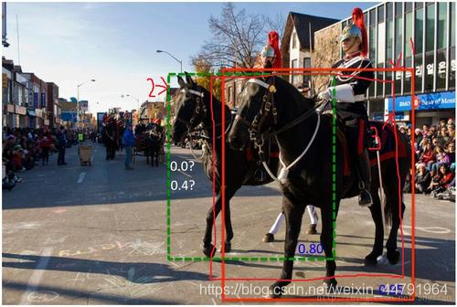

注意事项

Soft-NMS对于大多数数据集而言，作用比较小，提升效果非常不明显，它起作用的地方是大量密集的同类重叠场景，大量密集的不同类重叠场景其实也没什么作用，同学们可以借助Soft-NMS理解非极大抑制的含义，但是实现的必要性确实不强，在提升网络性能上，不建议死磕Soft-NMS。

已对该博文中的代码进行了重置，**视频中实现的代码是numpy形式，而且库比较久远。这里改成pytorch的形式，且适应当前的库。**

# 什么是非极大抑制NMS

非极大抑制的概念只需要看这两幅图就知道了：

下图是经过非极大抑制的。


下图是未经过非极大抑制的。


可以很明显的看出来，未经过非极大抑制的图片有许多重复的框，这些框都指向了同一个物体！

可以用一句话概括非极大抑制的功能就是：

**筛选出一定区域内属于同一种类得分最大的框。**

# 1、非极大抑制NMS的实现过程

本博文实现的是**多分类的非极大抑制**，该非极大抑制使用在我的pytorch-yolov3例子中：

输入shape为[ batch_size, all_anchors, 5+num_classes ]

**第一个维度是图片的数量。**

**第二个维度是所有的预测框。**

**第三个维度是所有的预测框的预测结果。**

非极大抑制的执行过程如下所示：

1. 对所有图片进行循环。
2. 找出该图片中**得分大于门限函数的框**。在进行**重合框筛选前就进行得分的筛选可以大幅度减少框的数量。**
3. 判断**第2步中获得的框的种类与得分**。取出预测结果中框的位置与之进行堆叠。此时最后一维度里面的内容由5+num_classes变成了4+1+2，**四个参数代表框的位置，一个参数代表预测框是否包含物体，两个参数分别代表种类的置信度与种类**。
4. 对**种类进行循环**，非极大抑制的作用是**筛选出一定区域内属于同一种类得分最大的框**，对种类进行循环可以**帮助我们对每一个类分别进行非极大抑制。**
5. 根据得分对该种类进行从大到小排序。
6. 每次取出得分最大的框，计算**其与其它所有预测框的重合程度，重合程度过大的则剔除。**

**视频中实现的代码是numpy形式，而且库比较久远。这里改成pytorch的形式，且适应当前的库。**

实现代码如下：

```python
    """
    非极大抑制,筛选出一定区域内属于同一种类得分最大的框
    """
    def non_max_suppression(self, prediction, num_classes, input_shape, image_shape, letterbox_image, conf_thres=0.5, nms_thres=0.4):
        #----------------------------------------------------------#
        #   将预测结果的格式转换成左上角右下角的格式。  y1,x1,y2,x2
        #   prediction: [batch_size, num_anchors, 25]
        #----------------------------------------------------------#
        box_corner          = prediction.new(prediction.shape)
        box_corner[:, :, 0] = prediction[:, :, 0] - prediction[:, :, 2] / 2     # x1
        box_corner[:, :, 1] = prediction[:, :, 1] - prediction[:, :, 3] / 2     # y1
        box_corner[:, :, 2] = prediction[:, :, 0] + prediction[:, :, 2] / 2     # x2
        box_corner[:, :, 3] = prediction[:, :, 1] + prediction[:, :, 3] / 2     # y2
        prediction[:, :, :4] = box_corner[:, :, :4]                             # 替换前4个数据换成左上角右下角的格式

        output = [None for _ in range(len(prediction))]

        #----------------------------------------------------------#
        #   循环图片,一张图片一次
        #----------------------------------------------------------#
        for i, image_pred in enumerate(prediction):
            #----------------------------------------------------------#
            #   image_pred: [num_boxes, 1+4+num_classes]
            #   image_pred[:, 5:5 + num_classes] 取出分类信息
            #   对种类预测部分取max。
            #   class_conf  [num_anchors, 1]    种类置信度
            #   class_pred  [num_anchors, 1]    种类
            #----------------------------------------------------------#
            class_conf, class_pred = torch.max(image_pred[:, 5:5 + num_classes], dim=1, keepdim=True)

            #----------------------------------------------------------#
            #   利用种类置信度进行第一轮筛选,是否大于门限,返回0/1
            #   image_pred[:, 4] * class_conf[:, 0]  是否包含物体 * 置信度 得到最后的置信度
            #----------------------------------------------------------#
            conf_mask = (image_pred[:, 4] * class_conf [:, 0] >= conf_thres).squeeze()

            #----------------------------------------------------------#
            #   根据置信度进行预测结果的筛选,使用0/1筛选
            #----------------------------------------------------------#
            image_pred = image_pred[conf_mask]  # 网络预测结果
            class_conf = class_conf[conf_mask]  # 种类置信度
            class_pred = class_pred[conf_mask]  # 种类
            if not image_pred.size(0):
                continue

            #-------------------------------------------------------------------------#
            #   堆叠位置参数,是否有物体,种类置信度,种类
            #   detections  [num_anchors, 7]
            #   7的内容为：x1, y1, x2, y2, obj_conf(是否包含物体置信度), class_conf(种类置信度), class_pred(种类预测值)
            #-------------------------------------------------------------------------#
            detections = torch.cat((image_pred[:, :5], class_conf.float(), class_pred.float()), 1)

            #------------------------------------------#
            #   获得预测结果中包含的所有种类
            #------------------------------------------#
            unique_labels = detections[:, -1].cpu().unique()    # 种类.unique减少后面的循环

            if prediction.is_cuda:
                unique_labels = unique_labels.cuda()
                detections = detections.cuda()

            # 循环所有预测的种类
            for c in unique_labels:
                #------------------------------------------#
                #   获得某一类得分筛选后全部的预测结果
                #------------------------------------------#
                detections_class = detections[detections[:, -1] == c]   # detections[:, -1] == c 循环获得类别

                #------------------------------------------#
                #   使用官方自带的非极大抑制会速度更快一些！
                #------------------------------------------#
                keep = nms(
                    detections_class[:, :4],                            # 坐标,中心+宽高
                    detections_class[:, 4] * detections_class[:, 5],    # 得分 4代表是是否包含物体置信度,5代表种类置信度
                    nms_thres                                           # 门限
                )
                max_detections = detections_class[keep]

                # # 按照存在物体的置信度排序
                # _, conf_sort_index = torch.sort(detections_class[:, 4]*detections_class[:, 5], descending=True)
                # # 按照排序好的进行重新取值
                # detections_class = detections_class[conf_sort_index]
                # # 进行非极大抑制
                # max_detections = []
                # while detections_class.size(0):
                #     # 取出这一类置信度最高的，一步一步往下判断，判断重合程度是否大于nms_thres，如果是则去除掉
                #     max_detections.append(detections_class[0].unsqueeze(0))
                #     if len(detections_class) == 1:
                #         break
                #     # 计算重合程度
                #     ious = bbox_iou(max_detections[-1], detections_class[1:])
                #     # 如果IoU小于阈值就保留,说明重合程度低,否则就丢弃
                #     detections_class = detections_class[1:][ious < nms_thres]     # [1:] 相当于删除第一个,每一次都减少
                # # 堆叠获得的框
                # max_detections = torch.cat(max_detections).data

                # Add max detections to outputs
                output[i] = max_detections if output[i] is None else torch.cat((output[i], max_detections))

            # 去除图片灰条
            if output[i] is not None:
                output[i]           = output[i].cpu().numpy()
                box_xy, box_wh      = (output[i][:, 0:2] + output[i][:, 2:4])/2, output[i][:, 2:4] - output[i][:, 0:2]
                output[i][:, :4]    = self.yolo_correct_boxes(box_xy, box_wh, input_shape, image_shape, letterbox_image)
        return output
```

# 2、柔性非极大抑制Soft-NMS的实现过程

柔性非极大抑制和普通的非极大抑制相差不大，只差了几行代码。

柔性非极大抑制认为不应该直接只通过重合程度进行筛选，如图所示，**很明显图片中存在两匹马，但是此时两匹马的重合程度较高，此时我们如果使用普通nms，后面那匹得分比较低的马会直接被剔除。**

Soft-NMS认为在进行非极大抑制的时候要同时考虑得分和重合程度。



我们直接看NMS和Soft-NMS的代码差别：

**视频中实现的代码是numpy形式，而且库比较久远。这里改成pytorch的形式，且适应当前的库。**

如下为NMS：

```python
while detections_class.size(0):
    # 取出这一类置信度最高的，一步一步往下判断，判断重合程度是否大于nms_thres，如果是则去除掉
    max_detections.append(detections_class[0].unsqueeze(0))
    if len(detections_class) == 1:
        break
    # 计算IoU
    ious = self.bbox_iou(max_detections[-1], detections_class[1:])
    # 如果IoU小于阈值就保留,说明重合程度低,否则就丢弃
    detections_class = detections_class[1:][ious < nms_thres]
```

如下为Soft-NMS：

```python
while detections_class.size(0):
    # 取出这一类置信度最高的，一步一步往下判断，判断重合程度是否大于nms_thres，如果是则去除掉
    max_detections.append(detections_class[0].unsqueeze(0))
    if len(detections_class) == 1:
        break
    # 计算IoU
    ious                    = self.bbox_iou(max_detections[-1], detections_class[1:])
    # 计算一个系数 重合度大,系数就小,被检测的框的得分会衰减,并将新得分赋予原分数 sigma=0.5
    detections_class[1:, 4] = torch.exp(-(ious * ious) / sigma) * detections_class[1:, 4]
    # 排除第一个最大的框
    detections_class        = detections_class[1:]
    # 只要大于阈值的
    detections_class        = detections_class[detections_class[:, 4] >= conf_thres]
    # 重新排序
    arg_sort                = torch.argsort(detections_class[:, 4], descending = True)
    # 获取p
    detections_class        = detections_class[arg_sort]
```

我们可以看到，对于NMS而言，其直接将 **与得分最大的框 重合程度较高的其它预测剔除**。而Soft-NMS则以一个权重的形式，**将获得的IOU取高斯指数后乘上原得分，之后重新排序**。继续循环。

**视频中实现的代码是numpy形式，而且库比较久远。这里改成pytorch的形式，且适应当前的库。**

实现代码如下：

```python
def bbox_iou(self, box1, box2, x1y1x2y2=True):
    """
        计算IOU
    """
    if not x1y1x2y2:
        b1_x1, b1_x2 = box1[:, 0] - box1[:, 2] / 2, box1[:, 0] + box1[:, 2] / 2
        b1_y1, b1_y2 = box1[:, 1] - box1[:, 3] / 2, box1[:, 1] + box1[:, 3] / 2
        b2_x1, b2_x2 = box2[:, 0] - box2[:, 2] / 2, box2[:, 0] + box2[:, 2] / 2
        b2_y1, b2_y2 = box2[:, 1] - box2[:, 3] / 2, box2[:, 1] + box2[:, 3] / 2
    else:
        b1_x1, b1_y1, b1_x2, b1_y2 = box1[:, 0], box1[:, 1], box1[:, 2], box1[:, 3]
        b2_x1, b2_y1, b2_x2, b2_y2 = box2[:, 0], box2[:, 1], box2[:, 2], box2[:, 3]

    inter_rect_x1 = torch.max(b1_x1, b2_x1)
    inter_rect_y1 = torch.max(b1_y1, b2_y1)
    inter_rect_x2 = torch.min(b1_x2, b2_x2)
    inter_rect_y2 = torch.min(b1_y2, b2_y2)

    inter_area = torch.clamp(inter_rect_x2 - inter_rect_x1, min=0) * \
                torch.clamp(inter_rect_y2 - inter_rect_y1, min=0)
                
    b1_area = (b1_x2 - b1_x1) * (b1_y2 - b1_y1)
    b2_area = (b2_x2 - b2_x1) * (b2_y2 - b2_y1)
    
    iou = inter_area / torch.clamp(b1_area + b2_area - inter_area, min = 1e-6)

    return iou

def non_max_suppression(self, prediction, num_classes, input_shape, image_shape, letterbox_image, conf_thres=0.5, nms_thres=0.4, sigma=0.5):
    #----------------------------------------------------------#
    #   将预测结果的格式转换成左上角右下角的格式。
    #   prediction  [batch_size, num_anchors, 85]
    #----------------------------------------------------------#
    box_corner          = prediction.new(prediction.shape)
    box_corner[:, :, 0] = prediction[:, :, 0] - prediction[:, :, 2] / 2
    box_corner[:, :, 1] = prediction[:, :, 1] - prediction[:, :, 3] / 2
    box_corner[:, :, 2] = prediction[:, :, 0] + prediction[:, :, 2] / 2
    box_corner[:, :, 3] = prediction[:, :, 1] + prediction[:, :, 3] / 2
    prediction[:, :, :4] = box_corner[:, :, :4]

    output = [None for _ in range(len(prediction))]
    for i, image_pred in enumerate(prediction):
        #----------------------------------------------------------#
        #   对种类预测部分取max。
        #   class_conf  [num_anchors, 1]    种类置信度
        #   class_pred  [num_anchors, 1]    种类
        #----------------------------------------------------------#
        class_conf, class_pred = torch.max(image_pred[:, 5:5 + num_classes], 1, keepdim=True)

        #----------------------------------------------------------#
        #   利用置信度进行第一轮筛选
        #----------------------------------------------------------#
        conf_mask = (image_pred[:, 4] * class_conf[:, 0] >= conf_thres).squeeze()

        #----------------------------------------------------------#
        #   根据置信度进行预测结果的筛选
        #----------------------------------------------------------#
        image_pred = image_pred[conf_mask]
        class_conf = class_conf[conf_mask]
        class_pred = class_pred[conf_mask]
        if not image_pred.size(0):
            continue
        #-------------------------------------------------------------------------#
        #   detections  [num_anchors, 7]
        #   7的内容为：x1, y1, x2, y2, obj_conf, class_conf, class_pred
        #-------------------------------------------------------------------------#
        detections = torch.cat((image_pred[:, :5], class_conf.float(), class_pred.float()), 1)

        #------------------------------------------#
        #   获得预测结果中包含的所有种类
        #------------------------------------------#
        unique_labels = detections[:, -1].cpu().unique()

        if prediction.is_cuda:
            unique_labels = unique_labels.cuda()
            detections = detections.cuda()

        for c in unique_labels:
            #------------------------------------------#
            #   获得某一类得分筛选后全部的预测结果
            #------------------------------------------#
            detections_class = detections[detections[:, -1] == c]

            # #------------------------------------------#
            # #   使用官方自带的非极大抑制会速度更快一些！
            # #------------------------------------------#
            # keep = nms(
            #     detections_class[:, :4],
            #     detections_class[:, 4] * detections_class[:, 5],
            #     nms_thres
            # )
            # max_detections = detections_class[keep]
            
            # 按照存在物体的置信度排序
            _, conf_sort_index = torch.sort(detections_class[:, 4]*detections_class[:, 5], descending=True)
            detections_class = detections_class[conf_sort_index]
            # 进行非极大抑制
            max_detections = []
            while detections_class.size(0):
                # 取出这一类置信度最高的，一步一步往下判断，判断重合程度是否大于nms_thres，如果是则去除掉
                max_detections.append(detections_class[0].unsqueeze(0))
                if len(detections_class) == 1:
                    break
                ious                    = self.bbox_iou(max_detections[-1], detections_class[1:])
                detections_class[1:, 4] = torch.exp(-(ious * ious) / sigma) * detections_class[1:, 4]
                detections_class        = detections_class[1:]
                detections_class        = detections_class[detections_class[:, 4] >= conf_thres]
                arg_sort                = torch.argsort(detections_class[:, 4], descending = True)
                detections_class        = detections_class[arg_sort]
            # 堆叠
            max_detections = torch.cat(max_detections).data
            
            # Add max detections to outputs
            output[i] = max_detections if output[i] is None else torch.cat((output[i], max_detections))
        
        if output[i] is not None:
            output[i]           = output[i].cpu().numpy()
            box_xy, box_wh      = (output[i][:, 0:2] + output[i][:, 2:4])/2, output[i][:, 2:4] - output[i][:, 0:2]
            output[i][:, :4]    = self.yolo_correct_boxes(box_xy, box_wh, input_shape, image_shape, letterbox_image)
    return output
```

