# [GITHUB](https://so.csdn.net/so/search?q=GITHUB&spm=1001.2101.3001.7020)代码下载

这个是用来绘制mAP曲线的。
 https://github.com/Cartucho/mAP
 这个是用来获取绘制mAP曲线所需的txt的
 https://github.com/bubbliiiing/count-mAP-txt

# 知识储备

## 1、IOU的概念

IOU的概念应该比较简单，就是衡量预测框和真实框的重合程度。

下图是一个示例：图中绿色框为实际框（好像不是很绿……），红色框为预测框，当我们需要判断两个框之间的关系时，主要就是判断两个框的重合程度。

计算IOU的公式为：
$$
IOU = \frac {S_交} {S_并}
$$

可以看到IOU是一个比值，即交并比。

在分子部分，值为预测框和实际框之间的重叠区域；

在分母部分，值为预测框和实际框所占有的总区域。

 

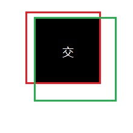

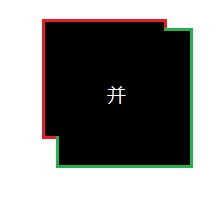

交区域和并区域的比值，就是IOU。

## 2、TP TN FP FN的概念

TP TN FP FN里面一共出现了4个字母，分别是T F P N。

T是True；

F是False；

P是Positive；

N是Negative。

T或者F代表的是该样本 是否被正确分类。

P或者N代表的是该样本 被预测成了正样本还是负样本。

TP（True Positives）意思就是被分为了正样本，而且分对了。

TN（True Negatives）意思就是被分为了负样本，而且分对了，

FP（False Positives）意思就是被分为了正样本，但是分错了（事实上这个样本是负样本）。

FN（False Negatives）意思就是被分为了负样本，但是分错了（事实上这个样本是这样本）。

在mAP计算的过程中主要用到了，TP、FP、FN这三个概念。

## 3、precision（精确度）和recall（召回率）

$$
Precision = \frac {TP} {TP + FP}
$$

TP是**分类器认为是正样本而且确实是正样本的例子**，FP是**分类器认为是正样本但实际上不是正样本的例子**，Precision翻译成中文就是“**分类器认为是正类并且确实是正类的部分占所有分类器认为是正类的比例**”。**查的准不准。**
$$
Recall = \frac {TP} {TP + FN}
$$

TP是**分类器认为是正样本而且确实是正样本的例子**，FN是**分类器认为是负样本但实际上不是负样本的例子**，Recall翻译成中文就是“**分类器认为是正类并且确实是正类的部分占所有确实是正类的比例**”。**查的全不全。**

## 4、概念举例

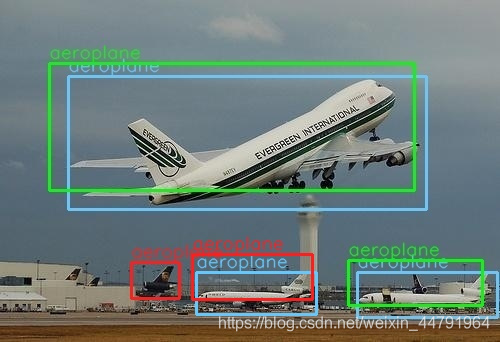

如图所示，**蓝色的框是 真实框**。**绿色和红色的框是 预测框**，绿色的框是正样本，红色的框是负样本。一般来讲，当预测框和真实框IOU>=0.5时，被认为是正样本。

因此对于这幅图来讲。

真实框一共有3个，正样本一共有2个，负样本一共有2个。

此时
$$
Precision = \frac 2 {2+2} = 1/2 \\

Recall = \frac 2 {2+1} = 2 / 3
$$

## 5、单个指标的局限性

在目标检测算法里面有一个非常重要的概念是置信度，如果置信度设置的高的话，预测的结果和实际情况就很符合，如果置信度低的话，就会有很多误检测。

假设一幅图里面总共有3个正样本，目标检测对这幅图的预测结果有10个，其中3个实际上是正样本，7个实际上是负样本。对应置信度如下。

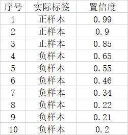

如果我们将可以接受的置信度设置为0.95的话，那么目标检测算法就会将序号为1的样本作为正样本，其它的都是负样本。此时TP = 1，FP = 0，FN = 2。
$$
Precision = \frac 1 {1 + 0} = 1 \\
Recall = \frac 1 {1 + 2} = 1 / 3
$$
此时Precision非常高，但是事实上我们只检测出一个正样本，还有两个没有检测出来，因此只用Precision就不合适。

这个时候如果我们将可以接受的置信度设置为0.35的话，那么目标检测算法就会将序号为1的样本作为正样本，其它的都是负样本。此时TP = 3，FP = 3，FN = 0。
$$
Precision = \frac 3 {3 + 3} = 1 / 2 \\
Recall = \frac 3 {3 + 0} = 1
$$
此时Recall非常高，但是事实上目标检测算法认为是正样本的样本里面，有3个样本确实是正样本，但有三个是负样本，存在非常严重的误检测，因此只用Recall就不合适。

二者进行结合才是评价的正确方法。

# 什么是AP

AP事实上指的是，利用不同的Precision和Recall的点的组合，画出来的曲线下面的面积。

**P-R曲线下的面积叫做AP**

如下面这幅图所示。

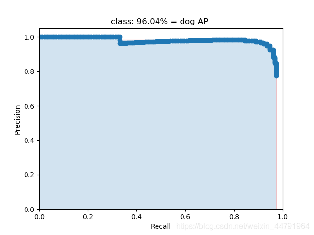

当我们取不同的置信度，可以获得不同的Precision和不同的Recall，当我们取得置信度够密集的时候，就可以获得非常多的Precision和Recall。

**此时Precision和Recall可以在图片上画出一条线，这条线下部分的面积就是某个类的AP值。**

**mAP就是所有的类的AP值求平均。**

**横坐标的Recall越来越大,同时置信度阈值越来越小**

> bottle的AP  随着Confidence阈值变高而变大

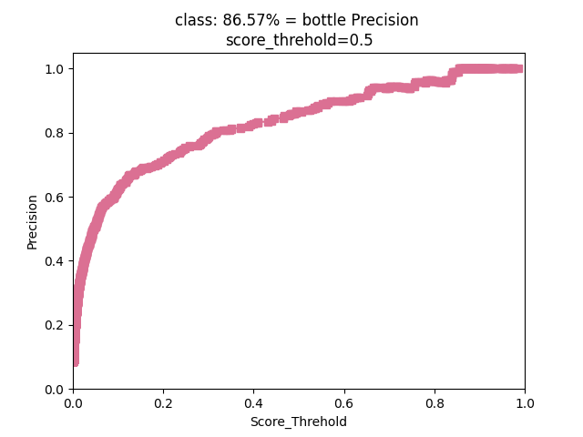

> bottle的召回率  随着Confidence阈值变高而降低

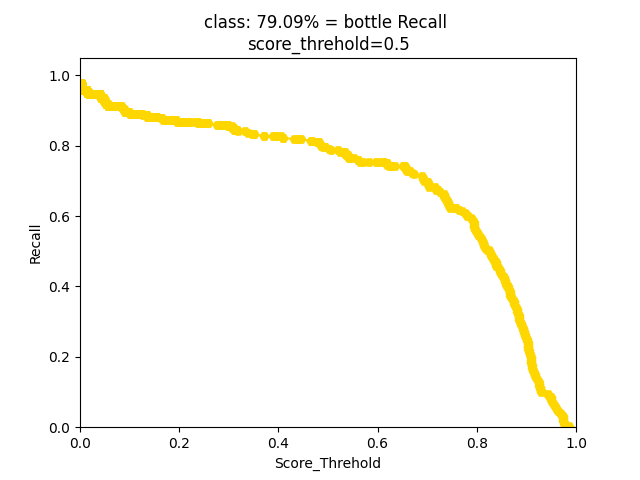

> bottle的AP
>
> 横坐标的Recall越来越大,同时Confidence的阈值越来越小(IOU的阈值用来判断为正样本或负样本,一次中都是相同的,如0.5,而Confidence的阈值由大到小变化)

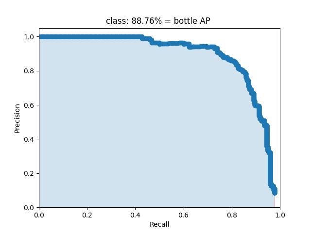

> IoU=0.5 mAP
>
> IoU区分正负样本
>
> Confidence由高到低获取Precision和Recall 
>
> 通过Precision和Recall绘制P-R曲线,下面的面积就是AP,所有种类的AP平均值就是mAP

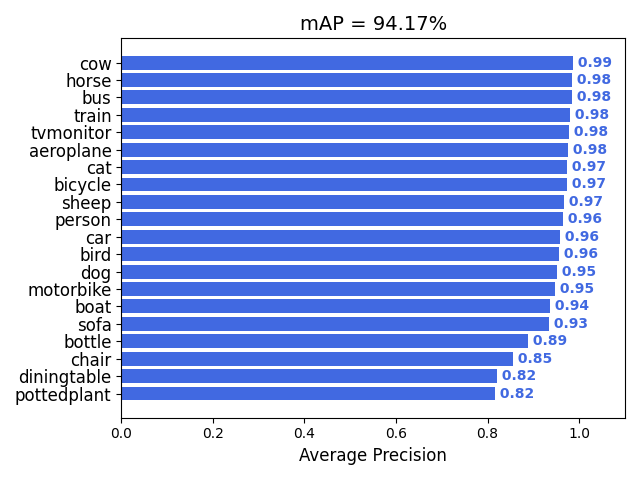

# 绘制mAP

我们首先在这个github上下载绘制mAP所需的代码。

https://github.com/Cartucho/mAP

在这个代码中，如果想要绘制mAP则需要三个内容。分别是：

detection-results：指的是预测结果的txt。

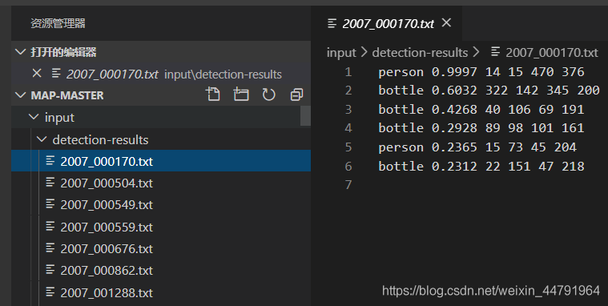

ground-truth：指的是真实框的txt。

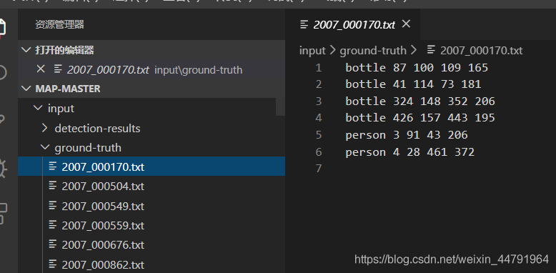

image-optional：指的是图片，有这个可以可视化，但是这个可以没有。

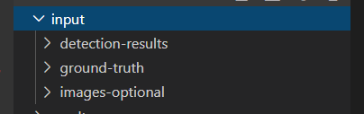

我们需要生成这三个内容，此时下载第二个库，这个是我拿我制作的ssd代码写的一个可以生成对应txt的例子。

https://github.com/bubbliiiing/count-mAP-txt

我们首先将整个VOC的数据集放到VOCdevikit中

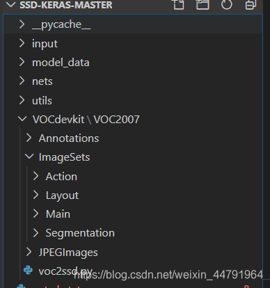

然后修改voc2ssd.py里面的trainval_percent，一般用数据集的10%或者更少用于测试。**如果大家放进VOCdevikit的数据集不是全部数据，而是已经筛选好的测试数据集的话，那么就把trainval_percent设置成0，表示全部的数据都用于测试。**

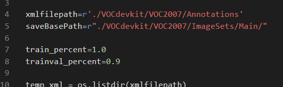

然后运行voc2ssd.py。

此时会生成test.txt，存放用于测试的图片的名字。

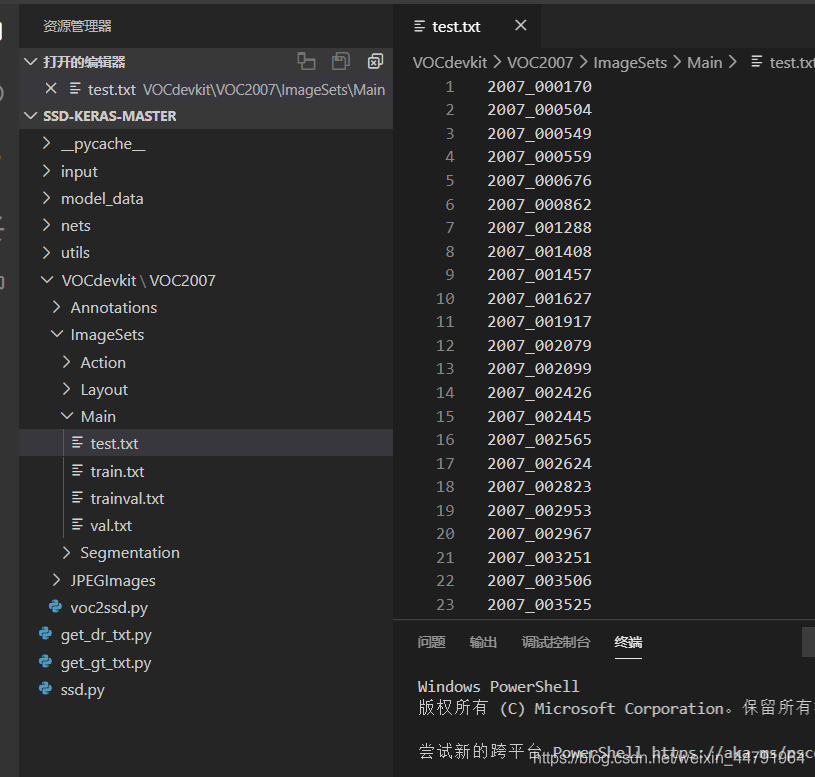

**然后依次运行主目录下的get_dr_txt.py和get_gt_txt.py获得预测框对应的txt和真实框对应的txt。**

get_dr_txt.py是用来检测测试集里面的图片的，然后会生成每一个图片的检测结果，我重写了detect_image代码，用于生成预测框的txt。
利用for循环检测所有的图片。

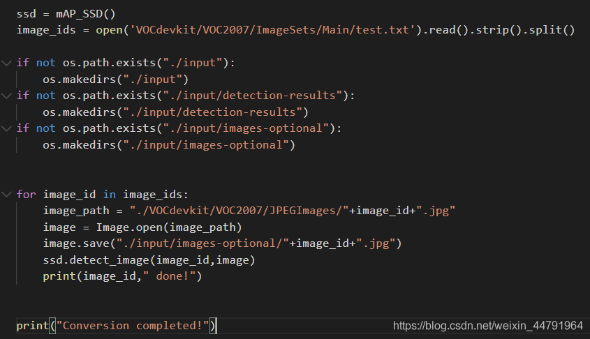

get_dr_txt.py是用来获取测试集中的xml，然后根据每个xml的结果生成真实框的txt。
利用for循环检测所有的xml。

.png)

完成后我们会在input获得三个文件夹。

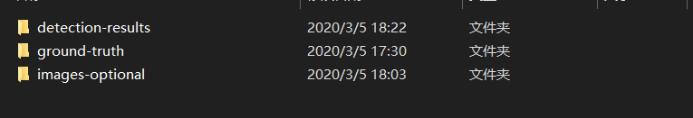

**此时把input内部的文件夹复制到mAP的代码中的input文件夹内部就可以了**，然后我们运行mAP的代码中的main.py，运行结束后，会生成mAP相关的文件。

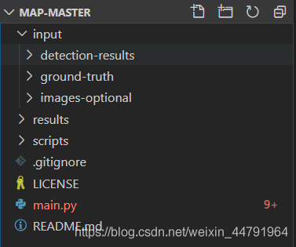

结果生成在Result里面。

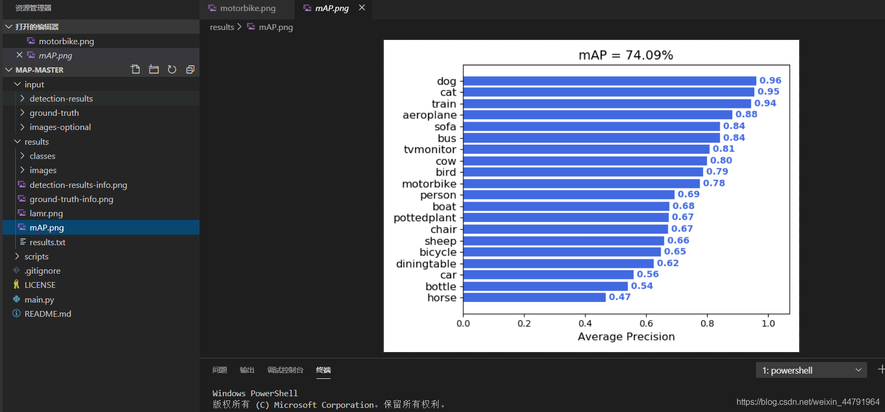