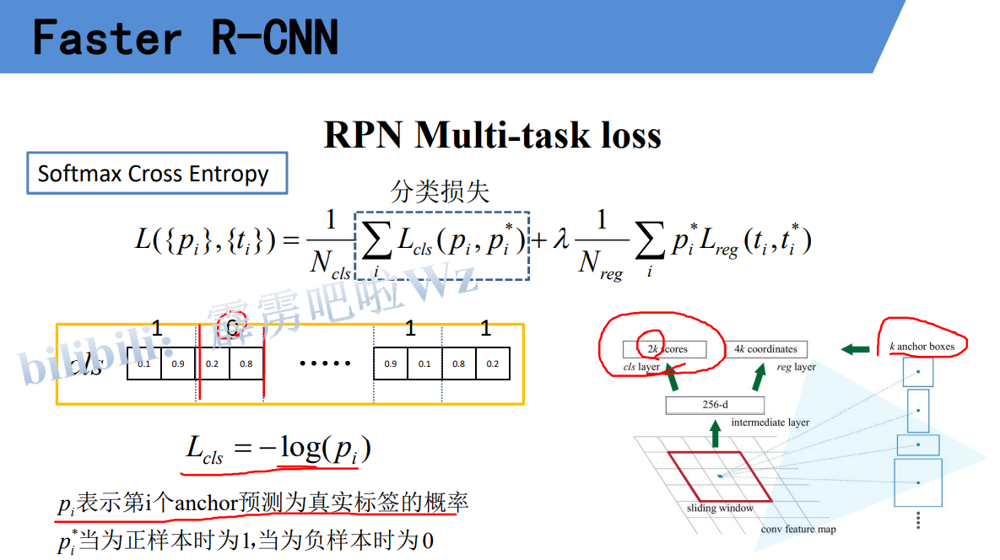

# 2 自定义dataset

> my_dataset.py


# 3 FasterRCNN框架

> network_files/faster_rcnn_framework.py


# 4 GeneralizedRCNNTransform

> network_files/transform.py


# 5 RPN上 生成先验框

> network_files/rpm_function.py


# 6 RPN中 使用目标边界框生成建议框

> metwork_files/rpm_function.py det_utils.py

# 7 RPN下 选取正负样本,计算loss

> metwork_files/rpm_function.py det_utils.py





# 8 RoIHeads = ROIPooling +  展平和两个全连接层 + 分类预测和框的预测 + 后处理部分

> network_files/faster_rcnn_framework.py roi_head.py


# 9 训练过程中的RPNHead和RIOPooling中间选择一部分proposal部分

> network_files/roi_head.py 中的 select_training_samples


# 10 计算fasterrcnn损失


> network_files/roi_head.py 中的 forward

```python
            #----------------------------------------------------#
            #   计算fastrcc损失:
            #       class_logits :       预测类别概率信息，shape=[num_anchors, num_classes]
            #       box_regression :     预测边目标界框回归信息
            #       labels :             真实类别信息
            #       regression_targets : 真实目标边界框信息
            #   返回:
            #       classification_loss (Tensor)
            #       box_loss (Tensor)
            #----------------------------------------------------#
            loss_classifier, loss_box_reg = fastrcnn_loss(class_logits, box_regression, labels, regression_targets)
            losses = {
                "loss_classifier": loss_classifier,
                "loss_box_reg": loss_box_reg
            }
```

> network_files/roi_head.py 中的 fastrcnn_loss

```python
#----------------------------------------------------#
#   计算fastrcc损失:
#----------------------------------------------------#
def fastrcnn_loss(class_logits, box_regression, labels, regression_targets):
    # type: (Tensor, Tensor, List[Tensor], List[Tensor]) -> Tuple[Tensor, Tensor]
    """
    Computes the loss for Faster R-CNN.

    Arguments:
        class_logits :       预测类别概率信息，shape=[num_anchors, num_classes]
        box_regression :     预测边目标界框回归信息
        labels :             真实类别信息
        regression_targets : 真实目标边界框信息

    Returns:
        classification_loss (Tensor)
        box_loss (Tensor)
    """
    # 每张图片对应的标签
    labels = torch.cat(labels, dim=0)
    # 每张图片对应的回归参数
    regression_targets = torch.cat(regression_targets, dim=0)

    #----------------------------------------------------#
    #   计算类别损失信息, 交叉熵损失  正样本标签是真实表现, 负样本标签都是0,没有起到计算效果
    #----------------------------------------------------#
    classification_loss = F.cross_entropy(class_logits, labels)

    #----------------------------------------------------#
    #   返回标签类别大于0的索引
    #----------------------------------------------------#
    # sampled_pos_inds_subset = torch.nonzero(torch.gt(labels, 0)).squeeze(1)
    sampled_pos_inds_subset = torch.where(torch.gt(labels, 0))[0]

    #----------------------------------------------------#
    #   返回标签类别大于0位置的类别信息
    #----------------------------------------------------#
    labels_pos = labels[sampled_pos_inds_subset]

    # shape=[num_proposal, num_classes]
    N, num_classes = class_logits.shape
    box_regression = box_regression.reshape(N, -1, 4)   # b,框的个数,4

    #----------------------------------------------------#
    #   计算边界框损失信息
    #----------------------------------------------------#
    box_loss = det_utils.smooth_l1_loss(
        # 获取指定索引proposal的指定类别box信息(只要匹配的正样本proposal,并取对应proposal的预测框的类别对应的框)
        box_regression[sampled_pos_inds_subset, labels_pos],
        regression_targets[sampled_pos_inds_subset],    # 只要对应正样本的真实框
        beta=1 / 9,
        size_average=False,
    ) / labels.numel()  # 除以采样的proposal个数 batch_size * 每张图片采样数

    return classification_loss, box_loss
```

> det_utils.py 中 smooth_l1_loss

```python
#----------------------------------------------------#
#   计算边界框损失信息
#----------------------------------------------------#
def smooth_l1_loss(input, target, beta: float = 1. / 9, size_average: bool = True):
    """
    very similar to the smooth_l1_loss from pytorch, but with
    the extra beta parameter
    """
    # n对应公式中的x
    n = torch.abs(input - target)
    # cond = n < beta
    cond = torch.lt(n, beta)

    # where 用来判断cond绝对值是否大于0
    loss = torch.where(cond, 0.5 * n ** 2 / beta, n - 0.5 * beta)

    # 返回平均损失还是损失和
    if size_average:
        return loss.mean()
    return loss.sum()
```


# 11 后处理部分,预测才有

> network_files/roi_head.py 中的 forward

```python
            #----------------------------------------------------#
            #   检测后,预测结果后处理,删除低概率目标,nms处理等
            #----------------------------------------------------#
            boxes, scores, labels = self.postprocess_detections(class_logits, box_regression, proposals, image_shapes)
            num_images = len(boxes)
            for i in range(num_images):
                result.append(
                    {
                        "boxes": boxes[i],
                        "labels": labels[i],
                        "scores": scores[i],
                    }
                )
```

> network_files/roi_head.py 中的 postprocess_detections

```python
    #----------------------------------------------------#
    #   检测后,预测结果后处理,删除低概率目标,nms处理等
    #----------------------------------------------------#
    def postprocess_detections(self,
                               class_logits,    # type: Tensor
                               box_regression,  # type: Tensor
                               proposals,       # type: List[Tensor]
                               image_shapes     # type: List[Tuple[int, int]]
                               ):
        # type: (...) -> Tuple[List[Tensor], List[Tensor], List[Tensor]]
        """
        对网络的预测数据进行后处理，包括
        （1）根据proposal以及预测的回归参数计算出最终bbox坐标
        （2）对预测类别结果进行softmax处理
        （3）裁剪预测的boxes信息，将越界的坐标调整到图片边界上
        （4）移除所有背景信息
        （5）移除低概率目标
        （6）移除小尺寸目标
        （7）执行nms处理，并按scores进行排序
        （8）根据scores排序返回前topk个目标
        Args:
            class_logits:   网络预测类别概率信息
            box_regression: 网络预测的边界框回归参数
            proposals:      rpn输出的proposal
            image_shapes:   打包成batch前每张图像的宽高

        Returns:

        """
        device = class_logits.device
        #----------------------------------------------------#
        #   预测目标类别数
        #----------------------------------------------------#
        num_classes = class_logits.shape[-1]

        #----------------------------------------------------#
        #   获取每张图像的预测bbox proposal数量,每个图片生成1000个proposal
        #----------------------------------------------------#
        boxes_per_image = [boxes_in_image.shape[0] for boxes_in_image in proposals]
        #----------------------------------------------------#
        #   根据proposal以及预测的回归参数计算出最终bbox坐标
        #----------------------------------------------------#
        pred_boxes = self.box_coder.decode(box_regression, proposals)

        #----------------------------------------------------#
        #   对预测类别结果进行softmax处理
        #----------------------------------------------------#
        pred_scores = F.softmax(class_logits, -1)

        #----------------------------------------------------#
        #   split boxes and scores per image
        #   根据每张图像的预测bbox数量分割结果
        #----------------------------------------------------#
        pred_boxes_list = pred_boxes.split(boxes_per_image, 0)
        pred_scores_list = pred_scores.split(boxes_per_image, 0)

        all_boxes = []
        all_scores = []
        all_labels = []
        # 遍历每张图像预测信息
        for boxes, scores, image_shape in zip(pred_boxes_list, pred_scores_list, image_shapes):
            #----------------------------------------------------#
            #   裁剪预测的boxes信息，将越界的坐标调整到图片边界上
            #----------------------------------------------------#
            boxes = box_ops.clip_boxes_to_image(boxes, image_shape)

            # 为每个预测创建标签
            labels = torch.arange(num_classes, device=device)
            labels = labels.view(1, -1).expand_as(scores)   # 添加新维度并扩充大小

            #----------------------------------------------------#
            #   移除索引为0的所有信息（0代表背景）
            #   0 1 2 ...
            #----------------------------------------------------#
            boxes = boxes[:, 1:]
            scores = scores[:, 1:]
            labels = labels[:, 1:]

            # batch everything, by making every class prediction be a separate instance
            boxes = boxes.reshape(-1, 4)
            scores = scores.reshape(-1)
            labels = labels.reshape(-1)

            #----------------------------------------------------#
            #   移除低概率目标，self.scores_thresh=0.05,概率大于0.05的索引
            #----------------------------------------------------#
            # gt: Computes input > other element-wise.
            # inds = torch.nonzero(torch.gt(scores, self.score_thresh)).squeeze(1)
            inds = torch.where(torch.gt(scores, self.score_thresh))[0]
            boxes, scores, labels = boxes[inds], scores[inds], labels[inds]

            #----------------------------------------------------#
            # 移除小目标
            #----------------------------------------------------#
            keep = box_ops.remove_small_boxes(boxes, min_size=1.)
            boxes, scores, labels = boxes[keep], scores[keep], labels[keep]

            #----------------------------------------------------#
            # 执行nms处理，执行后的结果会按照scores从大到小进行排序返回
            #----------------------------------------------------#
            keep = box_ops.batched_nms(boxes, scores, labels, self.nms_thresh)

            # keep only topk scoring predictions
            # 获取scores排在前topk个预测目标
            keep = keep[:self.detection_per_img]
            boxes, scores, labels = boxes[keep], scores[keep], labels[keep]

            all_boxes.append(boxes)
            all_scores.append(scores)
            all_labels.append(labels)

        return all_boxes, all_scores, all_labels
```

> network_file/det_utils.py 中 decode

```python
    #---------------------------------------------------#
    #   将预测的bbox regression参数应用到anchors上得到最终预测bbox坐标
    #---------------------------------------------------#
    def decode(self, rel_codes, boxes):
        # type: (Tensor, List[Tensor]) -> Tensor
        """

        Args:
            rel_codes: bbox regression parameters
            boxes: anchors/proposals

        Returns:

        """
        assert isinstance(boxes, (list, tuple))
        assert isinstance(rel_codes, torch.Tensor)
        #---------------------------------------------------#
        #   统计每张图像的anchors个数，方便后面拼接在一起处理后在分开
        #---------------------------------------------------#
        boxes_per_image = [b.size(0) for b in boxes]
        concat_boxes = torch.cat(boxes, dim=0)

        # 求sum总数
        box_sum = 0
        for val in boxes_per_image:
            box_sum += val

        #---------------------------------------------------#
        #   将预测的bbox回归参数应用到对应anchors上得到预测bbox的坐标
        #---------------------------------------------------#
        pred_boxes = self.decode_single(
            rel_codes, concat_boxes
        )

        # 防止pred_boxes为空时导致reshape报错
        if box_sum > 0:
            pred_boxes = pred_boxes.reshape(box_sum, -1, 4) # [b, 4] -> [b, 1, 4]

        return pred_boxes
```

> network_files/boxes.py 中 remove_small_boxes / batched_nms

```python
#-----------------------------------------------------#
#   移除宽高小于指定阈值的索引
#-----------------------------------------------------#
def remove_small_boxes(boxes, min_size):
    # type: (Tensor, float) -> Tensor
    """
    Remove boxes which contains at least one side smaller than min_size.
    移除宽高小于指定阈值的索引
    Arguments:
        boxes (Tensor[N, 4]): boxes in (x1, y1, x2, y2) format
        min_size (float): minimum size

    Returns:
        keep (Tensor[K]): indices of the boxes that have both sides
            larger than min_size
    """
    ws, hs = boxes[:, 2] - boxes[:, 0], boxes[:, 3] - boxes[:, 1]  # 预测boxes的宽和高

    # 当满足宽，高都大于给定阈值时为True
    # keep = (ws >= min_size) & (hs >= min_size)
    keep = torch.logical_and(torch.ge(ws, min_size), torch.ge(hs, min_size))
    # nonzero(): Returns a tensor containing the indices of all non-zero elements of input
    # keep = keep.nonzero().squeeze(1)
    keep = torch.where(keep)[0]         # true和false组成
    return keep

#-----------------------------------------------------#
#   nms非极大值抑制
#-----------------------------------------------------#
def batched_nms(boxes, scores, idxs, iou_threshold):
    # type: (Tensor, Tensor, Tensor, float) -> Tensor
    """
    Performs non-maximum suppression in a batched fashion.

    Each index value correspond to a category, and NMS
    will not be applied between elements of different categories.

    Parameters
    ----------
    boxes : Tensor[N, 4]
        boxes where NMS will be performed. They
        are expected to be in (x1, y1, x2, y2) format
    scores : Tensor[N]
        scores for each one of the boxes
    idxs : Tensor[N]
        indices of the categories for each one of the boxes.
    iou_threshold : float
        discards all overlapping boxes
        with IoU < iou_threshold

    Returns
    -------
    keep : Tensor
        int64 tensor with the indices of
        the elements that have been kept by NMS, sorted
        in decreasing order of scores
    """
    if boxes.numel() == 0:
        return torch.empty((0,), dtype=torch.int64, device=boxes.device)

    #-----------------------------------------------------#
    #   获取所有boxes中最大的坐标值（xmin, ymin, xmax, ymax）
    #-----------------------------------------------------#
    max_coordinate = boxes.max()

    #-----------------------------------------------------#
    #   为每一个类别/每一层生成一个很大的偏移量
    #   这里的to只是让生成tensor的dytpe和device与boxes保持一致
    #-----------------------------------------------------#
    offsets = idxs.to(boxes) * (max_coordinate + 1)
    # boxes加上对应层的偏移量后，保证不同类别/层之间boxes不会有重合的现象
    boxes_for_nms = boxes + offsets[:, None]
    keep = nms(boxes_for_nms, scores, iou_threshold)
    return keep
```


# 12 预测结果映射回原尺度

> network_files/faster_rcnn_framework.py 中 forward

```python

        #---------------------------------------------------#
        #   对网络的预测结果进行后处理（主要将bboxes还原到原图像尺度上）
        #---------------------------------------------------#
        detections = self.transform.postprocess(detections, images.image_sizes, original_image_sizes)

        losses = {}
        losses.update(detector_losses)
        losses.update(proposal_losses)

        if torch.jit.is_scripting():
            if not self._has_warned:
                warnings.warn("RCNN always returns a (Losses, Detections) tuple in scripting")
                self._has_warned = True
            return losses, detections
        else:
            #---------------------------------------------------#
            #   训练返回losses,否则返回detections
            #---------------------------------------------------#
            return self.eager_outputs(losses, detections)
```

> network_files/transform.py 中 postprocess

```python
    #---------------------------------------#
    #   将预测结果映射到原图
    #---------------------------------------#
    def postprocess(self,
                    result,                # type: List[Dict[str, Tensor]]
                    image_shapes,          # type: List[Tuple[int, int]]
                    original_image_sizes   # type: List[Tuple[int, int]]
                    ):
        # type: (...) -> List[Dict[str, Tensor]]
        """
        对网络的预测结果进行后处理（主要将bboxes还原到原图像尺度上）
        Args:
            result: list(dict),                     网络的预测结果,         len(result) == batch_size
            image_shapes: list(torch.Size),         图像预处理缩放后的尺寸,  len(image_shapes) == batch_size
            original_image_sizes: list(torch.Size), 图像的原始尺寸,         len(original_image_sizes) == batch_size

        Returns:

        """
        #---------------------------------------#
        #   训练不需要获取,只要计算损失即可
        #---------------------------------------#
        if self.training:
            return result

        #----------------------------------------------#
        # 遍历每张图片的预测信息，将boxes信息还原回原尺度
        #----------------------------------------------#
        for i, (pred, im_s, o_im_s) in enumerate(zip(result, image_shapes, original_image_sizes)):
            boxes = pred["boxes"]   # 获取预测box信息
            boxes = resize_boxes(boxes, im_s, o_im_s)  # 将bboxes缩放回原图像尺度上
            result[i]["boxes"] = boxes
        return result
    
    
    #------------------------------------------------------#
#   缩放框
#------------------------------------------------------#
def resize_boxes(boxes, original_size, new_size):
    # type: (Tensor, List[int], List[int]) -> Tensor
    """
    将boxes参数根据图像的缩放情况进行相应缩放

    Arguments:
        boxes: 框信息
        original_size: 图像缩放前的尺寸
        new_size: 图像缩放后的尺寸
    """

    # 缩放因子 = 新图像大小 / 旧图像大小
    ratios = [
        torch.tensor(s,      dtype=torch.float32, device=boxes.device) /
        torch.tensor(s_orig, dtype=torch.float32, device=boxes.device)
        for s, s_orig in zip(new_size, original_size)
    ]

    #------------------------------------------------------#
    # 获取宽高各自的缩放因子
    #------------------------------------------------------#
    ratios_height, ratios_width = ratios
    # boxes: [minibatch, 4]
    # unbind(1), 从第一维分为四部分,得到4个人自拍弄安排
    xmin, ymin, xmax, ymax = boxes.unbind(1)
    xmin = xmin * ratios_width
    xmax = xmax * ratios_width
    ymin = ymin * ratios_height
    ymax = ymax * ratios_height

    # 维度1上进行合并,多出第一个维度
    return torch.stack((xmin, ymin, xmax, ymax), dim=1)
```

# 13 更换backbone,不带RPN

> 需要pytorch==1.10以上版本和配合的torchvision
>
> change_backbone_without_fpn.py

```python
#----------------------------------------------------#
#   需要pytorch==1.10以上版本和配合的torchvision
#----------------------------------------------------#

import os
import datetime

import torch

import transforms
from network_files import FasterRCNN, AnchorsGenerator
from my_dataset import VOCDataSet
from train_utils import GroupedBatchSampler, create_aspect_ratio_groups
from train_utils import train_eval_utils as utils


def create_model(num_classes):
    import torchvision
    #   feature_extraction
    from torchvision.models.feature_extraction import create_feature_extractor

    # vgg16
    backbone = torchvision.models.vgg16_bn(pretrained=False)
    # print(backbone)
    #----------------------------------------------------#
    #   提取需要的节点和之前的节点,删除后面的部分
    #----------------------------------------------------#
    backbone = create_feature_extractor(backbone, return_nodes={"features.42": "0"})    # 提取的节点: 新名称
    # out = backbone(torch.rand(1, 3, 224, 224))
    # print(out["0"].shape) 512 下面就设置512,是为了方便后面使用
    backbone.out_channels = 512

    # resnet50 backbone
    # backbone = torchvision.models.resnet50(pretrained=False)
    # # print(backbone)
    # backbone = create_feature_extractor(backbone, return_nodes={"layer3": "0"})
    # # out = backbone(torch.rand(1, 3, 224, 224))
    # # print(out["0"].shape)
    # backbone.out_channels = 1024

    # EfficientNetB0
    # backbone = torchvision.models.efficientnet_b0(pretrained=False)
    # # print(backbone)
    # backbone = create_feature_extractor(backbone, return_nodes={"features.5": "0"})
    # # out = backbone(torch.rand(1, 3, 224, 224))
    # # print(out["0"].shape)
    # backbone.out_channels = 112

    #----------------------------------------------------#
    # 这两个要手动生成
    #----------------------------------------------------#
    anchor_generator = AnchorsGenerator(sizes=((32, 64, 128, 256, 512),),
                                        aspect_ratios=((0.5, 1.0, 2.0),))

    roi_pooler = torchvision.ops.MultiScaleRoIAlign(featmap_names=['0'],  # 在哪些特征层上进行RoIAlign pooling
                                                    output_size=[7, 7],   # RoIAlign pooling输出特征矩阵尺寸
                                                    sampling_ratio=2)     # 采样率

    model = FasterRCNN(backbone=backbone,
                       num_classes=num_classes,
                       rpn_anchor_generator=anchor_generator,
                       box_roi_pool=roi_pooler)

    return model


def main(parser_data):
    device = torch.device(parser_data.device if torch.cuda.is_available() else "cpu")
    print("Using {} device training.".format(device.type))

    # 用来保存coco_info的文件
    results_file = "results{}.txt".format(datetime.datetime.now().strftime("%Y%m%d-%H%M%S"))

    data_transform = {
        "train": transforms.Compose([transforms.ToTensor(),
                                     transforms.RandomHorizontalFlip(0.5)]),
        "val": transforms.Compose([transforms.ToTensor()])
    }

    VOC_root = parser_data.data_path
    # check voc root
    if os.path.exists(os.path.join(VOC_root, "VOCdevkit")) is False:
        raise FileNotFoundError("VOCdevkit dose not in path:'{}'.".format(VOC_root))

    # load train data set
    # VOCdevkit -> VOC2012 -> ImageSets -> Main -> train.txt
    train_dataset = VOCDataSet(VOC_root, "2012", data_transform["train"], "train.txt")
    train_sampler = None

    # 是否按图片相似高宽比采样图片组成batch
    # 使用的话能够减小训练时所需GPU显存，默认使用
    if args.aspect_ratio_group_factor >= 0:
        train_sampler = torch.utils.data.RandomSampler(train_dataset)
        # 统计所有图像高宽比例在bins区间中的位置索引
        group_ids = create_aspect_ratio_groups(train_dataset, k=args.aspect_ratio_group_factor)
        # 每个batch图片从同一高宽比例区间中取
        train_batch_sampler = GroupedBatchSampler(train_sampler, group_ids, args.batch_size)

    # 注意这里的collate_fn是自定义的，因为读取的数据包括image和targets，不能直接使用默认的方法合成batch
    batch_size = parser_data.batch_size
    nw = min([os.cpu_count(), batch_size if batch_size > 1 else 0, 8])  # number of workers
    print('Using %g dataloader workers' % nw)
    if train_sampler:
        # 如果按照图片高宽比采样图片，dataloader中需要使用batch_sampler
        train_data_loader = torch.utils.data.DataLoader(train_dataset,
                                                        batch_sampler=train_batch_sampler,
                                                        pin_memory=True,
                                                        num_workers=nw,
                                                        collate_fn=train_dataset.collate_fn)
    else:
        train_data_loader = torch.utils.data.DataLoader(train_dataset,
                                                        batch_size=batch_size,
                                                        shuffle=True,
                                                        pin_memory=True,
                                                        num_workers=nw,
                                                        collate_fn=train_dataset.collate_fn)

    # load validation data set
    # VOCdevkit -> VOC2012 -> ImageSets -> Main -> val.txt
    val_dataset = VOCDataSet(VOC_root, "2012", data_transform["val"], "val.txt")
    val_data_set_loader = torch.utils.data.DataLoader(val_dataset,
                                                      batch_size=1,
                                                      shuffle=False,
                                                      pin_memory=True,
                                                      num_workers=nw,
                                                      collate_fn=val_dataset.collate_fn)

    # create model num_classes equal background + 20 classes
    model = create_model(num_classes=parser_data.num_classes + 1)
    # print(model)

    model.to(device)

    # define optimizer
    params = [p for p in model.parameters() if p.requires_grad]
    optimizer = torch.optim.SGD(params, lr=0.005,
                                momentum=0.9, weight_decay=0.0005)

    scaler = torch.cuda.amp.GradScaler() if args.amp else None

    # learning rate scheduler
    lr_scheduler = torch.optim.lr_scheduler.StepLR(optimizer,
                                                   step_size=3,
                                                   gamma=0.33)

    # 如果指定了上次训练保存的权重文件地址，则接着上次结果接着训练
    if parser_data.resume != "":
        checkpoint = torch.load(parser_data.resume, map_location='cpu')
        model.load_state_dict(checkpoint['model'])
        optimizer.load_state_dict(checkpoint['optimizer'])
        lr_scheduler.load_state_dict(checkpoint['lr_scheduler'])
        parser_data.start_epoch = checkpoint['epoch'] + 1
        if args.amp and "scaler" in checkpoint:
            scaler.load_state_dict(checkpoint["scaler"])
        print("the training process from epoch{}...".format(parser_data.start_epoch))

    train_loss = []
    learning_rate = []
    val_map = []

    for epoch in range(parser_data.start_epoch, parser_data.epochs):
        # train for one epoch, printing every 10 iterations
        mean_loss, lr = utils.train_one_epoch(model, optimizer, train_data_loader,
                                              device=device, epoch=epoch,
                                              print_freq=50, warmup=True,
                                              scaler=scaler)
        train_loss.append(mean_loss.item())
        learning_rate.append(lr)

        # update the learning rate
        lr_scheduler.step()

        # evaluate on the test dataset
        coco_info = utils.evaluate(model, val_data_set_loader, device=device)

        # write into txt
        with open(results_file, "a") as f:
            # 写入的数据包括coco指标还有loss和learning rate
            result_info = [str(round(i, 4)) for i in coco_info + [mean_loss.item()]] + [str(round(lr, 6))]
            txt = "epoch:{} {}".format(epoch, '  '.join(result_info))
            f.write(txt + "\n")

        val_map.append(coco_info[1])  # pascal mAP

        # save weights
        save_files = {
            'model': model.state_dict(),
            'optimizer': optimizer.state_dict(),
            'lr_scheduler': lr_scheduler.state_dict(),
            'epoch': epoch}
        if args.amp:
            save_files["scaler"] = scaler.state_dict()
        torch.save(save_files, "./save_weights/resNetFpn-model-{}.pth".format(epoch))

    # plot loss and lr curve
    if len(train_loss) != 0 and len(learning_rate) != 0:
        from plot_curve import plot_loss_and_lr
        plot_loss_and_lr(train_loss, learning_rate)

    # plot mAP curve
    if len(val_map) != 0:
        from plot_curve import plot_map
        plot_map(val_map)


if __name__ == "__main__":
    import argparse

    parser = argparse.ArgumentParser(
        description=__doc__)

    # 训练设备类型
    parser.add_argument('--device', default='cuda:0', help='device')
    # 训练数据集的根目录(VOCdevkit)
    parser.add_argument('--data-path', default='D:/My_code/pythonProject', help='dataset')
    # 检测目标类别数(不包含背景)
    parser.add_argument('--num-classes', default=20, type=int, help='num_classes')
    # 文件保存地址
    parser.add_argument('--output-dir', default='./save_weights', help='path where to save')
    # 若需要接着上次训练，则指定上次训练保存权重文件地址
    parser.add_argument('--resume', default='', type=str, help='resume from checkpoint')
    # 指定接着从哪个epoch数开始训练
    parser.add_argument('--start_epoch', default=0, type=int, help='start epoch')
    # 训练的总epoch数
    parser.add_argument('--epochs', default=15, type=int, metavar='N',
                        help='number of total epochs to run')
    # 训练的batch size
    parser.add_argument('--batch_size', default=2, type=int, metavar='N',
                        help='batch size when training.')
    parser.add_argument('--aspect-ratio-group-factor', default=3, type=int)
    # 是否使用混合精度训练(需要GPU支持混合精度)
    parser.add_argument("--amp", default=False, help="Use torch.cuda.amp for mixed precision training")

    args = parser.parse_args()
    print(args)

    # 检查保存权重文件夹是否存在，不存在则创建
    if not os.path.exists(args.output_dir):
        os.makedirs(args.output_dir)

    main(args)
```

