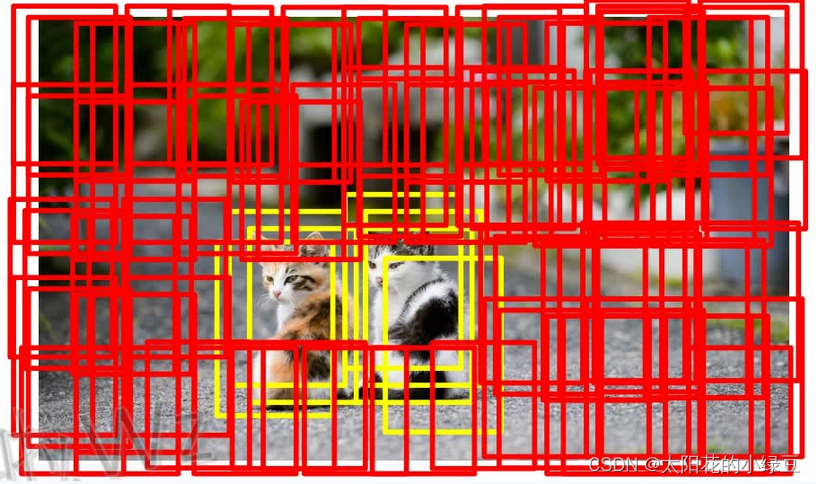
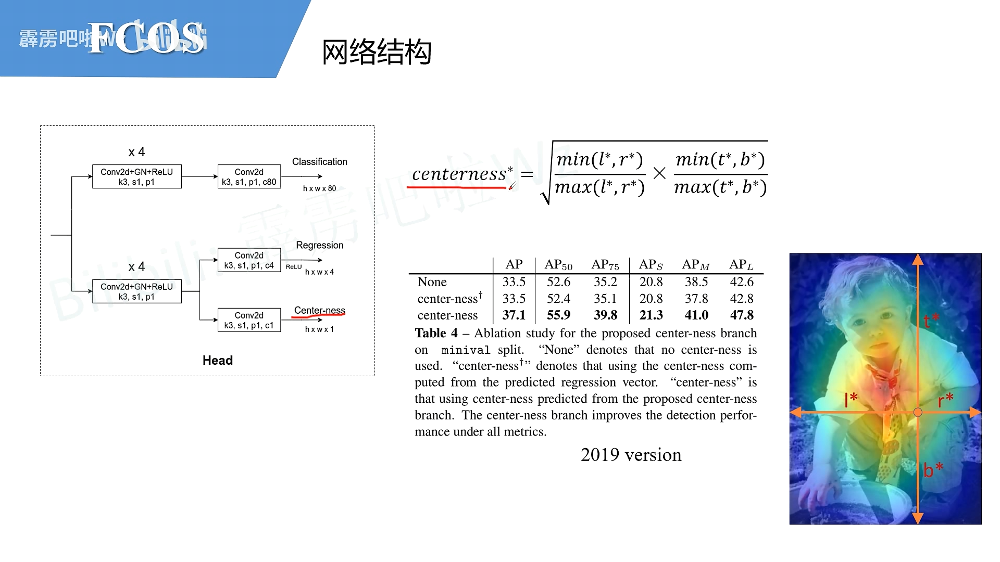
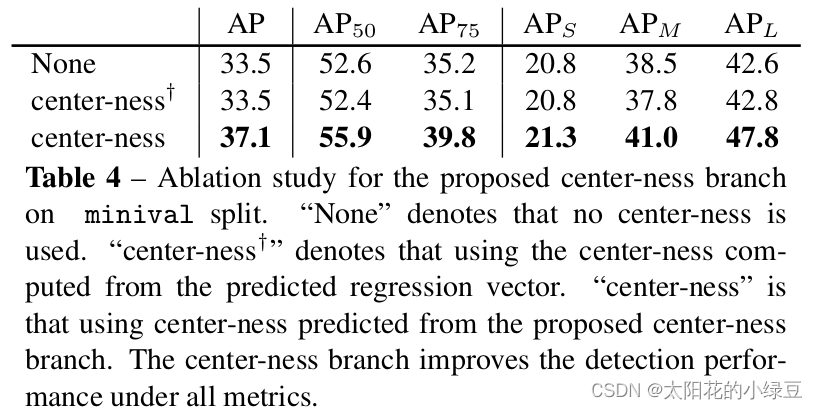
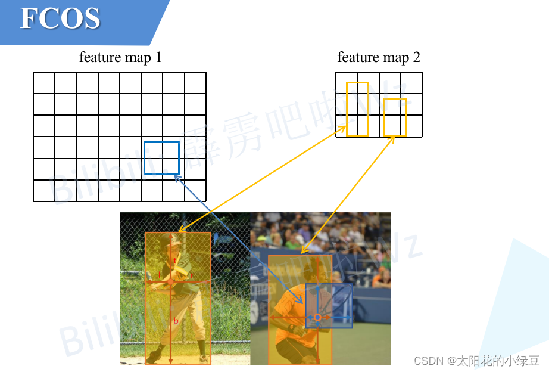
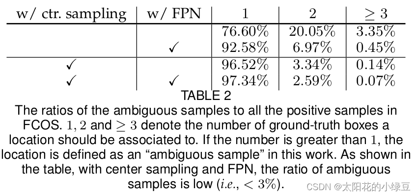
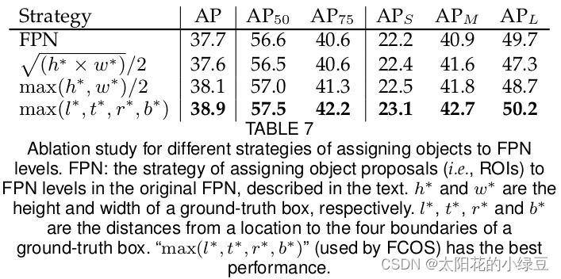
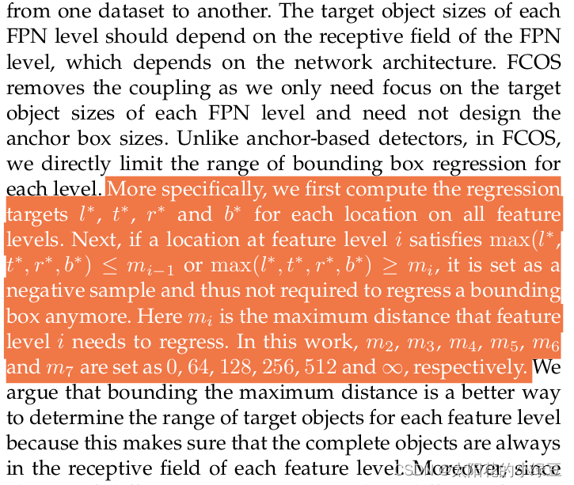

https://blog.csdn.net/qq_37541097/article/details/124844726?spm=1001.2014.3001.5502

https://mp.weixin.qq.com/s/2YiLmypIMuJQledtE-Utfw

论文名称：《FCOS: Fully Convolutional One-Stage Object Detection》

论文下载地址：

- https://arxiv.org/abs/1904.01355
- https://arxiv.org/abs/2006.09214 (注：2020年更新后的版本，比如center-ness分支有些小改动)

## 0 前言

在之前讲的一些目标检测网络中，比如`Faster RCNN`系列、`SSD`、`YOLOv2~v5`（注意`YOLOv1`不包括在内）都是基于Anchor进行预测的。即先在原图上生成一堆密密麻麻的Anchor  Boxes，然后网络基于这些Anchor去预测它们的类别、中心点偏移量以及宽高缩放因子得到网络预测输出的目标，最后通过NMS即可得到最终预测目标。那基于Anchor的网络存在哪些问题呢，在FCOS论文的`Introduction`中，作者总结了四点：

1. 检测器的性能和Anchor的size以及aspect ratio相关，比如在RetinaNet中改变Anchor（论文中说这是个超参数`hyper-parameters`）能够产生约4%的AP变化。换句话说，Anchor要设置的合适才行。
2. 一般Anchor的size和aspect  ratio都是固定的，所以很难处理那些形状变化很大的目标（比如一本书横着放w远大于h，竖着放h远大于w，斜着放w可能等于h，很难设计出合适的Anchor）。而且迁移到其他任务中时，如果新的数据集目标和预训练数据集中的目标形状差异很大，一般需要重新设计Anchor。
3. 为了达到更高的召回率（查全率），一般需要在图片中生成非常密集的Anchor Boxes尽可能保证每个目标都会有Anchor Boxes和它相交。比如说在FPN（Feature Pyramid  Network）中会生成超过18万个Anchor Boxes（以输入图片最小边长800为例），那么在训练时绝大部分的Anchor  Boxes都会被分为负样本，这样会导致正负样本极度不均。下图是我随手画的样例，红色的矩形框都是负样本，黄色的矩形框是正样本。
4. Anchor的引入使得网络在训练过程中更加的繁琐，因为匹配正负样本时需要计算每个Anchor Boxes和每个GT BBoxes之间的IoU。

虽然基于Anchor的目标检测网络存在如上所述问题，但并不能否认它的有效性，比如现在非常常用的`YOLO v3～v5`，它们都是基于Anchor的网络。当然，今天的主角是Anchor-Free，现今有关Anchor-Free的网络也很多，比如`DenseBox`、`YOLO v1`、`CornerNet`、`FCOS`以及`CenterNet`等等，而我们今天要聊的网络是`FCOS`（它不仅是`Anchor-Free`还是`One-Stage`，`FCN-base`  detector）。这是一篇发表在2019年CVPR上的文章，这篇文章的想法不仅简单而且很有效，它的思想是跳出Anchor的限制，

**在预测特征图的每个位置上直接去预测该点分别距离目标左侧（l: left），上侧（t：top），右侧(r: right)以及下侧（b：bottom）的距离，如下图所示。**

**预测距离中心的 l t r b的长度**

## 1 FCOS网络结构

下面这幅图是原论文中给的FCOS网络结构，还是非常清晰的。注意：这张图是2020年发表的版本，和2019年发表的版本有些不同。区别在于Center-ness分支的位置，在2019年论文的图中是将Center-ness分支和Classification分支放在一起的，但在2020年论文的图中是将Center-ness分支和Regression分支放在一起。论文中也有解释，将Center-ness分支和Regression分支放在一起能够得到更好的结果：

> it has been shown that positioning it on the regression branch can obtain better performance.

下面这张图是我结合Pytorch官方实现FCOS的源码绘制的更加详细的网络结构：

**Head部分是5个输出层共享的**

首先看上图左边的部分，Backbone是以ResNet50为例的，FPN是在Backbone输出的C3、C4和C5上先生成P3、P4和P5，接着在P5的基础上通过一个卷积核大小为`3x3`步距为2的卷积层得到P6，最后在P6的基础上再通过一个卷积核大小为`3x3`步距为2的卷积层得到P7。接着看右边的Head（注意这里的Head是共享的，即P3～P7都是共用一个Head），细分共有三个分支：`Classification`、`Regression`和`Center-ness`。其中`Regression`和`Center-ness`是同一个分支上的两个不同小分支。可以看到每个分支都会先通过4个`Conv2d+GN+ReLU`的组合模块，然后再通过一个卷积核大小为`3x3`步距为1的卷积层得到最终的预测结果。

**对于Classification分支**，在预测特征图的每个位置上都会预测80个score参数（MS COCO数据集目标检测任务的类别数为80）。

**对于Regression分支**，*在预测特征图的每个位置上都会预测4个距离参数（距离目标左侧距离`l`，上侧距离`t`，右侧距离`r`以及下侧距离`b`，注意，这里预测的数值是相对特征图尺度上的）*。假设对于预测特征图上某个点映射回原图的坐标是 $(c_x, c_y)$，*特征图相对原图的步距是`s`*，那么网络预测该点对应的目标边界框坐标为：
$$
x_{min} = c_x - l \cdot s, y_{min} = c_y - t \cdot s \quad\quad\quad (1) \\
x_{max} = c_x + r \cdot s, y_{max} = c_y + b \cdot s \quad\quad\;\; (2)
$$

> **对于Center-ness分支**，在预测特征图的每个位置上都会预测1个参数，`center-ness`反映的是该点（特征图上的某一点）距离目标中心的远近程度，它的值域在0~1之间，距离目标中心越近`center-ness`越接近于1，下面是`center-ness`真实标签的计算公式（计算损失时只考虑正样本，即预测点在目标内的情况，后续会详细讲解）。
>
> $*$ 指的是真实标签
>
> $l^*, r^*, t^*, b^*$ 指的是当前预测点针对真实框的距离
>
> 当在真实框中心点时,`center-ness`为1,因为中心点时 $l==r,t==b$, min,max相等
>
> 右下图中红色点为中心,数值为1,蓝色区域数值为0

$$
centerness^* = 
\sqrt{
\frac 
{min(l^*, r^*)}{max(l^*, r^*)} 
\times \frac 
{min(t^*, b^*)}{max(t^*, b^*)}
}
$$

在网络后处理部分筛选高质量bbox时，会将预测的目标`class score`与`center-ness`相乘再开根，然后根据得到的结果对bbox进行排序，只保留分数较高的bbox，这样做的目的是筛掉那些目标`class score`低且预测点距离目标中心较远的bbox，最终保留下来的就是高质量的bbox。下表展示了使用和不使用`center-ness`对AP的影响，我们只看第一行和第三行，不使用`center-ness`时AP为33.5，使用`center-ness`后AP提升到37.1，说明`center-ness`对FCOS网络还是很有用的。

## 2 正负样本的匹配

在计算损失之前，我们需要进行正负样本的匹配。在基于Anchor的目标检测网络中，一般会通过计算每个Anchor Box与每个GT的IoU配合事先设定的IoU阈值去匹配。比如某个Anchor Box与某个GT的IoU大于0.7，那么我们就将该Anchor  Box设置为正样本。但对于Anchor-Free的网络根本没有Anchor，那该如何匹配正负样本呢。在2020年版本的论文`2.1`章节中有这样一段话：

> Specifically, location (x, y) is considered as a positive sample if it  falls into the center area of any ground-truth box, by following [42].  The center area of a box centered at (cx , cy ) is defined as the  sub-box (cx − rs, cy − rs, cx + rs, cy + rs) , where s is the total  stride until the current feature maps and r is a hyper-parameter being  1.5 on COCO. The sub-box is clipped so that it is not beyond the  original box. Note that this is different from our original conference  version, where we consider the locations positive as long as they are in a ground-truth box.

最开始的一句话是说，对于特征图上的某一点 $(x,y)$，只要它落入GT  box中心区域，那么它就被视为正样本（其实在2019年的文章中，最开始说的是只要落入GT内就算正样本）。对应的参考文献[42]就是2019年发表的FCOS版本。但在2020年发表的FCOS版本中，新加了一条规则，在满足以上条件外，还需要满足**点 $(x,y)$ 在 $(c_x-rs, c_y-rs, c_x+rs, c_y+rs)$ 这个`sub-box`范围内，其中  $(c_x,c_y)$ GT的中心点，`s`是特征图相对原图的步距，`r`是一个超参数控制距离GT中心的远近，在COCO数据集中`r`设置为1.5**，关于`r`的消融实验可以看2020版论文的表6。换句话说点 $(x,y)$ 不仅要在GT的范围内，还要离GT的中心点 $(c_x,c_y)$ 足够近才能被视为正样本。

为了方便大家理解我画了下面这幅图，假设上面两个feature  map对应的是同一个特征图，将特征图上的每个点映射回原图就是下面图片中黑色的圆点。根据2019年发表论文的匹配准则，只要落入GT  box就算正样本，所以左侧的feature map中打勾的位置都被视为正样本。根据2020年的版本，不仅要落入GT Box还要在 $(c_x-rs, c_y-rs, c_x+rs, c_y+rs)$ 个`sub-box`范围内，所以右侧的feature map中打勾的位置都被视为正样本。

这里肯定有人会问，如果feature map上的某个点同时落入两个GT Box内（即两个GT Box相交区域），那该点到底分配给哪个GT Box，这就是论文中提到的Ambiguity问题。

**如下图所示，橙色圆圈对应的点同时落入`人`和`球拍`两个GT Box中，此时默认将该点分配给面积Area最小的GT Box，即图中的`球拍`。其实引入FPN后能够减少这种情况，后面4.1章节会讲。**

## 3 损失计算

在前面讲FCOS网络结构中有提到，Head总共有三个输出分支：`Classification`、`Regression`和`Center-ness`。故损失由分类损失 $L_{cls}$、定位损失 $L_{reg}$ 以及`center-ness`损失 $ L_{ctrness}$ 三部分共同组成：
$$
\begin{aligned}
L\left(\left\{p_{x, y}\right\},\left\{t_{x, y}\right\},\left\{s_{x, y}\right\}\right) &=\frac{1}{N_{p o s}} \sum_{x, y} L_{c l s}\left(p_{x, y}, c_{x, y}^{*}\right) \\
&+\frac{1}{N_{p o s}} \sum_{x, y} 1_{\left\{c_{x, y}^{*}>0\right\}} L_{r e g}\left(t_{x, y}, t_{x, y}^{*}\right) \\
&+\frac{1}{N_{p o s}} \sum_{x, y} 1_{\left\{c_{x, y}^{*}>0\right\}} L_{c t r n e s s}\left(s_{x, y}, s_{x, y}^{*}\right)
\end{aligned}
$$

其中：

- $p_{x,y}$ 表示在特征图 $(x,y)$ 点处预测的每个类别的score
- $c_{x,y}^∗$ 表示在特征图 $(x,y)$ 点对应的真实类别标签
- $1_{\{c_{x,y}^∗ > 0\}}$ 表示在特征图 $(x,y)$ 点被匹配为正样本时为1，否则为0
- $t_{x,y}$ 表示在特征图 $(x,y)$ 点处预测的目标边界框信息
- $t_{x,y}^*$ 表示在特征图 $(x,y)$ 点对应的真实目标边界框信息
- $s_{x,y}$ 表示在特征图 $(x,y)$ 点处预测的`center-ness`
- $s_{x,y}^*$ 表示在特征图 $(x,y)$ 点对应的真实`center-ness`

1. 对于分类损失 $L_{cls}$ 采用`bce_focal_loss`，即二值交叉熵损失配合`focal_loss`，计算损失时所有样本都会参与计算（正样本和负样本）。

2. 定位损失 $L_{reg}$ 采用`giou_loss`（在2019版中采用`iou_loss`，但在2020版中说采用`giou_loss`会更好一点），计算损失时只有正样本参与计算。

3. `center-ness`损失采用`bce_loss`二值交叉熵损失，计算损失时只有正样本参与计算。

> 在匹配正负样本过程中，对于特征图 $(x,y)$ 点处对应的GT信息 $c^*_{x,y}$ 和 $t^*_{x,y}$ 比较好得到，只要匹配到某一GT目标则 $c^*_{x,y} $ 对应GT的类别， $t^*_{x,y}$ 对应GT的bbox。而获取真实的`center-ness` $(s^*_{x,y})$ 要复杂一点，下面是 $s^*_{x,y}$ 的计算公式，前面有提到过。
>
> $*$ 指的是真实标签
>
> $l^*, r^*, t^*, b^*$ 指的是当前预测点针对真实框的距离

$$
centerness^* = 
\sqrt{
\frac 
{min(l^*, r^*)}{max(l^*, r^*)} 
\times 
\frac 
{min(t^*, b^*)}{max(t^*, b^*)}
}
$$
> 为了方便大家理解，同样画了一幅图，如下图所示。假设对于特征图上的某一个点（图中用蓝色填充的`cell`）映射回原图，对应图片中的黑色点。然后计算该点距离GT box左侧，上测，右侧，下侧的距离就能得到 $l^*,t^*,r^*,b^*$ 套用上面的公式就能得到 $s^*_{x,y}$ （这里的 $l^*, t^*, r^*, b^*$ 无论是计算特征图尺度上的还是原图尺度上的都无所谓，因为 $centerness^*$ 对尺度不敏感）。

## 4 其他

### 4.1 Ambiguity问题

在论文中专门有一部分内容用来分析ambiguous samples问题，即在匹配正样本时当特征图上的某一点同时落入多个GT Box内时，到底应该分配给哪一个GT的问题：

> Another concern about the FCN-based detector is that it may have a large number of ambiguous samples due to the overlap in ground-truth boxes.

前面在讲正负样本匹配内容时，有提到过当特征图上的某一点同时落入多个GT Box内时，默认将该点分配给面积Area最小的GT  Box，当然这并不是一个很好的解决办法。ambiguous  samples的存在始终会对网络的学习以及预测产生干扰。作者在COCO2017的val数据上进行了分析，作者发现如果不使用FPN结构时（仅在P4特征层上进行预测）会存在大量的ambiguous samples（大概占23.16%），如果启用FPN结构ambiguous  samples会大幅降低（大概占7.24%）。因为在FPN中会采用多个预测特征图，不同尺度的特征图负责预测不同尺度的目标。比如P3负责预测小型目标，P5负责预测中等目标，P7负责预测大型目标。下面我也画了一幅示意图，比如对于小型目标`球拍`，根据尺度划分准则（4.2中会讲）它被划分到feature map 1上，而对于大型目标`人`，根据尺度划分准则被划分到feature map 2上，这样在匹配正负样本时能够将部分重叠在一起的目标（这里主要指不同尺度的目标）给分开，即解决了大部分ambiguous samples问题。

如果再采用`center sampling`匹配准则（即在2020年更新的FCOS版本中，匹配正样本时要求不仅要落入GT Box还要在 $(c_x-rs, c_y-rs, c_x+rs, c_y+rs)$ 这个`sub-box`范围内）能够进一步降低ambiguous samples的比例（小于3%）。在论文表2中（2020版）有给出ambiguous samples比例的消融实验结果。

### 4.2 Assigning objects to FPN

这部分内容只在2020版的论文中有进行讨论。在上面已经讨论了使用FPN结构能够降低ambiguous  samples的比例。那么按照怎样的准则将目标划分到对应尺度的特征图上呢？在FPN中是采用如下计算公式分配的，之前在讲FPN时有详细讲过，这里不再赘述，如果有不了解的可以翻看之前的视频，https://b23.tv/Qhn6xA
$$
k=
\left\lfloor 
k_{0}+\log _{2}(\sqrt{w h} / 224)
\right\rfloor
$$
但在FCOS中，作者发现直接套用FPN中的公式效果并不是很好。作者**猜测**是因为按照FPN中的分配准则，不能确保目标在对应感受野范围内。比如对于某个特征层，每个`cell`的感受野为`28x28`，但分配到该特征层上的目标为`52x52`（举的这个例子可能不太恰当，因为head中采用的都是`3x3`大小的卷积层）。

> As shown in Table 7, this strategy results in degraded performance ( 37.7% AP). We conjecture that it may be because the strategy cannot make sure the complete object be within the receptive field of the target FPN  level.

接着作者自己也尝试了其他的一些匹配策略，如下表7：

> 最终采用的是 $max(l^*,t^*,r^*,b^*)$ 策略，其中  $l^*,t^*,r^*,b^*$  分别代表某点（特征图映射在原图上）相对GT Box左边界、上边界、右边界以及下边界的距离（在上面`3 损失计算`中有讲过）。关于这个策略在2020版论文的2.2章节中介绍的很清楚，对于不同的预测特征层只要满足以下公式即可，比如说对于P4特征图只要 $max(l^*,t^*,r^*,b^*)$ 在 $(64,128)$ 之间即为正样本：
>
> $*$ 指的是真实标签
>
> $l^*, r^*, t^*, b^*$ 指的是当前预测点针对真实框的距离

$$
  m_{i-1}<\max \left(l^{*}, t^{*}, r^{*}, b^{*}\right)<m_{i}
$$
关于原文中的介绍如下，这里就不再进一步讲解了，大家自己看看就知道了。

> **不同层的输出对应的m,比如p3 对应m2 m3,也就是 0 64 之间**
>
> m2  m3  m4  m5  m6  m7
>
> 0     64  128  256 512 $\infin$

到此，有关FCOS的内容就基本讲完了。如果觉得这篇文章对你有用，记得点赞、收藏并分享给你的小伙伴们哦😄。