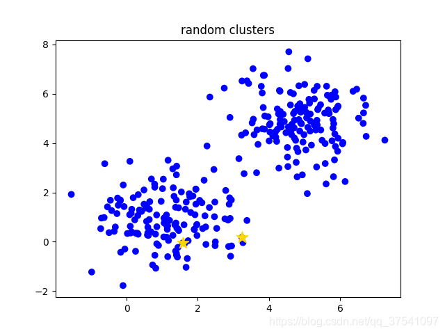
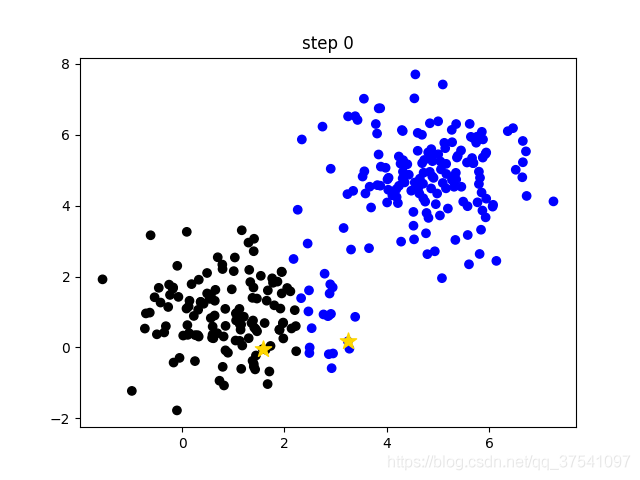
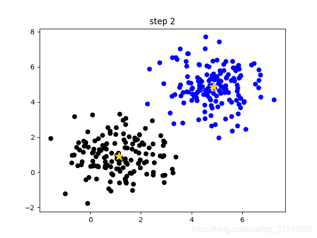
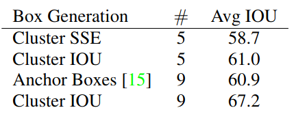

在之前讲yolo理论基础知识时有提到过，从yolov2开始使用的anchors都是通过聚类得到的。如果想了解更多yolo相关的知识可以看看我在bilibili上录得视频：https://www.bilibili.com/video/BV1yi4y1g7ro

今天补下之前没有细讲的聚类anchors相关知识，所使用的代码参考的是`yolov3 spp`以及`yolov5`中生成anchors的方法。

# K-means理论简介

k-means是非常经典且有效的聚类方法，通过计算样本之间的距离（相似程度）将较近的样本聚为同一类别（簇）。使用k-means时主要关注两个问题（个人认为）：1.如何表示样本与样本之间的距离（核心问题），这个一般需要根据具体场景去设计，不同的方法聚类效果也不同，最常见的就是欧式距离。2.分为几类，这个也是需要根据应用场景取选择的，也是一个超参数。

k-means算法主要流程如下：

1. 手动设定簇的个数k，假设k=2。
2. 在所有样本中随机选取k个样本作为簇的初始中心，如下图（random clusters）中两个黄色的小星星代表随机初始化的两个簇中心。
3. 计算每个样本离每个簇中心的距离（这里以欧式距离为例），然后将样本划分到离它最近的簇中。如下图（step 0）用不同的颜色区分不同的簇。
4. 更新簇的中心，计算每个簇中所有样本的均值（方法不唯一）作为新的簇中心。如下图（step 1）所示，两个黄色的小星星已经移动到对应簇的中心。
5. 重复第3步到第4步直到簇中心不在变化或者簇中心变化很小满足给定终止条件。如下图（step2）所示，最终聚类结果。






`plot_kmeans.py`生成以上聚类过程图片的代码： 

```python
import numpy as np
from matplotlib import pyplot as plt
np.random.seed(0)

colors = np.array(['blue', 'black'])


def plot_clusters(data, cls, clusters, title=""):
    if cls is None:
        c = [colors[0]] * data.shape[0]
    else:
        c = colors[cls].tolist()

    plt.scatter(data[:, 0], data[:, 1], c=c)
    for i, clus in enumerate(clusters):
        plt.scatter(clus[0], clus[1], c='gold', marker='*', s=150)
    plt.title(title)
    plt.show()
    plt.close()


def distances(data, clusters):
    xy1 = data[:, None]  # [N,1,2]
    xy2 = clusters[None]  # [1,M,2]
    d = np.sum(np.power(xy2 - xy1, 2), axis=-1)
    return d


def k_means(data, k, dist=np.mean):
    """
    k-means methods
    Args:
        data: 需要聚类的data
        k: 簇数(聚成几类)
        dist: 更新簇坐标的方法
    """
    data_number = data.shape[0]
    last_nearest = np.zeros((data_number,))

    # init k clusters
    clusters = data[np.random.choice(data_number, k, replace=False)]
    print(f"random cluster: \n {clusters}")
    # plot
    plot_clusters(data, None, clusters, "random clusters")

    step = 0
    while True:
        d = distances(data, clusters)
        current_nearest = np.argmin(d, axis=1)

        # plot
        plot_clusters(data, current_nearest, clusters, f"step {step}")
        
        if (last_nearest == current_nearest).all():
            break  # clusters won't change
        for cluster in range(k):
            # update clusters
            clusters[cluster] = dist(data[current_nearest == cluster], axis=0)
        last_nearest = current_nearest
        step += 1

    return clusters


def main():
    x1, y1 = [np.random.normal(loc=1., size=150) for _ in range(2)]
    x2, y2 = [np.random.normal(loc=5., size=150) for _ in range(2)]

    x = np.concatenate([x1, x2])
    y = np.concatenate([y1, y2])

    plt.scatter(x, y, c='blue')
    plt.title("initial data")
    plt.show()
    plt.close()

    clusters = k_means(np.concatenate([x[:, None], y[:, None]], axis=-1), k=2)
    print(f"k-means fluster: \n {clusters}")


if __name__ == '__main__':
    main()
```

# K-means在anchors中的应用

**anchor使用欧式距离不好,用 1 - IOU更好**

在之前讲`faster rcnn`理论时，使用的anchors都是作者通过经验手工设计的， 但为什么这么设计作者并未提及。那这里为什么要聚类anchors？`yolov2`论文中有这么一段话`The network can learn to adjust the boxes appropriately but if we pick better priors for the network to start with we can make it easier for the network to learn to predict good detections.`简单的说如果我们一开始就选择了合适的anchors，那么网络就更容易去学习得到好的检测器。那什么才算好的anchors呢？作者通过计算`Avg IOU`即所有目标bboxes与anchors最大IOU的均值作为指标，`Avg IOU`越大代表得到的anchors越好。

上面已经简单介绍了k-means算法的过程，下面在说下yolov2中是怎么利用k-means算法进行聚类得到anchors的。这里主要关注的是如何定义**样本之间的距离**。论文中有这么一句话，`If we use standard k-means with Euclidean distance larger boxes generate more error than smaller boxes.`简单的说就是直接使用欧式距离来计算效果不是很好。那么用什么表示距离呢，论文中使用`1-IOU(bboxes, anchors)`表示距离，如果bbox与对应的簇中心anchorIOU越大，则距离越近（`1-IOU(bboxes, anchors)`越小）。如下图所示采用`Cluster SSE`(Sum of Square Error) 误差平方和（欧式距离）和采用`Cluster IOU`相比，`Cluster IOU`对应的Avg IOU更大，当然你想使用`Cluster SSE`也是可以的。并且在anchors个数相同的情况下`Cluster IOU`得到的Avg IOU比`Faster RCNN`中手工设计（Anchor Boxes）的Avg IOU更高。

Cluster SSE： 误差平方和（欧式距离）

Anchor Boxes：Faster RCNN




下面是我参考几个开源项目自己改的代码。使用k-means算法，`1-IOU(bboxes, anchors)`作为样本之间的距离进行聚类。代码很简单，简要介绍下：

1. 在所有的bboxes中随机挑选k个作为簇的中心。
2. 计算每个bboxes离每个簇的距离`1-IOU(bboxes, anchors)`
3. 计算每个bboxes距离最近的簇中心，并分配到离它最近的簇中
4. 根据每个簇中的bboxes重新计算簇中心，这里默认使用的是计算中值，自己也可以改成其他方法
5. 重复3到4直到每个簇中元素不在发生变化

代码

https://github.com/WZMIAOMIAO/deep-learning-for-image-processing/blob/master/others_project/kmeans_anchors/yolo_kmeans.py

```python
import numpy as np


def wh_iou(wh1, wh2):
    # Returns the nxm IoU matrix. wh1 is nx2, wh2 is mx2
    wh1 = wh1[:, None]  # [N,1,2]
    wh2 = wh2[None]  # [1,M,2]
    inter = np.minimum(wh1, wh2).prod(2)  # [N,M]
    return inter / (wh1.prod(2) + wh2.prod(2) - inter)  # iou = inter / (area1 + area2 - inter)


def k_means(boxes, k, dist=np.median):
    """
    yolo k-means methods
    refer: https://github.com/qqwweee/keras-yolo3/blob/master/kmeans.py
    Args:
        boxes: 需要聚类的bboxes
        k: 簇数(聚成几类)
        dist: 更新簇坐标的方法(默认使用中位数，比均值效果略好)
    """
    box_number = boxes.shape[0]
    last_nearest = np.zeros((box_number,))
    # np.random.seed(0)  # 固定随机数种子

    # init k clusters
    clusters = boxes[np.random.choice(box_number, k, replace=False)]

    while True:
        distances = 1 - wh_iou(boxes, clusters)
        current_nearest = np.argmin(distances, axis=1)
        if (last_nearest == current_nearest).all():
            break  # clusters won't change
        for cluster in range(k):
            # update clusters
            clusters[cluster] = dist(boxes[current_nearest == cluster], axis=0)

        last_nearest = current_nearest

    return clusters
```

# yolov5中聚类anchors代码讲解

如果你是直接使用yolov5的训练脚本，那么它会自动去计算下默认的anchors与你数据集中所有目标的best possible recall，如果小于0.98就会根据你自己数据集的目标去重新聚类生成anchors，反之使用默认的anchors。

下面代码是我根据yolov5中聚类anchors的代码简单修改得到的。基本流程不变，主要改动了三点：1.对代码做了些简化。2.把使用pytorch的地方都改成了numpy（感觉这样会更通用点，但numpy效率确实没有pytorch高）。我自己改成了基于`1-IOU(bboxes, anchors)`距离的方法。当然我只是注释掉了作者原来的方法，如果想用自己把注释取消掉就行了。但在我使用测试过程中，还是基于`1-IOU(bboxes, anchors)`距离的方法会略好点。

完整代码链接：https://github.com/WZMIAOMIAO/deep-learning-for-image-processing/tree/master/others_project/kmeans_anchors

其实在yolov5生成anchors中不仅仅使用了**k-means**聚类，还使用了**Genetic Algorithm**遗传算法，在**k-means**聚类的结果上进行**mutation**变异。接下来简单介绍下代码流程：

1. 读取训练集中每张图片的wh以及所有bboxes的wh（这里是我自己写的脚本读取的PASCAL VOC数据）
2. 将每张图片中wh的最大值等比例缩放到指定大小`img_size`，由于读取的bboxes是相对坐标所以不需要改动
3. 将bboxes从相对坐标改成绝对坐标（乘以缩放后的wh）
4. 筛选bboxes，保留wh都大于等于两个像素的bboxes
5. 使用k-means聚类得到n个anchors
6. 使用遗传算法随机对anchors的wh进行变异，如果变异后效果变得更好（使用anchor_fitness方法计算得到的fitness（适应度）进行评估）就将变异后的结果赋值给anchors，如果变异后效果变差就跳过，默认变异1000次。
7. 将最终变异得到的anchors按照面积进行排序并返回

> main.py

```python
import random
import numpy as np
from tqdm import tqdm
from scipy.cluster.vq import kmeans

from read_voc import VOCDataSet
from yolo_kmeans import k_means, wh_iou


def anchor_fitness(k: np.ndarray, wh: np.ndarray, thr: float):  # mutation fitness
    r = wh[:, None] / k[None]
    x = np.minimum(r, 1. / r).min(2)  # ratio metric
    # x = wh_iou(wh, k)  # iou metric
    best = x.max(1)
    f = (best * (best > thr).astype(np.float32)).mean()  # fitness
    bpr = (best > thr).astype(np.float32).mean()  # best possible recall
    return f, bpr


def main(img_size=512, n=9, thr=0.25, gen=1000):
    # 从数据集中读取所有图片的wh以及对应bboxes的wh
    dataset = VOCDataSet(voc_root="/data", year="2012", txt_name="train.txt")
    im_wh, boxes_wh = dataset.get_info()

    # 最大边缩放到img_size
    im_wh = np.array(im_wh, dtype=np.float32)
    shapes = img_size * im_wh / im_wh.max(1, keepdims=True)
    wh0 = np.concatenate([l * s for s, l in zip(shapes, boxes_wh)])  # wh

    # Filter 过滤掉小目标
    i = (wh0 < 3.0).any(1).sum()
    if i:
        print(f'WARNING: Extremely small objects found. {i} of {len(wh0)} labels are < 3 pixels in size.')
    wh = wh0[(wh0 >= 2.0).any(1)]  # 只保留wh都大于等于2个像素的box

    # Kmeans calculation
    # print(f'Running kmeans for {n} anchors on {len(wh)} points...')
    # s = wh.std(0)  # sigmas for whitening
    # k, dist = kmeans(wh / s, n, iter=30)  # points, mean distance
    # assert len(k) == n, print(f'ERROR: scipy.cluster.vq.kmeans requested {n} points but returned only {len(k)}')
    # k *= s
    k = k_means(wh, n)

    # 按面积排序
    k = k[np.argsort(k.prod(1))]  # sort small to large
    f, bpr = anchor_fitness(k, wh, thr)
    print("kmeans: " + " ".join([f"[{int(i[0])}, {int(i[1])}]" for i in k]))
    print(f"fitness: {f:.5f}, best possible recall: {bpr:.5f}")

    # Evolve
    # 遗传算法(在kmeans的结果基础上变异mutation)
    npr = np.random
    f, sh, mp, s = anchor_fitness(k, wh, thr)[0], k.shape, 0.9, 0.1  # fitness, generations, mutation prob, sigma
    pbar = tqdm(range(gen), desc=f'Evolving anchors with Genetic Algorithm:')  # progress bar
    for _ in pbar:
        v = np.ones(sh)
        while (v == 1).all():  # mutate until a change occurs (prevent duplicates)
            v = ((npr.random(sh) < mp) * random.random() * npr.randn(*sh) * s + 1).clip(0.3, 3.0)
        kg = (k.copy() * v).clip(min=2.0)
        fg, bpr = anchor_fitness(kg, wh, thr)
        if fg > f:
            f, k = fg, kg.copy()
            pbar.desc = f'Evolving anchors with Genetic Algorithm: fitness = {f:.4f}'

    # 按面积排序
    k = k[np.argsort(k.prod(1))]  # sort small to large
    print("genetic: " + " ".join([f"[{int(i[0])}, {int(i[1])}]" for i in k]))
    print(f"fitness: {f:.5f}, best possible recall: {bpr:.5f}")


if __name__ == "__main__":
    main()
```

运行结果如下，注意由于随机性每次结果都会有些差异，如果要能够复现，需要固定numpy以及random包的随机数种子。

```
read data info.: 100%|██████████| 5717/5717 [00:00<00:00, 6549.98it/s]
kmeans: [12, 18] [27, 31] [33, 69] [75, 48] [65, 118] [125, 137] [164, 268] [299, 166] [382, 337]
fitness: 0.73256, best possible recall: 0.99956
Evolving anchors with Genetic Algorithm: fitness = 0.7358: 100%|██████████| 1000/1000 [00:05<00:00, 182.22it/s]
genetic: [13, 23] [34, 31] [30, 75] [79, 66] [69, 143] [142, 134] [169, 270] [331, 177] [391, 338]
fitness: 0.73582, best possible recall: 0.99930
```

# 聚类anchors需要注意的坑

有时使用自己聚类得到的anchors的效果反而变差了，此时你可以从以下几方面进行检查：

- 注意输入网络时训练的图片尺寸。这是个很重要的点，因为一般训练/验证时输入网络的图片尺寸是固定的，比如说640x640，那么图片在输入网络前一般会将最大边长缩放到640，同时图片中的bboxes也会进行缩放。所以在聚类anchors时需要使用相同的方式提前去缩放bboxes，否则聚类出来的anchors并不匹配。比如你的图片都是1280x1280大小的，假设bboxes都是100x100大小的，如果不去缩放bboxes，那么聚类得到的anchors差不多是在100x100附近。而实际训练网络时bboxes都已经缩放到50x50大小了，此时理想的anchors应该是50x50左右而不是100x100了。
- 如果使用预训练权重，不要冻结太多的权重。现在训练自己数据集时一般都是使用别人在coco等大型数据上预训练好的权重。而这些权重是基于coco等数据集上聚类得到的结果，并不是针对自己数据集聚类得到的。所以网络为了要适应新的anchors需要调整很多权重，如果你冻结了很多层（假设只去微调最后的预测器，其他权重全部冻结），那么得到的结果很大几率还没有之前的anchors好。当可训练的权重越来越多，一般使用自己数据集聚类得到的anchors会更好一点（前提是自己聚类的anchors是合理的）。