# TP FP FN

Precision： 精确率 查准率

Recall：      召回率 查全率

P-R曲线： Presicion-Recall曲线

AP： P-R曲线下面积

mAP: mean Average Persion， 各类别再指定IoU下的AP平均值

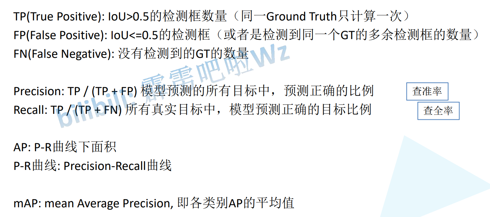


## 计算精确率和召回率

> num_ob = 2 有2个目标
>
> GT ID: 真实框id，绿色的
>
> 根据IOU判断是否是正确 IoU=0.5(大于0.5的为正值)
>
> 按照confidence排序

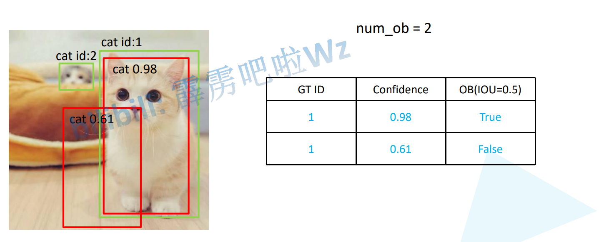

> num_ob = 3 累加目标个数
>
> 记录新的数据
>
> 按照confidence排序

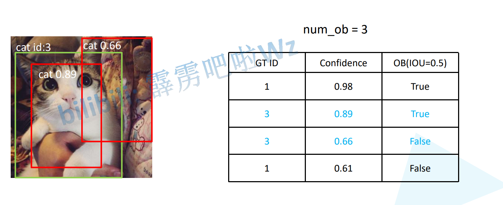

> num_obj = 7 累加个数

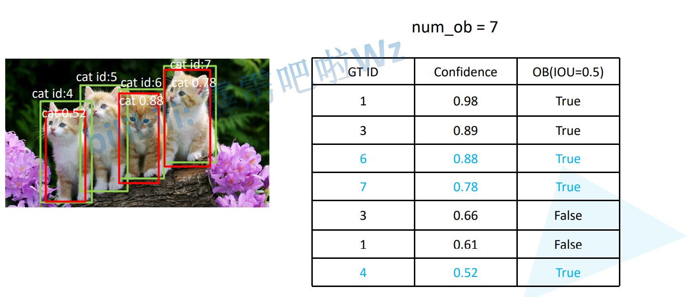


> 根据置信度选择是否是正样本
>
> Confidence >= 0.98 为阈值
>
> 有1个正样本，检测到1个，Persion为 1/1 = 1，Recall = 1/7 = 0.14

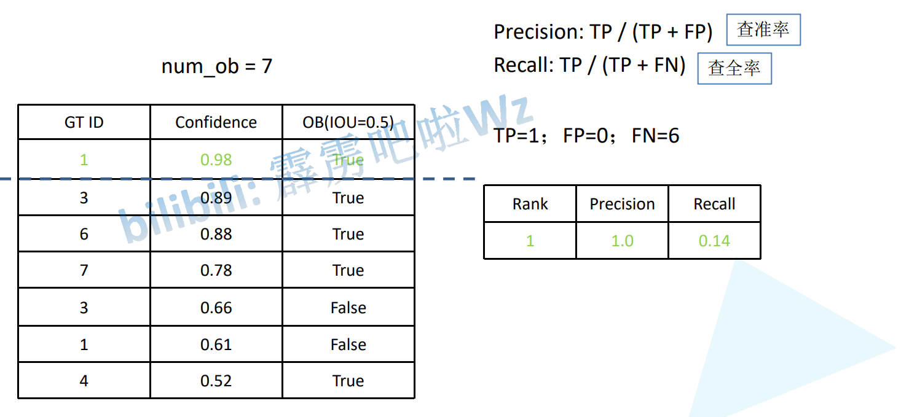

> 根据置信度选择是否是正样本
>
> Confidence >= 0.89 为阈值
>
> 有2个正样本，检测到2个，Presicion为 2/2 = 1，Recall = 2/7 = 0.28

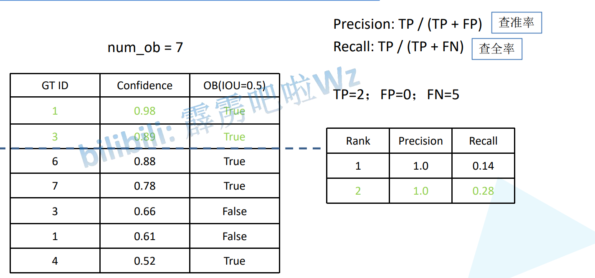

> 根据置信度选择是否是正样本
>
> Confidence >= 0.88 为阈值
>
> 有3个正样本，检测到3个，Presicion为 3/3 = 1，Recall = 3/7 = 0.42

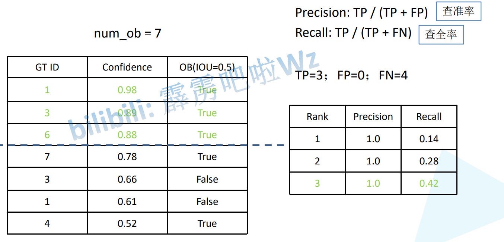

> 根据置信度选择是否是正样本
>
> Confidence >= 0.78 为阈值
>
> 有4个正样本，检测到4个，Presicion为 4/4 = 1，Recall = 4/7 = 0.57

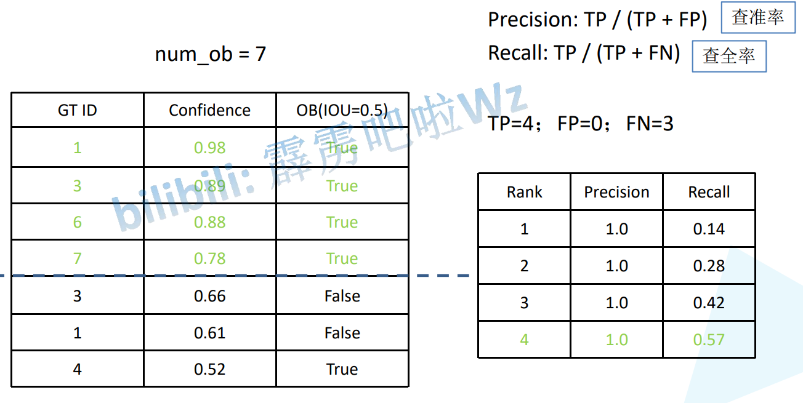

> 根据置信度选择是否是正样本
>
> Confidence >= 0.66 为阈值
>
> 有5个正样本，检测到4个，Presicion为 4/5 = 0.8，Recall = 4/7 = 0.57

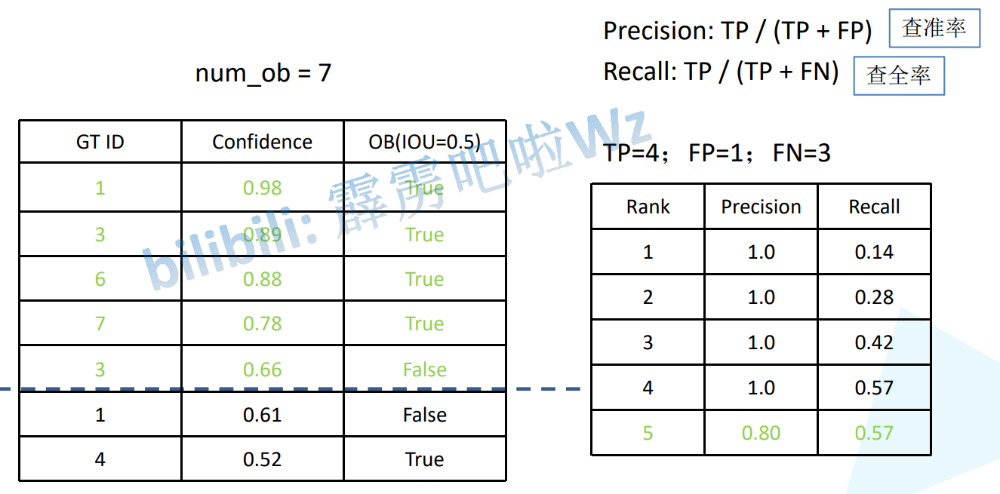


> 根据置信度选择是否是正样本
>
> Confidence >= 0.6 为阈值
>
> 有6个正样本，检测到4个，Presicion为 4/6 = 0.66，Recall = 4/7 = 0.57

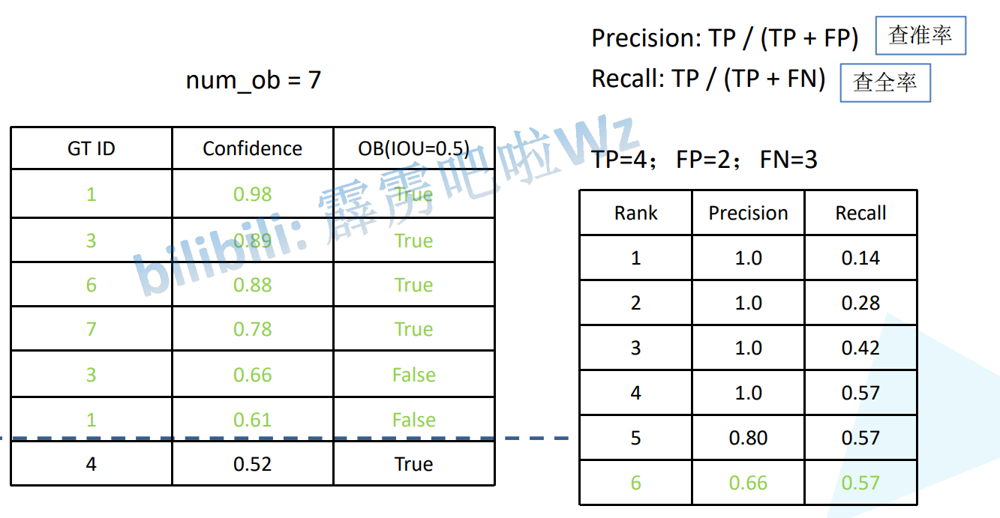

> 根据置信度选择是否是正样本
>
> Confidence >= 0.5 为阈值
>
> 有7个正样本，检测到5个，Presicion为 5/7 = 0.71，Recall = 5/7 = 0.71

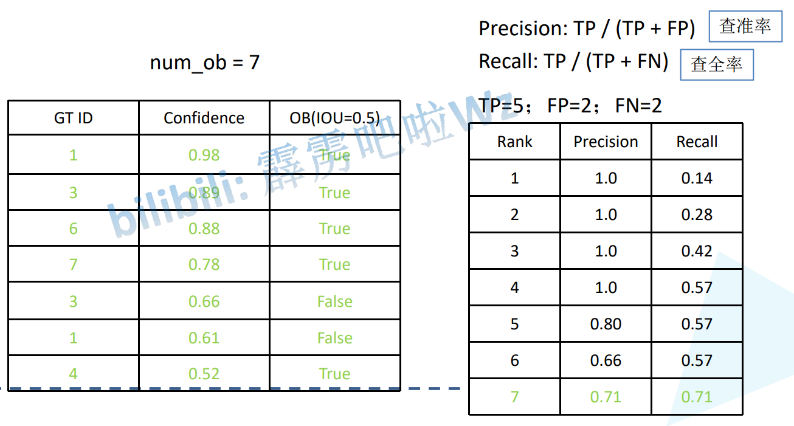


## 绘制 P-R 曲线

> **这些点是根据上面的Confidence的阈值获取的**
>
> **横坐标的Recall越来越大,同时Confidence的阈值越来越小(IOU的阈值用来判断为正样本或负样本,一次中都是相同的,如0.5,而Confidence的阈值由大到小变化)**
>
> 注意: 横坐标对应 Recall,有可能出现重复的情况,选择对应最大的Presicion,下图 5 6 忽略掉,选择4
>
> **下面的面积就是AP,注意最后没用梯形的面积,直接用的长方形面积**
>
> 这里求的是猫的AP,求出其他类别取平均值就是mAP
>
> **注意框的经过非极大值抑制后的**

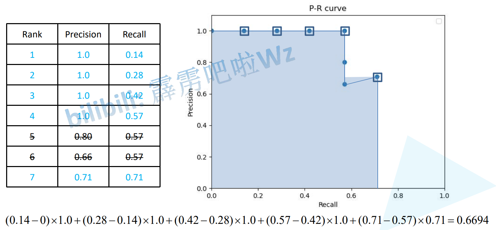


> bottle的AP  随着Confidence阈值变高而变大

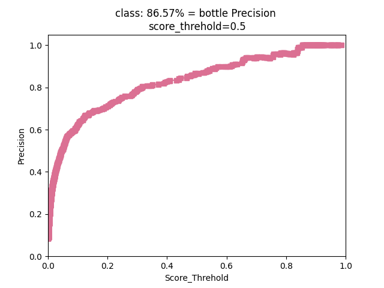

> bottle的召回率  随着Confidence阈值变高而降低


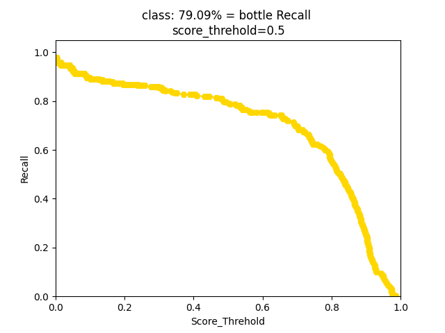

> bottle的AP
>
> 横坐标的Recall越来越大,同时Confidence的阈值越来越小(IOU的阈值用来判断为正样本或负样本,一次中都是相同的,如0.5,而Confidence的阈值由大到小变化)

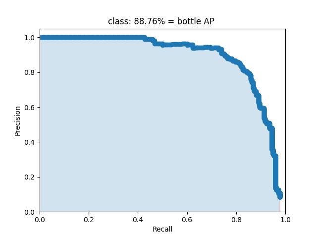

> IoU=0.5 mAP
>
> IoU区分正负样本
>
> Confidence由高到低获取Precision和Recall 
>
> 通过Precision和Recall绘制P-R曲线,下面的面积就是AP,所有种类的AP平均值就是mAP

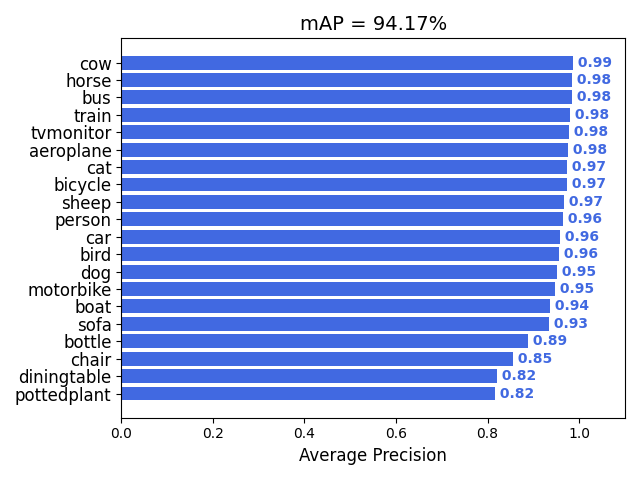


# COCO Eval Reult

> AP
>
> 第一行 AP: IoU在0.50~0.95,间隔0.5的是个IoU的均值(IoU判断是否为正样本)的mAP
>
> 第二行 IoU=0.50 IoU为0.5时的mAP,VOC标准
>
> 第三行 IoU=0.75 IoU为0.5时的mAP,严格标准(IoU越大,阈值越高)

> AP Across Scale 不同尺度物体大小的mAP
>
> 不同的目标大小,后面是物体面积大小标识

> Average Recall 平均召回率
>
> max=1 每个图片最多取1个预测框
>
> max=10 每个图片最多取10个预测框
>
> max=100 每个图片最多取100个预测框

> Across Scales 不同尺度物体大小的召回率
>
> 不同的目标大小,后面是物体面积大小标识

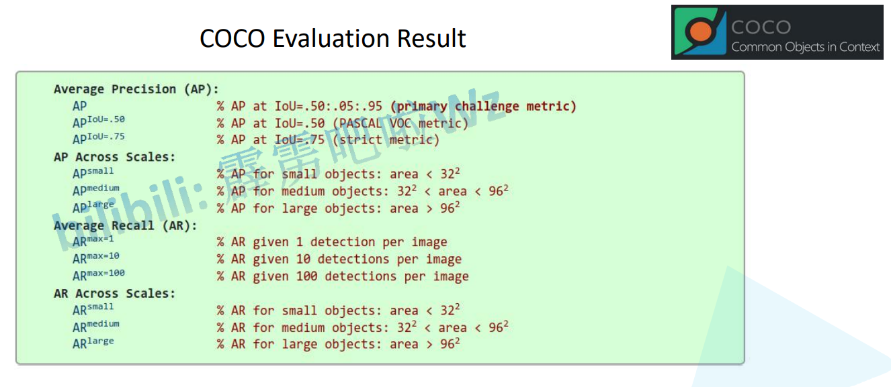

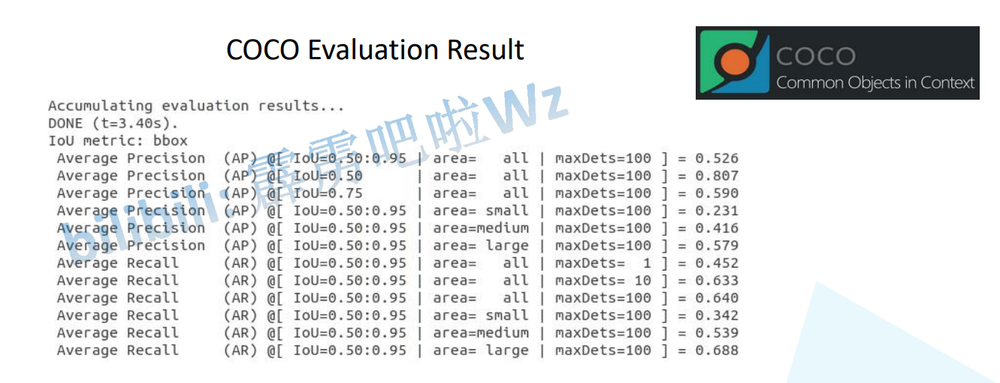


# mAP

mAP（Mean Average Precision）均值平均准确率，即检测多个目标类别的平均准确率。在目标检测领域mAP是一个最为常用的指标。具体概念不叙述，本文主要讲如何利用[Github](https://so.csdn.net/so/search?q=Github&spm=1001.2101.3001.7020)上一些开源项目计算自己网络的mAP值等信息。首先给出两个Github链接，**[链接1](https://github.com/Cartucho/mAP)**；**[链接2](https://github.com/rafaelpadilla/Object-Detection-Metrics)**。这两个链接项目都可以帮助我们计算mAP的值，用法也差不多，链接1感觉用起来更简单点，链接2的功能更全面点（绘制的Precision-Recall曲线更准）。本文主要介绍下链接项目1的使用方法，利用项目1最终能得到如下图所示的计算结果（虽然也能绘制P-R曲线，但感觉绘制的不准确）。

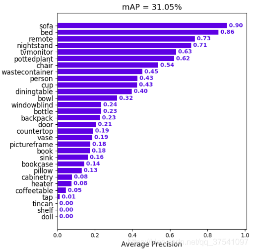

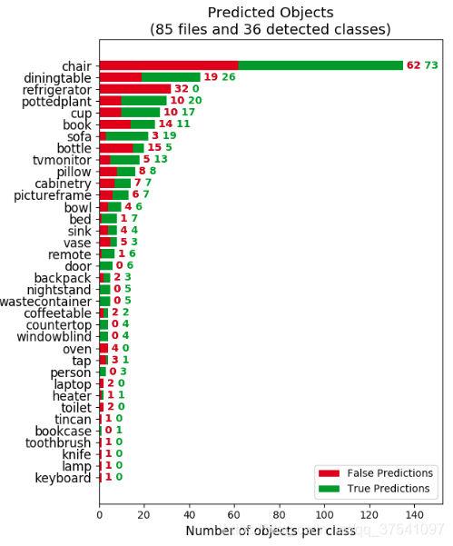

# 项目的使用流程

使用方法流程主要分为如下几步：

1. 克隆项目代码；
2. 创建ground-truth文件，并将文件复制到克隆项目的 input/ground-truth/ 文件夹中；
3. 创建detection-results文件，并将文件复制到克隆项目的 input/detection-results/ 文件夹中；
4. 将与detection-results对应的验证图像文件放入克隆项目 input/images-optional 文件夹中（该步骤为可选项，可以不放入图像，如果放入图像会将标注框、检测框都绘制在图像上，方便后期分析结果）；
5. 在项目文件夹中打开终端，并执行指令python main.py即可得到结果（结果全部保存在克隆项目的results文件夹中）。

## 1）克隆代码

打开项目1https://github.com/Cartucho/mAP进行克隆，或者直接使用git克隆。

## 2）创建ground-truth文件

在项目的readme中有给出事例：

例如图像1中的标注信息（image_1.txt），文件的命名要与图像命名相同，每一行的参数为类别名称、左上角x坐标、左上角y坐标、右下角x坐标、右下角y坐标

```txt
<class_name> <left> <top> <right> <bottom> [<difficult>]
```

参数difficult是可选项，每一个图像文件对应生成一个txt文件，与PASCAL VOC的xml文件一样，一一对应。

```
tvmonitor 2 10 173 238
book 439 157 556 241
book 437 246 518 351 difficult
pottedplant 272 190 316 259
```

将所有生成好的文件复制到克隆项目的 input/ground-truth/ 文件夹中

## 3）创建detection-results文件

同样在项目的readme中有给出事例：

对于图像1的实际预测信息（image_1.txt），文件的命名要与图像命名相同，每一行的参数为类别名称、预测概率、预测左上角x坐标、预测左上角y坐标、预测右下角x坐标、预测右下角y坐标

```xml
<class_name> <confidence> <left> <top> <right> <bottom>
```

每个预测图像对应生成一个txt文件

```
tvmonitor 0.471781 0 13 174 244
cup 0.414941 274 226 301 265
book 0.460851 429 219 528 247
chair 0.292345 0 199 88 436
book 0.269833 433 260 506 336
```

将所有生成好的预测文件复制到克隆项目的 input/detection-results/ 文件夹中

## 4）复制图像文件（可选）

将与detection-results对应的验证图像文件放入克隆项目 input/images-optional 文件夹中（该步骤为可选项，可以不放入图像，如果放入图像会将标注框、检测框都绘制在图像上，方便后期分析结果）

## 5）开始计算

在项目文件夹中打开终端，并执行指令python main.py即可得到结果（结果全部保存在克隆项目的results文件夹中，**注：该项目的计算结果是IOU阈值取0.5的结果**）

