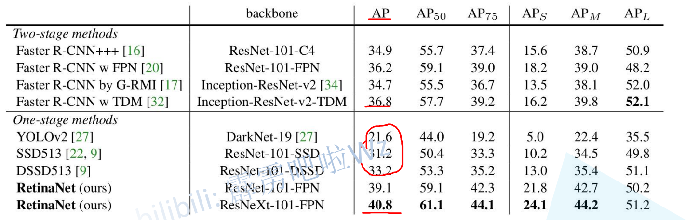
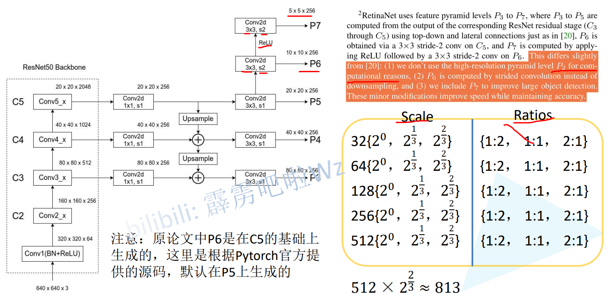
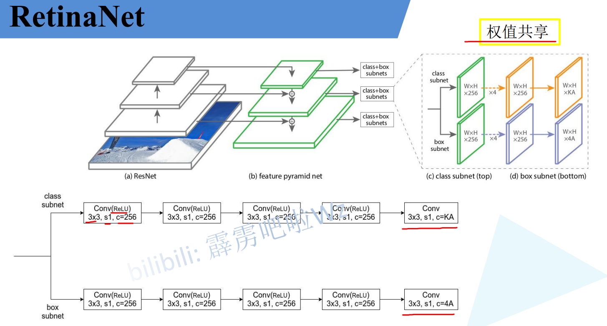
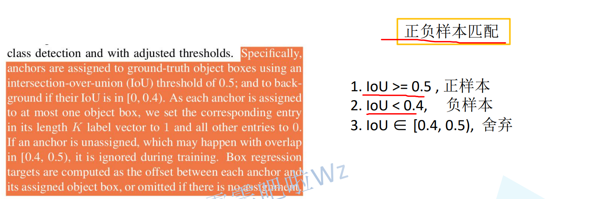
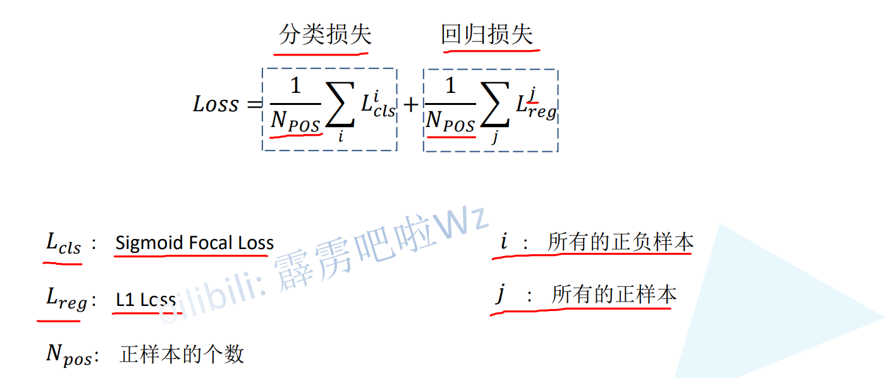

# one-stage首次超越two-stage

# 网络结构

> 使用了FPN结构
>
> 注意右侧P5下采样使用了是s=2的卷积

> 每个特征层使用了3个框和3种比例一共9个特征层
>
> Scale $32\{2^0,2^{\frac 1 3}, 2^{\frac 2 3}\}$ 含义是 宽高为 $32*2^0 \quad 32*2^{\frac 1 3} \quad 32*2^{\frac 2 3}$
>
> Ratios就是比例

# 预测

> 不同特征层使用了相同的预测器
>
> 分为class和box
>
> 最后没有激活函数
>
> class: out_channels = 9*classes   9代表框的数量 classes包含类别
>
> box:  out_channels = 9*4
>
> $9 \times k$ 和fastercnn不同,它不关心box属于哪个类别,fastercnn中是 $4 \times c \times k$ 针对每个类别预测特定的框**

# 正负样本

# 损失

> 使用了Focal loss
>
> 分类计算全部正负样本损失 / 除以正样本个数
>
> 回归损失只有正样本

