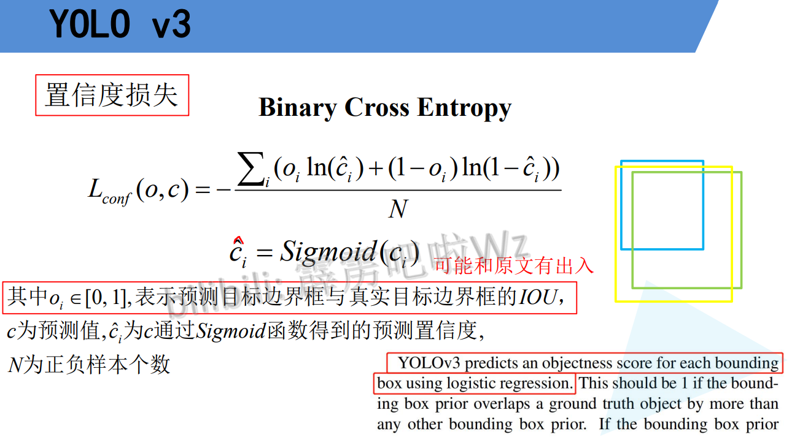
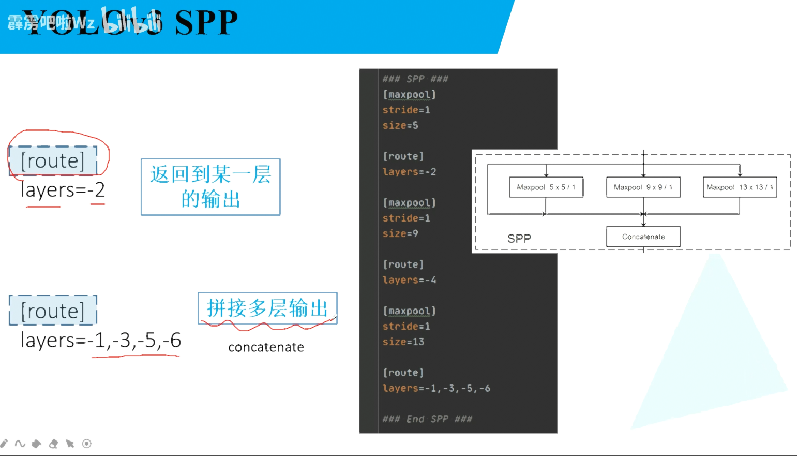

# 1 V1

> 每个网格有2个bbox,每个先验框5个值,4是xywh,**1是预测目标和真实目标的交并比,就是下图中的 $Pr(Object) * IOU^{truth}_{pred}$**,Pr(Object)是0或1,有物体就为1,否则为0,IOU不是预测出来的,是计算出来的
>
> **两个bbox是属于同一个类别的,因为只预测了一次分类**
>
> v1没有anchor,xywh是直接的坐标信息,实现对于完整图像来说的
>
> $Pr(Class_i | Object) * Pr(Object) * IOU^{truth}_{pred} = Pr(Class) * IOU^{truth}_{pred}$
>
> 上一行: 预测分数在有目标的概率下 * 有目标概率 * IOU


## loss

> 误差平方和:  $(预测值-真实值)^2$
>
> 边界框损失
>
> ​	xy   $(预测值-真实值)^2$
>
> ​	**宽高 $(\sqrt{预测值}-\sqrt{真实值})^2$  对于小目标如果不开根号效果会很差,小目标偏移和大目标相同距离会造成差距更大 下面会有详解**
>
> confidence损失
>
> ​	$(预测值-真实值)^2$
>
> ​	公式中上一行是正样本损失,下一行是负样本损失(noobj),对于正样本 $\hat{C_i} = 1$, 对于负样本 $\hat{C_i} = 0$
>
> classes损失
>
> ​	$(预测值-真实值)^2$
>
> ​	


> 边界框损失
>
> ​	xy   $(预测值-真实值)^2$
>
> ​	**宽高 $(\sqrt{预测值}-\sqrt{真实值})^2$  对于小目标如果不开根号效果会很差,小目标偏移和大目标相同距离会造成差距更大,x轴代表真实差距,y轴代表开根号的效果,开根号会让减小损失**


## 问题

> 对于小的高密度物体预测效果很差
>
> 出现了新的尺寸时效果很差
>
> 主要错误来自于定位不准确(使用了直接的预测位置,没使用anchors)


---

# 2 V2

## V2的尝试


### BN

> 减轻过拟合,不再需要dropout
>
> 提升2个mAP


### 高分辨率图像

> 448
>
> 提升4个mAP


### Anchor

> 简化预测,容易学习和收敛
>
> recall提升很多


## anchor聚类

> kmeans聚类获得anchor


## Direct location prediction 目标边界框的尝试

> 主要是中心的xy坐标偏移太随机,可能会便宜很远
>
> 下图蓝色部分使用了sigmoid函数将预测值调整到0~1之间,再加上先验框中心坐标
>
> 先验框默认坐标在特征图像每个分隔区的左上角,所以它始终会在这个框中移动
>
> 下面的算法,
>
>    中心调整: 先验框坐标 + sigmoid(预测结果) = 最终坐标
>
>    宽高调整: 先验框宽高 * e^预测结果 = 最终宽高
>
> $Pr(Object) * IOU(b, object) = sigmoid(t_o)$ $t_o$就是判断是否有物体


> FastRCNN loss
>
> 预测结果解码调整先验框得到预测框
>
>    中心调整: 先验框坐标 + 预测结果 * 先验框宽高 = 最终坐标
>
>    宽高调整: 先验框宽高 * e^预测结果 = 最终宽高
>
> 真实框求相于预测值的值(用来求loss)
>
>    中心参数 = (真实框坐标 - 先验框坐标) / 原始宽高
>
>    宽高参数 = ln(真实框宽高 / 先验框宽高)
>
>  求出来的参数和预测结果进行loss计算
>
> 原始坐标和宽高指的是先验框的坐标和宽高

## Fine-Grained Features

> 预测特征上结合更低层的信息,用来预测小目标

## 多尺度训练

> 使用不同的图形大小
>
> 每经过10个batch,随机变化输入图像大小
> 
---

# 3 V3

## Darknet53


## Loss

> 虚线框是先验框
>
> 实线框是预测框
>
> 先验框坐标就是中心坐标,在分割图片的框左上角点坐标
>
>    中心调整: 先验框坐标 + sigmoid(预测结果) = 最终坐标
>
>    宽高调整: 先验框宽高 * e^预测结果 = 最终宽高


>$L_{conf}  L_{cla}  L_{loc}$是损失
>
>$λ$ 是平衡系数
>
>


### 置信度损失 二值交叉熵损失

> $o_i$ 在原论文说为1或者0(正样本为1,负样本为0), 不过yolov3_spp的代码中 0到1之间的数
>

$$
\frac {o_i ln(\hat{c_i}) +  (1 - o_i) ln(( 1- \hat{c_i} ))} {N}
$$

 



### 类别损失 二值交叉熵损失

> $O_{ij}$ 真实标签,为0或者1, 正确类别为1,否则为0, 只计算正确类别的损失
>
> $C_{ij}$ 是预测值 sigmoid后在 0~之间, 不过总和不为1,因为不是用的softmax


> 交叉熵损失


> 二分类交叉熵损失实例
>
> 和多分类区别是使用了sigmoid而不是softmax,导致总的概率和不为1


### 定位损失 差值平方 l2损失

> 先验框坐标就是中心坐标,在分割图片的框左上角点坐标
>
>    中心调整: 先验框坐标 + sigmoid(预测结果) = 最终坐标
>
>    宽高调整: 先验框宽高 * e^预测结果 = 最终宽高
>
> 
>
> 差值平方
>
> $l$ 代表预测值 
>
> ​	中心参数 = sigmoid(预测值)
>
> ​	宽高参数 = 预测值
>
> $g$ 代表真实值
>
> ​	中心参数 = 真实框坐标 - 先验框坐标(cell左上角坐标)
>
> ​	宽高参数 = ln(真实框宽高 / 先验框宽高)


## 正负样本

> 一幅图片有几个gt目标.就有几个正样本
>
> 和gt重合度最大的就是正样本
>
> 大于一个重合阈值但不是最大的就抛弃
>
> 其余就是负样本
>
> 预测框不是正样本既没有定位损失,也没有分类损失,只有物体概率


---

# 4 V3SPP


## Mosaic图像增强


## SPP模型

> 不同大小的最大池化层
>
> k = 1(不用做) 5 9 13
>
> s = 1
>
> p = k // 2


## CIOU Loss

>IoU: 交并比


### IoU Loss = 1 - IoU

> 右侧三幅图片的 均值平方loss都相同, 不过IoU都不同
>
> 优点:
>
> ​	更好的反应重合程度
>
> ​	具有尺度不变性
>
> 缺点:
>
> ​	不相交时loss为0
>
> 使用IoU作为loss

$$
IoU Loss = -ln(IoU)
$$

> 下面这个更常见
>
> loss会越来越小,所以IoU会越来越大

$$
IoU Loss = 1 - IoU
$$


### GIoU Loss = 1 - GIoU [0,2]


$$
GIoU = IoU - \frac {A^c - u} {A^c}
$$

> **$A^c$ 指的是下图中最外侧的蓝色矩形面积**
>
> **$u$ 是下面两个矩形并集的面积**
>
> GIoU Loss = 1 - GIoU  [0,2]
>
> 如果两个边界框完美重合时,IoU=1,后面分子为0,后面就为0,最终结果就为IoU,最后结果就为1
>
> 完全不重合时,IoU=0, $A^c$很大,$u$为两个框的和,随着距离越来越远, $A^c$越来越大, 后面趋近于1,最后结果就为-1


> 缺点:
>
> 当两个框水平和竖直对齐的时候,GIoU就退化为IoU了(因为没有上图空白的空间了)
>
> $A^c = u$


### DIoU Loss = 1 - DIoU [0,2]

> 上面两个损失回归慢,定位不够准确
>
> 下图左侧图片黑色是先验框,绿色是真实框,蓝色时先验框
>
> ​	下图上面一行是 GIoU, 400次才勉强到达真实框
>
> ​	下一行是DIoU,120次就完美到达真实框
>
> 右侧下面三组图像的 IoU 和 GIoU 时相同的,不够DIoU是不同的


> DIoU Loss = 1 - DIoU [0,2]
>
> DIoU = IoU - 中心距离平方 / 对角线距离平方
>
> 完美重合时, IoU=1, d=0, DIoU就为 IoU,就是1
>
> 距离很远时, IoU=0, d约等于c,后面就为1, 最后结果为 -1

$$
DIoU = IoU - \frac {ρ^2 (b, b^{gt})} {c^2} = IoU - \frac {d^2} {c^2}
$$


### CIoU Loss = 1 - CIoU

> 重叠面积 中心点距离 长宽比
>
> IoU - 距离平方之比 - 长宽比

$$
CIOU = IOU − { \frac{ρ^2(b, b^{gt})} {c^2} } − αv
$$

> 可以写成

$$
CIOU = IOU − \frac {d^2} {c^2} − αv
$$

> v

$$
v = {\frac 4 {π^2}} ( arctan \frac {w^{gt}} {h^{gt}} - arctan \frac w h )^2
$$

> α

$$
α = \frac v {1 − IoU + v}
$$


---

## Focal Loss 难易分类不同权重

> 对于One-stage目标检测,能匹配到目标的框只有很少,负样本有很多个
>
> 负样本大多数是简单易分的负样本(概率很低)


>focal loss是为了应对正负样本极度不平衡的情况,比如 1:1000


### 二分类的交叉熵损失

> 二分类的交叉熵损失
>
> 正样本 -ln(p)
>
> 负样本(背景) -ln(1-p)


> 令 $p_t = p$
>
> 下面的公式可以简化为


### 引入 α 超参数平衡正负样本 α=0.25

> 当为正样本时(y=1),  α = α
>
> 当为负样本时(y!=1), α = 1 - α
>
> 右侧显示 α 为 0.75时效果是最好的


### 引入 $(1 - p_t)^γ$  降低简单样本的权重(p大)  γ=2

> 当 γ = 0 时, 就变为了交叉熵损失
>
> 


> 横坐标为 p
>
> 为正样本时p越大越好 $p_t = 1 - p$
>
> 为负样本时p越小越好 $p_t = 1 - (1 - p) = p$
>
> 总之要让 $p_t$ 越大越好
>
> 下图横坐标中 0.6~1 之间代表容易分类, 概率越大越精确,所以给他们的权重要小,
>
> 纵轴表示不同p所占的loss权重,要让易分的权重降低,下图中曲线靠下的好,不过也不是越小越好,下图 γ = 5 时,当概率0.4时权重就很小了,这是不好的


### 最终focal loss 结合 α 与  $(1 - p_t)^γ$  α=0.25,γ=2

> 右侧图像是分开的写法
>
> α用来平衡$(1 - p_t)^γ$, 不是用来平衡正负样本


### 效果对比

> p 预测概率
>
> y 真是标签
>
> CE 交叉熵
>
> FL focal loss
>
> rate 采用CE和FL得到loss的比值
>
> ---
>
> 前两行是正样本易分类损失, FL得到的损失比CE小很多
>
> 中间两行是负样本易分类损失, FL得到的损失比CE小很多
>
> 后面两行是难分类损失,FL的损失之比CE小一点
>
> ​	预测0.1,实际上是正样本
>
> ​	预测0.9,实际上是负样本


### 注意点

> **训练集要标注正确,因为focal loss专注学习难分类,所以错误标注会造成严重影响**

---

---

# 5 使用

## 准备数据集

> yolo数据集,标签是txt格式

```
├── my_yolo_dataset 自定义数据集根目录
│         ├── train   训练集目录
│         │     ├── images  训练集图像目录
│         │     └── labels  训练集标签目录 
│         └── val    验证集目录
│               ├── images  验证集图像目录
│               └── labels  验证集标签目录      
```

> 如果是voc格式要使用`voc2yolo.py`脚本转化
>
> 要有 `pascal_voc_classes.json` 文件
>
> 格式为

```json
{
    "aeroplane": 1,
    "bicycle": 2,
    "bird": 3,
    "boat": 4,
    "bottle": 5,
    "bus": 6,
    "car": 7,
    "cat": 8,
    "chair": 9,
    "cow": 10,
    "diningtable": 11,
    "dog": 12,
    "horse": 13,
    "motorbike": 14,
    "person": 15,
    "pottedplant": 16,
    "sheep": 17,
    "sofa": 18,
    "train": 19,
    "tvmonitor": 20
}
```

> 运行`calculate_dataset.py`生成一系列文件,包括

```python
├── cfg: 配置文件目录
│    ├── my_yolov3.cfg: 根据自己数据集生成的yolo配置
├── data 利用数据集生成的一系列相关准备文件目录
│    ├── my_train_data.txt:  该文件里存储的是所有训练图片的路径地址
│    ├── my_val_data.txt:  该文件里存储的是所有验证图片的路径地址
│    ├── my_data_label.names:  该文件里存储的是所有类别的名称，一个类别对应一行(这里会根据```.json```文件自动生成)
│    └── my_data.data:  该文件里记录的是类别数类别信息、train以及valid对应的txt文件
```

## 训练

----

---

# 6 yolov3-spp配置文件

> cfg/yolov3-spp.cfg


> 开始部分不起任何作用

```cfg
[net]
# Testing
# batch=1
# subdivisions=1
# Training
batch=64
subdivisions=16
width=608
height=608
channels=3
momentum=0.9
decay=0.0005
angle=0
saturation = 1.5
exposure = 1.5
hue=.1

learning_rate=0.001
burn_in=1000
max_batches = 500200
policy=steps
steps=400000,450000
scales=.1,.1
```

## conv


## shortcut


```cfg
# Downsample     		指示下一层下采样

[convolutional]
batch_normalize=1
filters=64
size=3
stride=2
pad=1
activation=leaky

[convolutional]
batch_normalize=1
filters=32
size=1
stride=1
pad=1
activation=leaky

[convolutional]
batch_normalize=1
filters=64
size=3
stride=1
pad=1
activation=leaky

[shortcut]				 	指的是上面 -1 的输出和 -3 的输出相加 两个卷积(1x1Conv + 3x3Conv)是一个残差块
from=-3						上面输出依次是 -1 -2 -3
activation=linear
```

## maxpool 只在spp中使用了

> 有padding


## route spp结构

> **只有一个值的时候, 下一个结构的输入是指定层的输出**
>
> **多个值的时候,拼接多层输出 concat**



```cfg
[convolutional]
batch_normalize=1
filters=512
size=1
stride=1
pad=1
activation=leaky

### SPP ###
[maxpool]
stride=1
size=5

[route]			# 下一个maxpool的输入是上面 -2 的输出
layers=-2

[maxpool]
stride=1
size=9

[route]			# 下一个maxpool的输入是上面 -4 的输出
layers=-4

[maxpool]
stride=1
size=13

[route]			# 拼接 最上面卷积和3个maxpool的输出
layers=-1,-3,-5,-6

### End SPP ###
```

## upsample FPN中使用


## yolo层,不是最后的yolo-header

> 是对预测结果进行处理生成anchors
>
> classes 是类别数
>
> anchors 代表anchor的宽高,两个一组
>
> mask代表 使用下面的哪个anchor  0 1 2 代表 使用前三个anchor
>
> 下面5个没用到


## build_utils/parse_config.py 解析配置文件

```python
import os
import numpy as np


def parse_model_cfg(path: str): # 路径
    #-----------------------------------------------#
    # 检查文件是否存在,必须是cfg文件
    #-----------------------------------------------#
    if not path.endswith(".cfg") or not os.path.exists(path):
        raise FileNotFoundError("the cfg file not exist...")

    # 读取文件信息
    with open(path, "r") as f:
        lines = f.read().split("\n")

    #-----------------------------------------------#
    # 去除空行和注释行,放入列表  if x 代表当前行不为空
    #-----------------------------------------------#
    lines = [x for x in lines if x and not x.startswith("#")]
    #-----------------------------------------------#
    # 去除每行开头和结尾的空格符
    #-----------------------------------------------#
    lines = [x.strip() for x in lines]

    #-----------------------------------------------#
    #   
    #-----------------------------------------------#
    mdefs = []  # module definitions
    for line in lines:
        #-----------------------------------------------#
        #   开始为 "[" 说明开启一个新block
        #   添加一个新字典,添加键值
        #-----------------------------------------------#
        if line.startswith("["):  # this marks the start of a new block
            mdefs.append({})
            mdefs[-1]["type"] = line[1:-1].strip()  # 记录module类型    [1:-1] 不要两边的 []
            #-----------------------------------------------#
            # 如果是卷积模块，设置默认不使用BN(普通卷积层后面会重写成1，最后的预测层conv保持为0)
            #-----------------------------------------------#
            if mdefs[-1]["type"] == "convolutional":
                mdefs[-1]["batch_normalize"] = 0
        else:
            #-----------------------------------------------#
            #   开始不为 "[" 说明是block参数
            #   通过等号分隔得到 key value
            #-----------------------------------------------#
            key, val = line.split("=")
            key = key.strip()
            val = val.strip()

            #-----------------------------------------------#
            #   yolo层的anchor
            #-----------------------------------------------#
            if key == "anchors":
                # anchors = 10,13,  16,30,  33,23,  30,61,  62,45,  59,119,  116,90,  156,198,  373,326
                val = val.replace(" ", "")  # 将空格去除
                # 通过逗号分隔获取数据,转换为浮点数,改变形状到二维数据,放入列表
                mdefs[-1][key] = np.array([float(x) for x in val.split(",")]).reshape((-1, 2))  # np anchors
            elif (key in ["from", "layers", "mask"]) or (key == "size" and "," in val):
                #-----------------------------------------------#
                #   逗号分隔,主要是shortcut 和 root 模块,转换为int,放入列表
                #-----------------------------------------------#
                mdefs[-1][key] = [int(x) for x in val.split(",")]
            else:
                #-----------------------------------------------#
                #   卷积层
                #-----------------------------------------------#
                # TODO: .isnumeric() actually fails to get the float case
                if val.isnumeric():  # return int or float
                    #-----------------------------------------------#
                    #   如果是数值的情况
                    #   判断是int还是float
                    #   假设是int 转化为 int 还是 float 相等,减去为0,就说明是int
                    #-----------------------------------------------#
                    mdefs[-1][key] = int(val) if (int(val) - float(val)) == 0 else float(val)
                else:
                    # 是字符的情况
                    mdefs[-1][key] = val  # return string

    #-----------------------------------------------#
    # 类型名支持的列表
    #-----------------------------------------------#
    supported = ['type', 'batch_normalize', 'filters', 'size', 'stride', 'pad', 'activation', 'layers', 'groups',
                 'from', 'mask', 'anchors', 'classes', 'num', 'jitter', 'ignore_thresh', 'truth_thresh', 'random',
                 'stride_x', 'stride_y', 'weights_type', 'weights_normalization', 'scale_x_y', 'beta_nms', 'nms_kind',
                 'iou_loss', 'iou_normalizer', 'cls_normalizer', 'iou_thresh', 'probability']

    #-----------------------------------------------#
    # 遍历检查每个模型的配置
    #-----------------------------------------------#
    for x in mdefs[1:]:  # 0对应net配置
        #-----------------------------------------------#
        # 遍历每个配置字典中的key值
        #-----------------------------------------------#
        for k in x:
            if k not in supported:
                raise ValueError("Unsupported fields:{} in cfg".format(k))

    return mdefs


def parse_data_cfg(path):
    # Parses the data configuration file
    if not os.path.exists(path) and os.path.exists('data' + os.sep + path):  # add data/ prefix if omitted
        path = 'data' + os.sep + path

    with open(path, 'r') as f:
        lines = f.readlines()

    options = dict()
    for line in lines:
        line = line.strip()
        if line == '' or line.startswith('#'):
            continue
        key, val = line.split('=')
        options[key.strip()] = val.strip()

    return options
```

---

# 7 利用配置列表搭建网络

> models.py

## meshgrid


```python
#-------------------------------------------------#
# xv = yv = 13,26,52
# 所有点的x,y轴坐标通过meshgrid组合成坐标
# xv = [[0,1,2,3],
#       [0,1,2,3],
#       [0,1,2,3],
#       [0,1,2,3]]
# yv = [[0,0,0,0],
#       [1,1,1,1],
#       [2,2,2,2],
#       [3,3,3,3]]
#-------------------------------------------------#
yv, xv = torch.meshgrid([torch.arange(self.ny, device=device),
                         torch.arange(self.nx, device=device)])
#-------------------------------------------------#
# 通过stack拼接
# grid = [[[0,0],[1,0],[2,0].[3,0],
#          [0,1],[1,1],[2,1].[3,1],
#          [0,2],[1,2],[2,2].[3,2],
#          [0,3],[1,3],[2,3].[3,3],]]
# batch_size, anchor数量, grid_h, grid_w, wh
#-------------------------------------------------#
self.grid = torch.stack((xv, yv), 2).view((1, 1, self.ny, self.nx, 2)).float()
```


## build_utils/layers.py

```python
class FeatureConcat(nn.Module):
    """
    将多个特征矩阵在channel维度进行concatenate拼接
    如果只有一个值,就返回那个值的输出
    """
    def __init__(self, layers):
        super(FeatureConcat, self).__init__()
        self.layers = layers  # layer indices
        self.multiple = len(layers) > 1  # 是否有多个值

    def forward(self, x, outputs):
        # 通过layers遍历outputs
        return torch.cat([outputs[i] for i in self.layers], 1) if self.multiple else outputs[self.layers[0]]


class WeightedFeatureFusion(nn.Module):  # weighted sum of 2 or more layers https://arxiv.org/abs/1911.09070
    """
    将多个特征矩阵的值进行融合(add操作)  残差部分
    """
    def __init__(self, layers, weight=False):
        super(WeightedFeatureFusion, self).__init__()
        self.layers = layers  # layer indices
        self.weight = weight  # apply weights boolean
        self.n = len(layers) + 1  # number of layers 融合的特征矩阵个数 2个特征层
        if weight:
            self.w = nn.Parameter(torch.zeros(self.n), requires_grad=True)  # layer weights

    def forward(self, x, outputs):
        """
        x:       上一层的输出
        outputs: 收集的所有的输出
        """
        # Weights
        if self.weight:
            w = torch.sigmoid(self.w) * (2 / self.n)  # sigmoid weights (0-1)
            x = x * w[0]

        # Fusion
        nx = x.shape[1]  # input channels

        # 循环1次
        for i in range(self.n - 1):
            #-------------------------------------------------#
            #   weight为false,只看后面的 self.layers[i]
            #-------------------------------------------------#
            a = outputs[self.layers[i]] * w[i + 1] if self.weight else outputs[self.layers[i]]  # feature to add
            na = a.shape[1]  # feature channels

            #-------------------------------------------------#
            # 根据相加的两个特征矩阵的channel选择相加方式 这里只会使用第一个相加
            #-------------------------------------------------#
            if nx == na:  # same shape 如果channel相同，直接相加
                x = x + a
            # 下面两种情况的channel不同,选小的一边,大的进行切片拼接
            elif nx > na:   # slice input 如果channel不同，将channel多的特征矩阵砍掉部分channel保证相加的channel一致
                x[:, :na] = x[:, :na] + a  # or a = nn.ZeroPad2d((0, 0, 0, 0, 0, dc))(a); x = x + a
            else:  # slice feature
                x = x + a[:, :nx]

        return x
```

## models.py

```python
from build_utils.layers import *
from build_utils.parse_config import *

ONNX_EXPORT = False


def create_modules(modules_defs: list, img_size):
    """
    Constructs module list of layer blocks from module configuration in module_defs
    :param modules_defs: 通过.cfg文件解析得到的每个层结构的列表
    :param img_size:
    :return:
    """

    img_size = [img_size] * 2 if isinstance(img_size, int) else img_size
    #-------------------------------------------------#
    #   删除解析cfg列表中的第一个配置(对应[net]的配置)
    #-------------------------------------------------#
    modules_defs.pop(0)  # cfg training hyperparams (unused)
    #-------------------------------------------------#
    #   记录搭建每个模块时输出的channel,开始为3, rgb
    #-------------------------------------------------#
    output_filters = [3]
    module_list = nn.ModuleList()
    #-------------------------------------------------#
    #   统计哪些特征层的输出会被后续的层使用到(可能是特征融合，也可能是拼接)
    #-------------------------------------------------#
    routs = []  # list of layers which rout to deeper layers
    #-------------------------------------------------#
    #   
    #-------------------------------------------------#
    yolo_index = -1

    # 遍历搭建每个层结构
    for i, mdef in enumerate(modules_defs):
        modules = nn.Sequential()

        #-------------------------------------------------#
        #   卷积
        #-------------------------------------------------#
        if mdef["type"] == "convolutional":
            bn = mdef["batch_normalize"]    # 1 or 0 / 是否使用BN
            filters = mdef["filters"]       # out_channel
            k = mdef["size"]                # kernel size
            stride = mdef["stride"] if "stride" in mdef else (mdef['stride_y'], mdef["stride_x"])   # stride,后面的v3用不到
            # kernel_size 必须为整数
            if isinstance(k, int):
                modules.add_module("Conv2d", nn.Conv2d(in_channels=output_filters[-1],
                                                       out_channels=filters,
                                                       kernel_size=k,
                                                       stride=stride,
                                                       padding=k // 2 if mdef["pad"] else 0,
                                                       bias=not bn))
            else:
                raise TypeError("conv2d filter size must be int type.")

            if bn:
                modules.add_module("BatchNorm2d", nn.BatchNorm2d(filters))
            else:
                #-------------------------------------------------#
                #   如果该卷积操作没有bn层，意味着该层为yolo的predictor,记录索引
                #-------------------------------------------------#
                routs.append(i)  # detection output (goes into yolo layer)

            #-------------------------------------------------#
            #   激活函数
            #-------------------------------------------------#
            if mdef["activation"] == "leaky":
                modules.add_module("activation", nn.LeakyReLU(0.1, inplace=True))
            else:
                pass

        #-------------------------------------------------#
        #   BatchNorm2d
        #-------------------------------------------------#
        elif mdef["type"] == "BatchNorm2d":
            pass


        #-------------------------------------------------#
        #   maxpool spp结构 k= 5 9 13
        #-------------------------------------------------#
        elif mdef["type"] == "maxpool":
            k = mdef["size"]  # kernel size
            stride = mdef["stride"]
            modules = nn.MaxPool2d(kernel_size=k, stride=stride, padding=(k - 1) // 2)

        #-------------------------------------------------#
        #   upsample Upsample(scale_factor=2)
        #-------------------------------------------------#
        elif mdef["type"] == "upsample":
            if ONNX_EXPORT:  # explicitly state size, avoid scale_factor
                g = (yolo_index + 1) * 2 / 32  # gain
                modules = nn.Upsample(size=tuple(int(x * g) for x in img_size))
            else:
                modules = nn.Upsample(scale_factor=mdef["stride"])

        #-------------------------------------------------#
        #   route
        #-------------------------------------------------#
        elif mdef["type"] == "route":  # [-2],  [-1,-3,-5,-6], [-1, 61]
            layers = mdef["layers"]
            #-------------------------------------------------#
            #   记录当前特征层的out_channel
            #   l + 1 if l > 0 else l  l > 0要加一,因为开始有一个3,要跳过它
            #-------------------------------------------------#
            filters = sum([output_filters[l + 1 if l > 0 else l] for l in layers])
            #-------------------------------------------------#
            #   记录使用哪些层的输出
            #   小于0时比如 -1 说明要上一层的输出
            #-------------------------------------------------#
            routs.extend([i + l if l < 0 else l for l in layers])
            modules = FeatureConcat(layers=layers)

        #-------------------------------------------------#
        #   shortcut 残差部分  -3 和 -1 相加
        #-------------------------------------------------#
        elif mdef["type"] == "shortcut":
            # 与前面哪一层拼接, 残差使用了
            layers = mdef["from"]
            # 获取上一层输出 -1 的输出
            filters = output_filters[-1]
            # routs.extend([i + l if l < 0 else l for l in layers])
            routs.append(i + layers[0])
            modules = WeightedFeatureFusion(layers=layers, weight="weights_type" in mdef)

        #-------------------------------------------------#
        #   yolo是对预测结果进行处理生成anchors
        #-------------------------------------------------#
        elif mdef["type"] == "yolo":
            #-------------------------------------------------#
            #   记录是第几个yolo_layer [0, 1, 2]
            #-------------------------------------------------#
            yolo_index += 1
            stride = [32, 16, 8]  # 预测特征层对应原图的缩放比例

            modules = YOLOLayer(anchors=mdef["anchors"][mdef["mask"]],  # anchor list   选择合适的anchor
                                nc=mdef["classes"],                     # number of classes
                                img_size=img_size,                      # onnx使用
                                stride=stride[yolo_index])              # 不同图像大小不同的步长

            #-------------------------------------------------#
            #   初始化偏置
            #-------------------------------------------------#
            # Initialize preceding Conv2d() bias (https://arxiv.org/pdf/1708.02002.pdf section 3.3)
            try:
                j = -1 # yolo上一层
                # bias: shape(255,) 索引0对应Sequential中的Conv2d
                # view: shape(3, 85)
                b = module_list[j][0].bias.view(modules.na, -1)
                b.data[:, 4] += -4.5  # obj
                b.data[:, 5:] += math.log(0.6 / (modules.nc - 0.99))  # cls (sigmoid(p) = 1/nc)
                module_list[j][0].bias = torch.nn.Parameter(b.view(-1), requires_grad=True)
            except Exception as e:
                print('WARNING: smart bias initialization failure.', e)
        else:
            print("Warning: Unrecognized Layer Type: " + mdef["type"])

        #-------------------------------------------------#
        # 放入模型列表
        #-------------------------------------------------#
        module_list.append(modules)
        #-------------------------------------------------#
        #   这一层的out_channel当做下一层的in_channel
        #-------------------------------------------------#
        output_filters.append(filters)

    #-------------------------------------------------#
    #   多少个模块存入多少个False,需要记录输出的设置为True
    #-------------------------------------------------#
    routs_binary = [False] * len(modules_defs)
    for i in routs: # routs 统计哪些特征层的输出会被后续的层使用到(可能是特征融合，也可能是拼接)
        routs_binary[i] = True
    return module_list, routs_binary


class YOLOLayer(nn.Module):
    """
    对YOLO的输出进行处理,将中心宽高调整到原图尺寸上
    """
    def __init__(self, anchors, nc, img_size, stride):
        super(YOLOLayer, self).__init__()
        self.anchors = torch.Tensor(anchors)
        self.stride = stride    # layer stride 特征图上一步对应原图上的步距 [32, 16, 8]
        self.na = len(anchors)  # 3 种 anchors
        self.nc = nc            # 分类数 80
        self.no = nc + 5        # 85: x, y, w, h, obj, cls1, ...
        self.nx, self.ny, self.ng = 0, 0, (0, 0)  # initialize number of x, y gridpoints
        #-------------------------------------------------#
        # 将anchors大小缩放到grid尺度,缩小
        #-------------------------------------------------#
        self.anchor_vec = self.anchors / self.stride
        #-------------------------------------------------#
        # batch_size, na, grid_h, grid_w, wh,
        # 值为1的维度对应的值不是固定值，后续操作可根据broadcast广播机制自动扩充
        #-------------------------------------------------#
        self.anchor_wh = self.anchor_vec.view(1, self.na, 1, 1, 2)  # 1, 3, 1, 1, 2  batch, 框的个数, 宽, 高, 宽高     batch,宽,高会随着图像变化, 剩余两个不会
        self.grid = None

        if ONNX_EXPORT:
            self.training = False
            self.create_grids((img_size[1] // stride, img_size[0] // stride))  # number x, y grid points

    def create_grids(self, ng=(13, 13), device="cpu"):
        """
        更新grids信息并生成新的grids参数
        :param ng: 特征图大小
        :param device:
        :return:
        """
        self.nx, self.ny = ng
        self.ng = torch.tensor(ng, dtype=torch.float)

        #-------------------------------------------------#
        # build xy offsets 构建每个cell处的anchor的xy偏移量(在feature map上的)
        #-------------------------------------------------#
        # 训练模式不需要回归到最终预测boxes,预测才需要生成网格
        if not self.training:
            #-------------------------------------------------#
            # 所有点的x,y轴坐标通过meshgrid组合成坐标
            # vx = [[0,1,2,3],
            #       [0,1,2,3],
            #       [0,1,2,3],
            #       [0,1,2,3]]
            # vy = [[0,0,0,0],
            #       [1,1,1,1],
            #       [2,2,2,2],
            #       [3,3,3,3]]
            #-------------------------------------------------#
            yv, xv = torch.meshgrid([torch.arange(self.ny, device=device),
                                     torch.arange(self.nx, device=device)])
            #-------------------------------------------------#
            # 通过stack拼接
            # grid = [[[0,0],[1,0],[2,0].[3,0],
            #          [0,1],[1,1],[2,1].[3,1],
            #          [0,2],[1,2],[2,2].[3,2],
            #          [0,3],[1,3],[2,3].[3,3],]]
            # [grid_h, grid_w, wh] -> [batch_size, anchor数量, grid_h, grid_w, wh]
            #-------------------------------------------------#
            self.grid = torch.stack((xv, yv), 2).view((1, 1, self.ny, self.nx, 2)).float()

        if self.anchor_vec.device != device:
            self.anchor_vec = self.anchor_vec.to(device)
            self.anchor_wh = self.anchor_wh.to(device)

    def forward(self, p):
        """
        p: 预测参数   [b, _, h, w]
        """
        if ONNX_EXPORT:
            bs = 1  # batch size
        else:
            #-------------------------------------------------#
            #   batch_size, predict_param(255), grid(13), grid(13)
            #-------------------------------------------------#
            bs, _, ny, nx = p.shape

            if (self.nx, self.ny) != (nx, ny) or self.grid is None:  # fix no grid bug
                self.create_grids((nx, ny), p.device)

        #-------------------------------------------------#
        #   view:     [batch_size, 255, 13, 13] -> [batch_size, 3, 85, 13, 13]
        #   permute:  [batch_size, 3, 85, 13, 13)] -> [batch_size, 3, 13, 13, 85]
        #   [bs, anchor, h, w, xywh + obj + classes]
        #-------------------------------------------------#
        p = p.view(bs, self.na, self.no, self.ny, self.nx).permute(0, 1, 3, 4, 2).contiguous()  # prediction

        #-------------------------------------------------#
        #   训练模式直接返回数据
        #-------------------------------------------------#
        if self.training:
            return p
        elif ONNX_EXPORT:
            # Avoid broadcasting for ANE operations
            m = self.na * self.nx * self.ny  # 3*
            ng = 1. / self.ng.repeat(m, 1)
            grid = self.grid.repeat(1, self.na, 1, 1, 1).view(m, 2)
            anchor_wh = self.anchor_wh.repeat(1, 1, self.nx, self.ny, 1).view(m, 2) * ng

            p = p.view(m, self.no)
            # xy = torch.sigmoid(p[:, 0:2]) + grid  # x, y
            # wh = torch.exp(p[:, 2:4]) * anchor_wh  # width, height
            # p_cls = torch.sigmoid(p[:, 4:5]) if self.nc == 1 else \
            #     torch.sigmoid(p[:, 5:self.no]) * torch.sigmoid(p[:, 4:5])  # conf
            p[:, :2] = (torch.sigmoid(p[:, 0:2]) + grid) * ng  # x, y
            p[:, 2:4] = torch.exp(p[:, 2:4]) * anchor_wh  # width, height
            p[:, 4:] = torch.sigmoid(p[:, 4:])
            p[:, 5:] = p[:, 5:self.no] * p[:, 4:5]
            return p
        else:
            #-------------------------------------------------#
            # inference
            # [bs, anchor, h, w, xywh + obj + classes]
            #   中心调整: 先验框坐标 + sigmoid(预测结果) = 最终坐标
            #   宽高调整: 先验框宽高 * e^预测结果        = 最终宽高
            #-------------------------------------------------#
            io = p.clone()  # inference output 复制一份作为输出
            io[..., :2]  = torch.sigmoid(io[..., :2]) + self.grid    # xy 计算在feature map上的xy坐标   ... 取前4个维度
            io[..., 2:4] = torch.exp(io[..., 2:4]) * self.anchor_wh  # wh yolo method 计算在feature map上的wh
            io[..., :4]  *= self.stride                              # 换算映射回原图尺度
            torch.sigmoid_(io[..., 4:])                              # 分类全都经过sigmoid

            # 调整到原图尺寸以及sigmoid置信度和分类的值 view [1, 3, 13, 13, 85] as [1, 507, 85]
            # 将预测进行转置处理                       [bs, anchor, h, w, xywh + obj + classes]
            return io.view(bs, -1, self.no), p


class Darknet(nn.Module):
    """
    YOLOv3 spp object detection model
    """
    def __init__(self, cfg, img_size=(416, 416), verbose=False):
        super(Darknet, self).__init__()
        #-------------------------------------------------#
        #   训练时分辨率是动态的
        #   这里传入的img_size只在导出ONNX模型时起作用
        #-------------------------------------------------#
        self.input_size = [img_size] * 2 if isinstance(img_size, int) else img_size
        #-------------------------------------------------#
        #   解析网络对应的.cfg文件,返回列表
        #-------------------------------------------------#
        self.module_defs = parse_model_cfg(cfg)
        #-------------------------------------------------#
        #   根据解析的网络结构一层一层去搭建
        #   返回模块列表和 True/False列表,这个列表代表是否需要保存这一层的输出
        #-------------------------------------------------#
        self.module_list, self.routs = create_modules(self.module_defs, img_size)
        #-------------------------------------------------#
        #   获取3个YOLOLayer层的索引 [89, 101, 113]
        #-------------------------------------------------#
        self.yolo_layers = get_yolo_layers(self)

        #-------------------------------------------------#
        #   打印下模型的信息，如果verbose为True则打印详细信息
        #-------------------------------------------------#
        self.info(verbose) if not ONNX_EXPORT else None  # print model description

    def forward(self, x, verbose=False):
        return self.forward_once(x, verbose=verbose)

    def forward_once(self, x, verbose=False):
        """
        x: 图像数据
        """
        #-------------------------------------------------#
        #   yolo_out收集每个yolo_layer层的输出
        #   out收集每个模块的输出
        #-------------------------------------------------#
        yolo_out, out = [], []
        if verbose:
            print('0', x.shape)
            str = ""

        #-------------------------------------------------#
        #   遍历搭建的所有模块
        #-------------------------------------------------#
        for i, module in enumerate(self.module_list):
            name = module.__class__.__name__
            #-------------------------------------------------#
            # sum, concat
            #-------------------------------------------------#
            if name in ["WeightedFeatureFusion", "FeatureConcat"]:
                if verbose:
                    l = [i - 1] + module.layers  # layers
                    sh = [list(x.shape)] + [list(out[i].shape) for i in module.layers]  # shapes
                    str = ' >> ' + ' + '.join(['layer %g %s' % x for x in zip(l, sh)])
                # 将 x 和每一层输出的放入
                x = module(x, out)  # WeightedFeatureFusion(), FeatureConcat()
            elif name == "YOLOLayer":
                #-------------------------------------------------#
                #   将yolo放入 yolo_out 中
                #-------------------------------------------------#
                yolo_out.append(module(x))
            else:
                #-------------------------------------------------#
                #   其余直接返回就可
                #   run module directly, i.e. mtype = 'convolutional', 'upsample', 'maxpool', 'batchnorm2d' etc.
                #-------------------------------------------------#
                x = module(x)

            #-------------------------------------------------#
            #   routs: True/False列表,这个列表代表是否需要保存这一层的输出
            #-------------------------------------------------#
            out.append(x if self.routs[i] else [])
            if verbose:
                print('%g/%g %s -' % (i, len(self.module_list), name), list(x.shape), str)
                str = ''

        # 训练直接返回数据
        if self.training:
            return yolo_out
        elif ONNX_EXPORT:  # export
            # x = [torch.cat(x, 0) for x in zip(*yolo_out)]
            # return x[0], torch.cat(x[1:3], 1)  # scores, boxes: 3780x80, 3780x4
            p = torch.cat(yolo_out, dim=0)

            # # 根据objectness虑除低概率目标
            # mask = torch.nonzero(torch.gt(p[:, 4], 0.1), as_tuple=False).squeeze(1)
            # # onnx不支持超过一维的索引（pytorch太灵活了）
            # # p = p[mask]
            # p = torch.index_select(p, dim=0, index=mask)
            #
            # # 虑除小面积目标，w > 2 and h > 2 pixel
            # # ONNX暂不支持bitwise_and和all操作
            # mask_s = torch.gt(p[:, 2], 2./self.input_size[0]) & torch.gt(p[:, 3], 2./self.input_size[1])
            # mask_s = torch.nonzero(mask_s, as_tuple=False).squeeze(1)
            # p = torch.index_select(p, dim=0, index=mask_s)  # width-height 虑除小目标
            #
            # if mask_s.numel() == 0:
            #     return torch.empty([0, 85])

            return p
        else:
            #-------------------------------------------------#
            #   x指的是调整到原图尺寸以及sigmoid置信度和分类的值  [1, 507, 85]
            #   p只将预测进行转置处理                           [bs, anchor, h, w, xywh + obj + classes]
            #-------------------------------------------------#
            x, p = zip(*yolo_out)   # inference output, training output
            x = torch.cat(x, 1)     # 在通道上拼接,将三个输出拼接到一起

            return x, p

    def info(self, verbose=False):
        """
        打印模型的信息
        :param verbose:
        :return:
        """
        torch_utils.model_info(self, verbose)


def get_yolo_layers(self):
    """
    获取网络中三个"YOLOLayer"模块对应的索引
    :param self:
    :return:
    """
    return [i for i, m in enumerate(self.module_list) if m.__class__.__name__ == 'YOLOLayer']  # [89, 101, 113]
```

---

# 8 自定义数据集 上 init

## 调整高宽比

> 如果高/宽小于1(h < w)，将w设为img_size
>
> maxi: h相对指定尺度的比例(小于1) 1: w相对指定尺度的比例
>
> 假设为 [0.75, 1] 我们会让它乘以batch中全部图片的高宽,向上取整,得到最近的32的倍数为最终大小,图片放大后填充,空余部分用灰色填充
>
> 图片在左上角,其余部分填充,这样好调整


> 如果高/宽大于1((h > w)，将h设置为img_size
>
> mini: 高/宽比, 高固定为1, 宽=1/ratio
>
> 假设为 [1, 0.75] 我们会让它乘以batch中全部图片的高宽,向上取整,得到最近的32的倍数为最终大小,图片放大后填充,空余部分用灰色填充
>
> 图片在左上角,其余部分填充,这样好调整


> LoadImagesAndLabels init

```python
            #------------------------------------------------#
            #   set training image shapes
            #   最大尺寸相同,最小边长不同
            #   计算每个batch采用的统一尺度
            #------------------------------------------------#
            shapes = [[1, 1]] * nb  # nb: 多少个batch
            for i in range(nb):
                ari = ar[bi == i]   # bi: batch index 找每个batch对应的索引位置
                #------------------------------------------------#
                #   获取第i个batch中，最小和最大高宽比
                #------------------------------------------------#
                mini, maxi = ari.min(), ari.max()
                #------------------------------------------------#
                #   如果高/宽小于1(h < w)，将w设为img_size
                #   maxi: h相对指定尺度的比例(小于1) 1: w相对指定尺度的比例
                #   假设为 [0.75, 1] 我们会让它乘以batch中全部图片的高宽,向上取整,得到最近的32的倍数为最终大小,图片放大后填充,空余部分用灰色填充
                #   图片在左上角,其余部分填充,这样好调整
                #------------------------------------------------#
                if maxi < 1:
                    shapes[i] = [maxi, 1]
                #------------------------------------------------#
                #   如果高/宽大于1((h > w)，将h设置为img_size
                #   是高/宽比, 高固定为1, 宽=1/ratio
                #   假设为 [1, 0.75] 我们会让它乘以batch中全部图片的高宽,向上取整,得到最近的32的倍数为最终大小,图片放大后填充,空余部分用灰色填充
                #   图片在左上角,其余部分填充,这样好调整
                #------------------------------------------------#
                elif mini > 1:
                    shapes[i] = [1, 1 / mini]
            # 计算每个batch输入网络的shape值(向上设置为32的整数倍)
            self.batch_shapes = np.ceil(np.array(shapes) * img_size / 32. + pad).astype(np.int) * 32
```

## build_utils/datasets.py

```python
import math
import os
import random
import shutil
from pathlib import Path

import cv2
import numpy as np
import torch
from PIL import Image, ExifTags
from torch.utils.data import Dataset
from tqdm import tqdm

from build_utils.utils import xyxy2xywh, xywh2xyxy

help_url = 'https://github.com/ultralytics/yolov3/wiki/Train-Custom-Data'
img_formats = ['.bmp', '.jpg', '.jpeg', '.png', '.tif', '.dng']


# get orientation in exif tag
# 找到图像exif信息中对应旋转信息的key值
for orientation in ExifTags.TAGS.keys():
    if ExifTags.TAGS[orientation] == "Orientation":
        break


def exif_size(img):
    """
    获取图像的原始img size
    通过exif的orientation信息判断图像是否有旋转，如果有旋转则返回旋转前的size
    :param img: PIL图片
    :return: 原始图像的size
    """
    # Returns exif-corrected PIL size
    s = img.size  # (width, height)
    try:
        rotation = dict(img._getexif().items())[orientation]
        if rotation == 6:  # rotation 270  顺时针翻转90度
            s = (s[1], s[0])    # 宽高对调
        elif rotation == 8:  # ratation 90  逆时针翻转90度
            s = (s[1], s[0])    # 宽高对调
    except:
        # 如果图像的exif信息中没有旋转信息，则跳过
        pass

    return s


class LoadImagesAndLabels(Dataset):  # for training/testing
    def __init__(self,
                 path,   # 指向data/my_train_data.txt路径或data/my_val_data.txt路径
                 #------------------------------------------------#
                 # 这里设置的是预处理后输出的图片尺寸
                 # 当为训练集时，设置的是训练过程中(开启多尺度)的最大尺寸
                 # 当为验证集时，设置的是最终使用的网络大小
                 #------------------------------------------------#
                 img_size=416,
                 batch_size=16,
                 augment=False,         # 训练集设置为True(augment_hsv)，验证集设置为False 对比度,亮度等调整
                 hyp=None,              # 超参数字典，其中包含图像增强会使用到的超参数
                 rect=False,            # 是否使用rectangular training 训练不开启,验证开启
                 cache_images=False,    # 是否缓存图片到内存中
                 single_cls=False, pad=0.0, rank=-1):   # rank 单GPU = 1  多GPU为 0 1 2...

        try:
            path = str(Path(path))
            # 是否是文件
            # parent = str(Path(path).parent) + os.sep
            if os.path.isfile(path):  # file
                # 读取对应my_train/val_data.txt文件，读取每一行的图片路劲信息
                with open(path, "r") as f:
                    f = f.read().splitlines()   # 按行分隔
            else:
                raise Exception("%s does not exist" % path)

            #------------------------------------------------#
            #   检查每张图片后缀格式是否在支持的列表中，保存支持的图像路径
            #   img_formats = ['.bmp', '.jpg', '.jpeg', '.png', '.tif', '.dng']
            #------------------------------------------------#
            self.img_files = [x for x in f if os.path.splitext(x)[-1].lower() in img_formats]
            self.img_files.sort()  # 防止不同系统排序不同，导致shape文件出现差异
        except Exception as e:
            raise FileNotFoundError("Error loading data from {}. {}".format(path, e))

        #------------------------------------------------#
        #   如果图片列表中没有图片，则报错
        #------------------------------------------------#
        n = len(self.img_files)
        assert n > 0, "No images found in %s. See %s" % (path, help_url)

        #------------------------------------------------#
        #   batch index
        #   将数据划分到一个个batch中
        #   图片id假设为        0 1 2 3 4 5 6 7 8 9   batch 假设为 4
        #   图片id除以batch得到 0 0 0 0 1 1 1 1 2 2
        #------------------------------------------------#
        bi = np.floor(np.arange(n) / batch_size).astype(np.int)
        # 记录数据集划分后的总batch数
        nb = bi[-1] + 1  # number of batches

        self.n = n                  # number of images 图像总数目
        self.batch = bi             # batch index of image 记录哪些图片属于哪个batch
        self.img_size = img_size    # 这里设置的是预处理后输出的图片尺寸
        self.augment = augment      # 是否启用augment_hsv 对比度,亮度等调整
        self.hyp = hyp              # 超参数字典，其中包含图像增强会使用到的超参数
        self.rect = rect            # 是否使用rectangular training
        # 注意: 开启rect后，mosaic就默认关闭
        self.mosaic = self.augment and not self.rect  # load 4 images at a time into a mosaic (only during training)

        #------------------------------------------------#
        #   Define labels
        #   遍历设置图像对应的label路径
        #   (./my_yolo_dataset/train/images/2009_004012.jpg) -> (./my_yolo_dataset/train/labels/2009_004012.txt)
        #------------------------------------------------#
        self.label_files = [x.replace("images", "labels").replace(os.path.splitext(x)[-1], ".txt")
                            for x in self.img_files]

        #------------------------------------------------#
        #   Read image shapes (wh)
        #   查看data文件下是否缓存有对应数据集的.shapes文件，里面存储了每张图像的width, height
        #   训练之后才会有 .shapes
        #------------------------------------------------#
        sp = path.replace(".txt", ".shapes")  # shapefile path

        #------------------------------------------------#
        #   第一次读取shape会报错,没有 shapes 文件,会创建图片信息
        #------------------------------------------------#
        try:
            with open(sp, "r") as f:  # read existing shapefile
                s = [x.split() for x in f.read().splitlines()]
                #------------------------------------------------#
                #   判断现有的shape文件中的行数(图像个数)是否与当前数据集中图像个数相等
                #   如果不相等则认为是不同的数据集，故重新生成shape文件
                #------------------------------------------------#
                assert len(s) == n, "shapefile out of aync"
        except Exception as e:
            # print("read {} failed [{}], rebuild {}.".format(sp, e, sp))
            # tqdm库会显示处理的进度
            # 读取每张图片的size信息
            if rank in [-1, 0]: # rank 是否是主进程
                image_files = tqdm(self.img_files, desc="Reading image shapes")
            else:
                image_files = self.img_files
            s = [exif_size(Image.open(f)) for f in image_files]
            # 将所有图片的shape信息保存在.shape文件中
            np.savetxt(sp, s, fmt="%g")  # overwrite existing (if any)

        #------------------------------------------------#
        #   记录每张图像的原始尺寸
        #------------------------------------------------#
        self.shapes = np.array(s, dtype=np.float64)

        #------------------------------------------------#
        # Rectangular Training https://github.com/ultralytics/yolov3/issues/232
        # 如果为ture，训练网络时，会使用类似原图像比例的矩形(让最长边为img_size)，而不是img_size x img_size
        # 注意: 开启rect后，mosaic就默认关闭
        #------------------------------------------------#
        if self.rect:
            # Sort by aspect ratio
            s = self.shapes  # wh
            #------------------------------------------------#
            #   计算每个图片的高/宽比
            #------------------------------------------------#
            ar = s[:, 1] / s[:, 0]  # aspect ratio
            #------------------------------------------------#
            #   argsort函数返回的是数组值从小到大的索引值
            #   按照高宽比例进行排序，这样后面划分的每个batch中的图像就拥有类似的高宽比
            #------------------------------------------------#
            irect = ar.argsort()
            #------------------------------------------------#
            #   根据排序后的顺序重新设置图像顺序、标签顺序以及shape顺序
            #------------------------------------------------#
            self.img_files = [self.img_files[i] for i in irect]
            self.label_files = [self.label_files[i] for i in irect]
            self.shapes = s[irect]  # wh
            ar = ar[irect]          # 排序后的高/宽比

            #------------------------------------------------#
            #   set training image shapes
            #   最大尺寸相同,最小边长不同
            #   计算每个batch采用的统一尺度
            #------------------------------------------------#
            shapes = [[1, 1]] * nb  # nb: 多少个batch
            for i in range(nb):
                ari = ar[bi == i]   # bi: batch index 找每个batch对应的索引位置
                #------------------------------------------------#
                #   获取第i个batch中，最小和最大高宽比
                #------------------------------------------------#
                mini, maxi = ari.min(), ari.max()
                #------------------------------------------------#
                #   如果高/宽小于1(h < w)，将w设为img_size
                #   maxi: h相对指定尺度的比例(小于1) 1: w相对指定尺度的比例
                #   假设为 [0.75, 1] 我们会让它乘以batch中全部图片的高宽,向上取整,得到最近的32的倍数为最终大小,图片放大后填充,空余部分用灰色填充
                #   图片在左上角,其余部分填充,这样好调整
                #------------------------------------------------#
                if maxi < 1:
                    shapes[i] = [maxi, 1]
                #------------------------------------------------#
                #   如果高/宽大于1((h > w)，将h设置为img_size
                #   mini: 高/宽比, 高固定为1, 宽=1/ratio
                #   假设为 [1, 0.75] 我们会让它乘以batch中全部图片的高宽,向上取整,得到最近的32的倍数为最终大小,图片放大后填充,空余部分用灰色填充
                #   图片在左上角,其余部分填充,这样好调整
                #------------------------------------------------#
                elif mini > 1:
                    shapes[i] = [1, 1 / mini]
            # 计算每个batch输入网络的shape值(向上设置为32的整数倍)
            self.batch_shapes = np.ceil(np.array(shapes) * img_size / 32. + pad).astype(np.int) * 32

        #------------------------------------------------#
        #   cache labels
        #   n为图像总数
        #------------------------------------------------#
        self.imgs = [None] * n
        #------------------------------------------------#
        #   label: [class, x, y, w, h] 其中的xywh都为相对值
        #------------------------------------------------#
        self.labels = [np.zeros((0, 5), dtype=np.float32)] * n
        extract_bounding_boxes, labels_loaded = False, False
        #------------------------------------------------#
        #       缺少标签  找到了  空标签  重复标签
        # number mission, found, empty, duplicate
        #------------------------------------------------#
        nm, nf, ne, nd = 0, 0, 0, 0
        #------------------------------------------------#
        #   这里分别命名是为了防止出现rect为False/True时混用导致计算的mAP错误
        #   当rect为True时会对self.images和self.labels进行从新排序
        #------------------------------------------------#
        if rect is True:
            np_labels_path = str(Path(self.label_files[0]).parent) + ".rect.npy"  # saved labels in *.npy file
        else:
            np_labels_path = str(Path(self.label_files[0]).parent) + ".norect.npy"

        if os.path.isfile(np_labels_path):  # 缓存文件是否存在
            x = np.load(np_labels_path, allow_pickle=True)
            if len(x) == n:
                #------------------------------------------------#
                # 如果载入的缓存标签个数与当前计算的图像数目相同则认为是同一数据集，直接读缓存
                #------------------------------------------------#
                self.labels = x
                labels_loaded = True

        # 处理进度条只在第一个进程中显示
        if rank in [-1, 0]:     # rank 是否是主进程
            pbar = tqdm(self.label_files)
        else:
            pbar = self.label_files

        #------------------------------------------------#
        #   遍历载入标签文件
        #------------------------------------------------#
        for i, file in enumerate(pbar):
            if labels_loaded is True:
                # 如果存在缓存直接从缓存读取
                l = self.labels[i]
            else:
                # 从文件读取标签信息
                try:
                    with open(file, "r") as f:
                        # 读取每一行label，并按空格划分数据 每一行5个数据: 类别索引 x y w h 相对坐标
                        l = np.array([x.split() for x in f.read().splitlines()], dtype=np.float32)
                except Exception as e:
                    print("An error occurred while loading the file {}: {}".format(file, e))
                    nm += 1  # 错文件计数
                    continue

            #------------------------------------------------#
            # 文件有标注信息
            #------------------------------------------------#
            if l.shape[0]:
                # 标签信息每行必须是五个值[class, x, y, w, h]
                assert l.shape[1] == 5, "> 5 label columns: %s" % file
                assert (l >= 0).all(), "negative labels: %s" % file                                             # 类别id大于等于1
                assert (l[:, 1:] <= 1).all(), "non-normalized or out of bounds coordinate labels: %s" % file    # 相对坐标小于等于1

                # 检查每一行，看是否有重复信息
                if np.unique(l, axis=0).shape[0] < l.shape[0]:  # duplicate rows
                    nd += 1     # 重复行+1
                if single_cls:
                    l[:, 0] = 0  # force dataset into single-class mode

                self.labels[i] = l
                nf += 1  # 成功找到文件+1

                #------------------------------------------------#
                # Extract object detection boxes for a second stage classifier
                # True 将图片中每一个目标裁剪出来,进行保存,可以进行分类
                #------------------------------------------------#
                if extract_bounding_boxes:
                    p = Path(self.img_files[i])
                    img = cv2.imread(str(p))
                    h, w = img.shape[:2]
                    for j, x in enumerate(l):
                        f = "%s%sclassifier%s%g_%g_%s" % (p.parent.parent, os.sep, os.sep, x[0], j, p.name)
                        if not os.path.exists(Path(f).parent):
                            os.makedirs(Path(f).parent)  # make new output folder

                        # 将相对坐标转为绝对坐标
                        # b: x, y, w, h
                        b = x[1:] * [w, h, w, h]  # box
                        # 将宽和高设置为宽和高中的最大值
                        b[2:] = b[2:].max()  # rectangle to square
                        # 放大裁剪目标的宽高
                        b[2:] = b[2:] * 1.3 + 30  # pad
                        # 将坐标格式从 x,y,w,h -> xmin,ymin,xmax,ymax
                        b = xywh2xyxy(b.reshape(-1, 4)).revel().astype(np.int)

                        # 裁剪bbox坐标到图片内
                        b[[0, 2]] = np.clip[b[[0, 2]], 0, w]
                        b[[1, 3]] = np.clip[b[[1, 3]], 0, h]
                        assert cv2.imwrite(f, img[b[1]:b[3], b[0]:b[2]]), "Failure extracting classifier boxes"
            else:
                ne += 1  # 空文件+1

            # 处理进度条只在第一个进程中显示
            if rank in [-1, 0]:     # rank 是否是主进程
                # 更新进度条描述信息
                pbar.desc = "Caching labels (%g found, %g missing, %g empty, %g duplicate, for %g images)" % (
                    nf, nm, ne, nd, n)
        assert nf > 0, "No labels found in %s." % os.path.dirname(self.label_files[0]) + os.sep

        #------------------------------------------------#
        #   如果标签信息没有被保存成numpy的格式，且训练样本数大于1000则将标签信息保存成numpy的格式
        #------------------------------------------------#
        if not labels_loaded and n > 1000:
            print("Saving labels to %s for faster future loading" % np_labels_path)
            np.save(np_labels_path, self.labels)  # save for next time

        #------------------------------------------------#
        #   缓存图片到内存
        #   Cache images into memory for faster training (Warning: large datasets may exceed system RAM)
        #------------------------------------------------#
        if cache_images:  # if training
            gb = 0  # Gigabytes of cached images 用于记录缓存图像占用RAM大小
            if rank in [-1, 0]:
                pbar = tqdm(range(len(self.img_files)), desc="Caching images")
            else:
                pbar = range(len(self.img_files))

            self.img_hw0, self.img_hw = [None] * n, [None] * n
            for i in pbar:  # max 10k images
                self.imgs[i], self.img_hw0[i], self.img_hw[i] = load_image(self, i)  # img, hw_original, hw_resized
                gb += self.imgs[i].nbytes  # 用于记录缓存图像占用RAM大小
                if rank in [-1, 0]:
                    pbar.desc = "Caching images (%.1fGB)" % (gb / 1E9)

        #------------------------------------------------#
        #   检测文件是否损坏,遍历图片,严重影响速度
        #   Detect corrupted images https://medium.com/joelthchao/programmatically-detect-corrupted-image-8c1b2006c3d3
        #------------------------------------------------#
        detect_corrupted_images = False
        if detect_corrupted_images:
            from skimage import io  # conda install -c conda-forge scikit-image
            for file in tqdm(self.img_files, desc="Detecting corrupted images"):
                try:
                    _ = io.imread(file)
                except Exception as e:
                    print("Corrupted image detected: {}, {}".format(file, e))
```


---

# 9 自定义数据集 下 \__getitem__

## 马赛克增强

> 图片之前进行了缩放,将最大边长缩放到了指定的长度,小边长也进行相同缩放,图片比例不变
>
> xc,yc不在正中间,是在中间范围随机的
>
> 第一张图片的右下角,第二张图片的左下角,第三张图片的右上角和第四张图片的左上角就是这个坐标
>
> 如果图片放入后超出了边界,就截取图片: 根据中心点到大图片的边界长度和图片宽高相比就能得出是否出界
>
> 


```python
def load_mosaic(self, index):
    """
    将四张图片拼接在一张马赛克图像中
    :param self:
    :param index: 需要获取的图像索引
    :return:
    """

    labels4 = []        # 拼接图像的label信息
    s = self.img_size   # 期待输出的图像大小尺寸 宽高是默认图像尺寸的2倍
    #------------------------------------------------#
    #   随机初始化拼接图像的中心点坐标
    #   x,y在 0.5~1.5之间,因为新图像宽高是原来的2倍
    #------------------------------------------------#
    xc, yc = [int(random.uniform(s * 0.5, s * 1.5)) for _ in range(2)]  # mosaic center x, y
    #------------------------------------------------#
    #   再从dataset中随机寻找三张图像索引进行拼接
    #------------------------------------------------#
    indices = [index] + [random.randint(0, len(self.labels) - 1) for _ in range(3)]  # 3 additional image indices
    #------------------------------------------------#
    #   遍历四张图像索引进行拼接
    #------------------------------------------------#
    for i, index in enumerate(indices):
        # load image
        img, _, (h, w) = load_image(self, index)

        # place img in img4
        if i == 0:  # 第一张图片 top left
            #------------------------------------------------#
            #   创建马赛克图像,是指定宽高的2倍
            #------------------------------------------------#
            img4 = np.full((s * 2, s * 2, img.shape[2]), 114, dtype=np.uint8)  # base image with 4 tiles
            #------------------------------------------------#
            #   计算马赛克图像中的坐标信息(将图像填充到马赛克图像中)
            #   max(xc - w, 0), max(yc - h, 0) 相减看左上角坐标是否小于(0,0)
            #------------------------------------------------#
            x1a, y1a, x2a, y2a = max(xc - w, 0), max(yc - h, 0), xc, yc  # xmin, ymin, xmax, ymax (large image)
            #------------------------------------------------#
            #   计算截取的图像区域信息(以xc,yc为第一张图像的右下角坐标填充到马赛克图像中，丢弃越界的区域)
            #   截取图片右下角
            #   w - (x2a - x1a) 宽度减去超出界限  h - (y2a - y1a) 高度减去超出边界
            #------------------------------------------------#
            x1b, y1b, x2b, y2b = w - (x2a - x1a), h - (y2a - y1a), w, h  # xmin, ymin, xmax, ymax (small image)
        elif i == 1:  # top right
            #------------------------------------------------#
            #   计算马赛克图像中的坐标信息(将图像填充到马赛克图像中)
            #------------------------------------------------#
            x1a, y1a, x2a, y2a = xc, max(yc - h, 0), min(xc + w, s * 2), yc
            #------------------------------------------------#
            #   计算截取的图像区域信息(以xc,yc为第二张图像的左下角坐标填充到马赛克图像中，丢弃越界的区域)
            #------------------------------------------------#
            x1b, y1b, x2b, y2b = 0, h - (y2a - y1a), min(w, x2a - x1a), h
        elif i == 2:  # bottom left
            #------------------------------------------------#
            #   计算马赛克图像中的坐标信息(将图像填充到马赛克图像中)
            #------------------------------------------------#
            x1a, y1a, x2a, y2a = max(xc - w, 0), yc, xc, min(s * 2, yc + h)
            #------------------------------------------------#
            #   计算截取的图像区域信息(以xc,yc为第三张图像的右上角坐标填充到马赛克图像中，丢弃越界的区域)
            #------------------------------------------------#
            x1b, y1b, x2b, y2b = w - (x2a - x1a), 0, max(xc, w), min(y2a - y1a, h)
        elif i == 3:  # bottom right
            #------------------------------------------------#
            #   计算马赛克图像中的坐标信息(将图像填充到马赛克图像中)
            #------------------------------------------------#
            x1a, y1a, x2a, y2a = xc, yc, min(xc + w, s * 2), min(s * 2, yc + h)
            #------------------------------------------------#
            #   计算截取的图像区域信息(以xc,yc为第四张图像的左上角坐标填充到马赛克图像中，丢弃越界的区域)
            #------------------------------------------------#
            x1b, y1b, x2b, y2b = 0, 0, min(w, x2a - x1a), min(y2a - y1a, h)

        #------------------------------------------------#
        #   将截取的图像区域填充到马赛克图像的相应位置
        #------------------------------------------------#
        img4[y1a:y2a, x1a:x2a] = img[y1b:y2b, x1b:x2b]  # img4[ymin:ymax, xmin:xmax]
        #------------------------------------------------#
        #   计算pad(图像边界与马赛克边界的距离，越界的情况为负值,就是没越界的情况)
        #------------------------------------------------#
        padw = x1a - x1b
        padh = y1a - y1b

        #------------------------------------------------#
        #   Labels 获取对应拼接图像的labels信息,坐标是相对坐标和宽高
        #   [class_index, x_center, y_center, w, h]
        #------------------------------------------------#
        x = self.labels[index]
        labels = x.copy()  # 深拷贝，防止修改原数据
        if x.size > 0:  # Normalized xywh to pixel xyxy format
            #------------------------------------------------#
            #   计算标注数据在马赛克图像中的坐标(相对坐标 -> 绝对坐标)
            #   从1开始取,0代表图片类别
            #------------------------------------------------#
            labels[:, 1] = w * (x[:, 1] - x[:, 3] / 2) + padw   # xmin
            labels[:, 2] = h * (x[:, 2] - x[:, 4] / 2) + padh   # ymin
            labels[:, 3] = w * (x[:, 1] + x[:, 3] / 2) + padw   # xmax
            labels[:, 4] = h * (x[:, 2] + x[:, 4] / 2) + padh   # ymax
        labels4.append(labels)

    #------------------------------------------------#
    #   有目标才拼接
    #------------------------------------------------#
    if len(labels4):
        labels4 = np.concatenate(labels4, 0)
        # 设置上下限防止越界
        np.clip(labels4[:, 1:], 0, 2 * s, out=labels4[:, 1:])  # use with random_affine

    #------------------------------------------------#
    #   Augment
    #   随机旋转，缩放，平移以及错切
    #------------------------------------------------#
    img4, labels4 = random_affine(img4, labels4,
                                  degrees=self.hyp['degrees'],
                                  translate=self.hyp['translate'],
                                  scale=self.hyp['scale'],
                                  shear=self.hyp['shear'],
                                  border=-s // 2)  # border to remove   s是期待输出图片的大小

    return img4, labels4
```


## 仿射变换


```python
def random_affine(img, targets=(), degrees=10, translate=.1, scale=.1, shear=10, border=0):
    """随机旋转，缩放，平移以及错切"""
    # torchvision.transforms.RandomAffine(degrees=(-10, 10), translate=(.1, .1), scale=(.9, 1.1), shear=(-10, 10))
    # https://medium.com/uruvideo/dataset-augmentation-with-random-homographies-a8f4b44830d4
    # 这里可以参考我写的博文: https://blog.csdn.net/qq_37541097/article/details/119420860
    # targets = [cls, xyxy]

    #------------------------------------------------#
    #   最终输出的图像尺寸，等于img4.shape / 2
    #   img是马赛克背景的宽高=2s, border = -s/2  最后是  2s - s/2 * 2 = s
    #------------------------------------------------#
    height = img.shape[0] + border * 2
    width = img.shape[1] + border * 2

    #------------------------------------------------#
    #   Rotation and Scale
    #   生成旋转以及缩放矩阵
    #------------------------------------------------#
    R = np.eye(3)  # 生成对角阵
    a = random.uniform(-degrees, degrees)       # 随机旋转角度
    s = random.uniform(1 - scale, 1 + scale)    # 随机缩放因子
    R[:2] = cv2.getRotationMatrix2D(angle=a, center=(img.shape[1] / 2, img.shape[0] / 2), scale=s)

    #------------------------------------------------#
    #   Translation
    #   生成平移矩阵
    #------------------------------------------------#
    T = np.eye(3)
    T[0, 2] = random.uniform(-translate, translate) * img.shape[0] + border  # x translation (pixels)
    T[1, 2] = random.uniform(-translate, translate) * img.shape[1] + border  # y translation (pixels)

    #------------------------------------------------#
    #   Shear
    #   生成错切矩阵
    #------------------------------------------------#
    S = np.eye(3)
    S[0, 1] = math.tan(random.uniform(-shear, shear) * math.pi / 180)  # x shear (deg)
    S[1, 0] = math.tan(random.uniform(-shear, shear) * math.pi / 180)  # y shear (deg)

    #------------------------------------------------#
    #   放射矩阵相乘得到最终变化矩阵
    #------------------------------------------------#
    M = S @ T @ R  # ORDER IS IMPORTANT HERE!!
    if (border != 0) or (M != np.eye(3)).any():  # image changed
        # 进行仿射变化
        img = cv2.warpAffine(img, M[:2], dsize=(width, height), flags=cv2.INTER_LINEAR, borderValue=(114, 114, 114))

    #------------------------------------------------#
    #   对坐标进行变化
    #   Transform label coordinates
    #------------------------------------------------#
    n = len(targets)
    if n:
        #------------------------------------------------#
        #   四个顶点坐标
        #------------------------------------------------#
        xy = np.ones((n * 4, 3))
        xy[:, :2] = targets[:, [1, 2, 3, 4, 1, 4, 3, 2]].reshape(n * 4, 2)  # x1y1, x2y2, x1y2, x2y1
        # [4*n, 3] -> [n, 8]
        xy = (xy @ M.T)[:, :2].reshape(n, 8)

        #------------------------------------------------#
        #   调整目标边界框
        #   对transform后的bbox进行修正(假设变换后的bbox变成了菱形，此时要修正成矩形),框框要横平竖直,不能倾斜
        #------------------------------------------------#
        x = xy[:, [0, 2, 4, 6]]  # [n, 4]
        y = xy[:, [1, 3, 5, 7]]  # [n, 4]
        #   取最小的x,y为新的左上角; 最大的x,y为右下角
        xy = np.concatenate((x.min(1), y.min(1), x.max(1), y.max(1))).reshape(4, n).T  # [n, 4]

        #------------------------------------------------#
        #   reject warped points outside of image
        #   对坐标进行裁剪，防止越界
        #------------------------------------------------#
        xy[:, [0, 2]] = xy[:, [0, 2]].clip(0, width)
        xy[:, [1, 3]] = xy[:, [1, 3]].clip(0, height)
        w = xy[:, 2] - xy[:, 0]
        h = xy[:, 3] - xy[:, 1]

        #------------------------------------------------#
        #   计算调整后的每个box的面积
        #------------------------------------------------#
        area = w * h
        #------------------------------------------------#
        #   计算调整前的每个box的面积
        #------------------------------------------------#
        area0 = (targets[:, 3] - targets[:, 1]) * (targets[:, 4] - targets[:, 2])
        #------------------------------------------------#
        #   变化之后计算每个box的比例
        #------------------------------------------------#
        ar = np.maximum(w / (h + 1e-16), h / (w + 1e-16))  # aspect ratio
        #------------------------------------------------#
        #   选取长宽大于4个像素，且调整前后面积比例大于0.2，且比例小于10的box
        #------------------------------------------------#
        i = (w > 4) & (h > 4) & (area / (area0 * s + 1e-16) > 0.2) & (ar < 10)

        targets = targets[i]
        targets[:, 1:5] = xy[i]

    return img, targets
```

## \__getitem__

```python
    def __getitem__(self, index):
        #------------------------------------------------#
        #   获取超参数
        #------------------------------------------------#
        hyp = self.hyp
        #------------------------------------------------#
        #   是否使用马赛克,训练集使用,验证集不使用
        #------------------------------------------------#
        if self.mosaic:
            # load mosaic
            img, labels = load_mosaic(self, index)
            shapes = None
        else:
            # load image
            img, (h0, w0), (h, w) = load_image(self, index)

            #------------------------------------------------#
            #   letterbox
            #   index原本是哪一个batch,找到batch的大小
            #------------------------------------------------#
            shape = self.batch_shapes[self.batch[index]] if self.rect else self.img_size  # final letterboxed shape
            # 裁剪后的图片,缩放比例,填充数值
            img, ratio, pad = letterbox(img, shape, auto=False, scale_up=self.augment)
            shapes = (h0, w0), ((h / h0, w / w0), pad)  # for COCO mAP rescaling

            #------------------------------------------------#
            #   load labels
            #   相对坐标中心宽高转化为左上右下绝对坐标
            #------------------------------------------------#
            labels = []
            x = self.labels[index]
            if x.size > 0:
                # Normalized xywh to pixel xyxy format
                labels = x.copy()  # label: class, x, y, w, h
                labels[:, 1] = ratio[0] * w * (x[:, 1] - x[:, 3] / 2) + pad[0]  # pad width
                labels[:, 2] = ratio[1] * h * (x[:, 2] - x[:, 4] / 2) + pad[1]  # pad height
                labels[:, 3] = ratio[0] * w * (x[:, 1] + x[:, 3] / 2) + pad[0]
                labels[:, 4] = ratio[1] * h * (x[:, 2] + x[:, 4] / 2) + pad[1]

        #------------------------------------------------#
        #   数据增强
        #------------------------------------------------#
        if self.augment:
            #------------------------------------------------#
            #   mosaic默认使用了变化,没用mosaic才使用
            #------------------------------------------------#
            if not self.mosaic:
                img, labels = random_affine(img, labels,
                                            degrees=hyp["degrees"],
                                            translate=hyp["translate"],
                                            scale=hyp["scale"],
                                            shear=hyp["shear"])

            #------------------------------------------------#
            #   hsv空间增强
            #------------------------------------------------#
            augment_hsv(img, h_gain=hyp["hsv_h"], s_gain=hyp["hsv_s"], v_gain=hyp["hsv_v"])

        nL = len(labels)  # number of labels
        if nL:
            #------------------------------------------------#
            #   左上角转化为中心坐标
            #------------------------------------------------#
            labels[:, 1:5] = xyxy2xywh(labels[:, 1:5])

            #------------------------------------------------#
            #   转化为相对坐标
            #------------------------------------------------#
            labels[:, [2, 4]] /= img.shape[0]  # height
            labels[:, [1, 3]] /= img.shape[1]  # width

        #------------------------------------------------#
        #   图片随机翻转
        #------------------------------------------------#
        if self.augment:
            # random left-right flip 水平
            lr_flip = True  # 随机水平翻转
            if lr_flip and random.random() < 0.5:
                img = np.fliplr(img)
                if nL:
                    labels[:, 1] = 1 - labels[:, 1]  # 1 - x_center

            # random up-down flip    竖直
            ud_flip = False
            if ud_flip and random.random() < 0.5:
                img = np.flipud(img)
                if nL:
                    labels[:, 2] = 1 - labels[:, 2]  # 1 - y_center

        # 每个label有6个值 第1个全为0,后面依次是 class,x,y,w,h
        labels_out = torch.zeros((nL, 6))  # nL: number of labels
        if nL:
            # 从1开始放入,0行全为0
            labels_out[:, 1:] = torch.from_numpy(labels)

        #------------------------------------------------#
        #   Convert BGR to RGB, and HWC to CHW(3x512x512)
        #------------------------------------------------#
        img = img[:, :, ::-1].transpose(2, 0, 1)
        img = np.ascontiguousarray(img)

        #------------------------------------------------#
        #   图片,标签,图片路径,形状,图片id
        #------------------------------------------------#
        return torch.from_numpy(img), labels_out, self.img_files[index], shapes, index

    @staticmethod
    def collate_fn(batch):
        # 图片,标签,图片路径,形状,图片id
        img, label, path, shapes, index = zip(*batch)  # transposed
        for i, l in enumerate(label):
            #------------------------------------------------#
            #   同一张图片的label第一个值是相同的,作为id
            #   add target image index for build_targets()
            #------------------------------------------------#
            l[:, 0] = i
        #------------------------------------------------#
        #   stack会在0添加一维,label本身就多一个维度,所以用cat
        #------------------------------------------------#
        return torch.stack(img, 0), torch.cat(label, 0), path, shapes, index
```

---

# 10 正样本匹配

```python
#------------------------------------------------#
#   [3] -> [3, 1] -> [3, nt]   nt是target数量
#------------------------------------------------#
at = torch.arange(na).view(na, 1).repeat(1, nt)  # anchor tensor, same as .repeat_interleave(nt)
```


## 粗略计算IoU

```python
        #------------------------------------------------#
        #   target相对坐标转化为绝对坐标
        #   Match targets to anchors
        #------------------------------------------------#
        a, t, offsets = [], targets * gain, 0
        if nt:  # 如果存在target的话
            #------------------------------------------------#
            #   通过计算anchor模板与所有target的wh_iou来匹配正样本 anchor左上角和target左上角重合,简单计算IoU
            #   t是正样本,通过 4:6 取出宽高
            #   j: [3, nt] , iou_t = 0.20
            #------------------------------------------------#
            j = wh_iou(anchors, t[:, 4:6]) > model.hyp['iou_t']  # iou(3,n) = wh_iou(anchors(3,2), gwh(n,2))
            #------------------------------------------------#
            #   t.repeat(na, 1, 1): [nt, 6] -> [3, nt, 6]
            #   获取正样本对应的anchor模板与target信息
            #   t是正样本匹配到的target(gt)的信息
            #------------------------------------------------#
            a, t = at[j], t.repeat(na, 1, 1)[j]  # filter
```


> **根据右侧True取出左边的 0 1 1 2**


> **根据上面的 0 1 1 2 取出信息,每个都是6个值,都是真实框,真实框依次匹配得到IoU大的先验框作为正样本**


## 得到正样本匹配到的target(gt)的真实坐标

```python
        #------------------------------------------------#
        #   t是正样本匹配到的target(gt)的信息
        #   long等于to(torch.int64), 数值向下取整
        #------------------------------------------------#
        b, c = t[:, :2].long().T  # image_idx, class
        gxy = t[:, 2:4]  # grid xy
        gwh = t[:, 4:6]  # grid wh
        gij = (gxy - offsets).long()  # 匹配targets所在的grid cell左上角坐标
        gi, gj = gij.T  # grid xy indices
```


## build_utils/utils.py

```python
#------------------------------------------------#
#   计算正样本
#------------------------------------------------#
def build_targets(p, targets, model):
    '''
    p:       预测值(三个元素,三个特征层的输出)
    targets: 目标: [b, 6]  6: index(标记图片,属于batch中哪一个) class x y w h (坐标是相对坐标)
    model:   模型
    '''

    # Build targets for compute_loss(), input targets(image_idx,class,x,y,w,h)
    nt = targets.shape[0]
    tcls, tbox, indices, anch = [], [], [], []
    gain = torch.ones(6, device=targets.device)  # normalized to gridspace gain 针对[b, 6] 6个元素的增益

    #------------------------------------------------#
    # 判断模型模型,是的话就是多GPU
    #------------------------------------------------#
    multi_gpu = type(model) in (nn.parallel.DataParallel, nn.parallel.DistributedDataParallel)
    for i, j in enumerate(model.yolo_layers):  # j: [89, 101, 113]  yolo_header的索引
        #------------------------------------------------#
        #   获取该yolo predictor对应的anchors
        #   注意anchor_vec是anchors缩放到对应特征层上的尺度
        #------------------------------------------------#
        anchors = model.module.module_list[j].anchor_vec if multi_gpu else model.module_list[j].anchor_vec
        #------------------------------------------------#
        #   p[i].shape: [batch_size, 3, grid_h, grid_w, num_params]
        #------------------------------------------------#
        gain[2:] = torch.tensor(p[i].shape)[[3, 2, 3, 2]]  # xyxy gain
        na = anchors.shape[0]  # number of anchors
        #------------------------------------------------#
        #   [3] -> [3, 1] -> [3, nt]   nt是target数量
        #------------------------------------------------#
        at = torch.arange(na).view(na, 1).repeat(1, nt)  # anchor tensor, same as .repeat_interleave(nt)

        #------------------------------------------------#
        #   target相对坐标转化为绝对坐标
        #   Match targets to anchors
        #------------------------------------------------#
        a, t, offsets = [], targets * gain, 0
        if nt:  # 如果存在target的话
            #------------------------------------------------#
            #   通过计算anchor模板与所有target的wh_iou来匹配正样本 anchor左上角和target左上角重合,简单计算IoU
            #   t是正样本,通过 4:6 取出宽高
            #   j: [3, nt] , iou_t = 0.20
            #------------------------------------------------#
            j = wh_iou(anchors, t[:, 4:6]) > model.hyp['iou_t']  # iou(3,n) = wh_iou(anchors(3,2), gwh(n,2))
            #------------------------------------------------#
            #   t.repeat(na, 1, 1): [nt, 6] -> [3, nt, 6]
            #   获取正样本对应的anchor模板与target信息
            #   t是正样本匹配到的target(gt)的信息
            #------------------------------------------------#
            a, t = at[j], t.repeat(na, 1, 1)[j]  # filter

        #------------------------------------------------#
        #   t是正样本匹配到的target(gt)的信息
        #   long等于to(torch.int64), 数值向下取整
        #------------------------------------------------#
        b, c = t[:, :2].long().T  # image_idx, class
        gxy = t[:, 2:4]  # grid xy
        gwh = t[:, 4:6]  # grid wh
        gij = (gxy - offsets).long()  # 匹配targets所在的grid cell左上角坐标
        gi, gj = gij.T  # grid xy indices

        #------------------------------------------------#
        #   Append
        #   gain[3]: grid_h, gain[2]: grid_w
        #   image_idx, anchor_idx, grid indices(y, x)
        #   b: 正样本对应的image_index
        #   a: 正样本对应的anchor模板 0 1 2
        #   gj: 正样本中心点y坐标
        #   gi: 正样本中心点x坐标
        #------------------------------------------------#
        indices.append((b, a, gj.clamp_(0, gain[3]-1), gi.clamp_(0, gain[2]-1)))
        #------------------------------------------------#
        #   gt box相对anchor的x,y偏移量以及w,h
        #------------------------------------------------#
        tbox.append(torch.cat((gxy - gij, gwh), 1))
        anch.append(anchors[a])  # anchors a: 正样本对应的anchor模板
        tcls.append(c)  # class
        if c.shape[0]:  # if any targets
            #------------------------------------------------#
            #   目标的标签数值不能大于给定的目标类别数
            #------------------------------------------------#
            assert c.max() < model.nc, 'Model accepts %g classes labeled from 0-%g, however you labelled a class %g. ' \
                                       'See https://github.com/ultralytics/yolov3/wiki/Train-Custom-Data' % (
                                           model.nc, model.nc - 1, c.max())

    return tcls, tbox, indices, anch
```

----

# IoU计算

## IoU实现

> build_utils/utils.py

```python
def bbox_iou(box1, box2, x1y1x2y2=True, GIoU=False, DIoU=False, CIoU=False):
    """
    box1:   预测xywh调整值
    box2:   真实框xywh调整值
    """
    # Returns the IoU of box1 to box2. box1 is 4, box2 is nx4
    box2 = box2.t()

    # Get the coordinates of bounding boxes
    if x1y1x2y2:  # x1, y1, x2, y2 = box1
        b1_x1, b1_y1, b1_x2, b1_y2 = box1[0], box1[1], box1[2], box1[3]
        b2_x1, b2_y1, b2_x2, b2_y2 = box2[0], box2[1], box2[2], box2[3]
    else:  # transform from xywh to xyxy
        b1_x1, b1_x2 = box1[0] - box1[2] / 2, box1[0] + box1[2] / 2
        b1_y1, b1_y2 = box1[1] - box1[3] / 2, box1[1] + box1[3] / 2
        b2_x1, b2_x2 = box2[0] - box2[2] / 2, box2[0] + box2[2] / 2
        b2_y1, b2_y2 = box2[1] - box2[3] / 2, box2[1] + box2[3] / 2

    # Intersection area
    inter = (torch.min(b1_x2, b2_x2) - torch.max(b1_x1, b2_x1)).clamp(0) * \
            (torch.min(b1_y2, b2_y2) - torch.max(b1_y1, b2_y1)).clamp(0)

    # Union Area
    w1, h1 = b1_x2 - b1_x1, b1_y2 - b1_y1
    w2, h2 = b2_x2 - b2_x1, b2_y2 - b2_y1
    union = (w1 * h1 + 1e-16) + w2 * h2 - inter

    iou = inter / union  # iou
    if GIoU or DIoU or CIoU:
        cw = torch.max(b1_x2, b2_x2) - torch.min(b1_x1, b2_x1)  # convex (smallest enclosing box) width
        ch = torch.max(b1_y2, b2_y2) - torch.min(b1_y1, b2_y1)  # convex height
        if GIoU:  # Generalized IoU https://arxiv.org/pdf/1902.09630.pdf
            c_area = cw * ch + 1e-16  # convex area
            return iou - (c_area - union) / c_area  # GIoU
        if DIoU or CIoU:  # Distance or Complete IoU https://arxiv.org/abs/1911.08287v1
            # convex diagonal squared
            c2 = cw ** 2 + ch ** 2 + 1e-16
            # centerpoint distance squared
            rho2 = ((b2_x1 + b2_x2) - (b1_x1 + b1_x2)) ** 2 / 4 + ((b2_y1 + b2_y2) - (b1_y1 + b1_y2)) ** 2 / 4
            if DIoU:
                return iou - rho2 / c2  # DIoU
            elif CIoU:  # https://github.com/Zzh-tju/DIoU-SSD-pytorch/blob/master/utils/box/box_utils.py#L47
                v = (4 / math.pi ** 2) * torch.pow(torch.atan(w2 / h2) - torch.atan(w1 / h1), 2)
                with torch.inference_mode():
                    alpha = v / (1 - iou + v)
                return iou - (rho2 / c2 + v * alpha)  # CIoU

    return iou
```

## 类别损失


> 1


```python
            #------------------------------------------------#
            #    Class,只有一类物体不会计算这个,为0
            #------------------------------------------------#
            if model.nc > 1:  # cls loss (only if multiple classes)
                #                           cn 填充,为0
                t = torch.full_like(ps[:, 5:], cn, device=device)  # targets
                #   正样本设置为1
                t[range(nb), tcls[i]] = cp
                lcls += BCEcls(ps[:, 5:], t)  # BCE
```


## object损失

```python
        #------------------------------------------------#
        #   objectloss
        #   参数: 预测是否有物体,正样本构建的
        #------------------------------------------------#
        lobj += BCEobj(pi[..., 4], tobj)  # obj loss
```

