https://blog.csdn.net/qq_37541097/article/details/123229946

## 0 前言

YOLOv4是2020年`Alexey Bochkovskiy`等人发表在CVPR上的一篇文章，并不是`Darknet`的原始作者`Joseph Redmon`发表的，但这个工作已经被`Joseph Redmon`大佬认可了。之前我们有聊过`YOLOv1`～`YOLOv3`以及`Ultralytics`版的`YOLOv3 SPP`网络结构，如果不了解的可以参考之前的视频，[YOLO系列网络详解](https://www.bilibili.com/video/BV1yi4y1g7ro)。如果将`YOLOv4`和原始的`YOLOv3`相比效果确实有很大的提升，但和`Ultralytics`版的`YOLOv3 SPP`相比提升确实不大，但毕竟`Ultralytics`的`YOLOv3 SPP`以及`YOLOv5`都没有发表过正式的文章，所以不太好讲。所以今天还是先简单聊聊`Alexey Bochkovskiy`的`YOLOv4`。

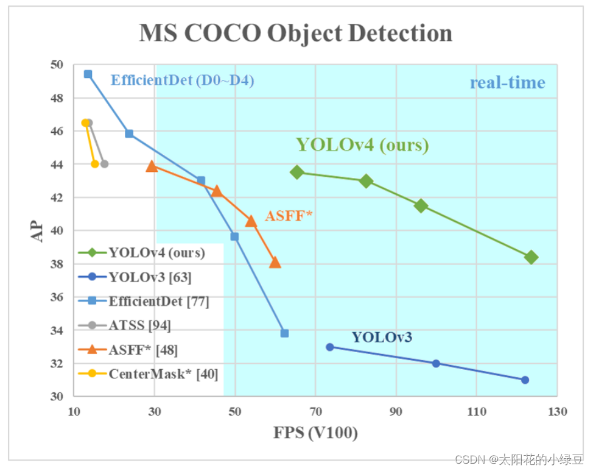

## 1 YOLOv4中的亮点

如果之前有阅读过`YOLOv4`这篇论文的小伙伴，你会发现作者就是把当年所有的常用技术罗列了一遍，然后做了一堆消融实验。实验过程及结果写的还是很详细的，但对我个人而言感觉有点杂乱，没能很好的突出重点。如果大家对实验不敢兴趣的话，直接从论文`3.4`章节往后看就行了。

### 1.1 网络结构

在论文`3.4`章节中介绍了`YOLOv4`网络的具体结构：

- Backbone: `CSPDarknet53`
- Neck: `SPP`，`PAN`
- Head: `YOLOv3`

相比之前的`YOLOv3`，改进了下Backbone，在`Darknet53`中引入了`CSP`模块（来自`CSPNet`）。在Neck部分，采用了`SPP`模块（`Ultralytics`版的`YOLOv3 SPP`就使用到了）以及`PAN`模块（来自`PANet`）。Head部分没变还是原来的检测头。

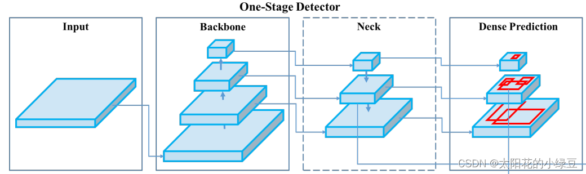

关于`CSPDarnet53`，后面有专门的章节讲解，这里暂时跳过。关于`SPP`（`Spatial Pyramid Pooling`）模块之前讲[YOLO系列网络详解](https://www.bilibili.com/video/BV1yi4y1g7ro)时详细介绍过，`SPP`就是将特征层分别通过一个池化核大小为`5x5`、`9x9`、`13x13`的最大池化层，然后在通道方向进行concat拼接在做进一步融合，这样能够在一定程度上解决目标多尺度问题，如下图所示。

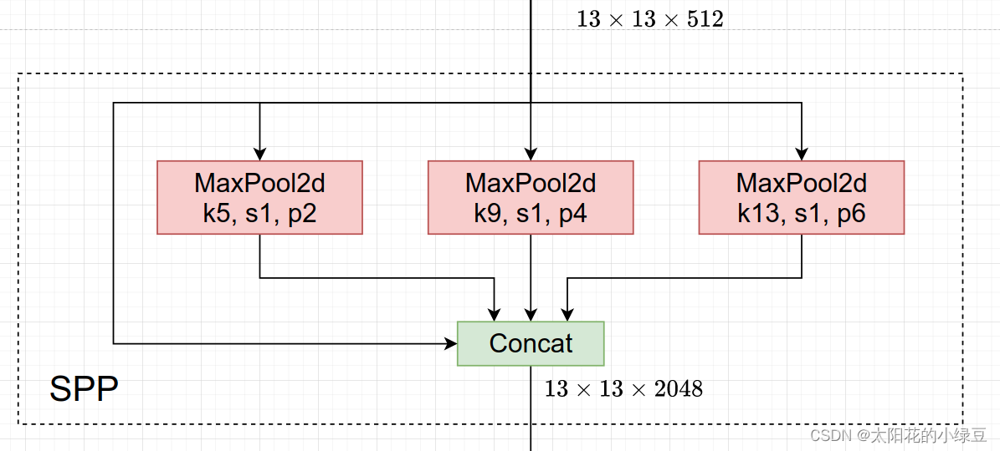

`PAN`（`Path Aggregation Network`）结构其实就是在`FPN`（从顶到底信息融合）的基础上加上了从底到顶的信息融合，如下图(b)所示。

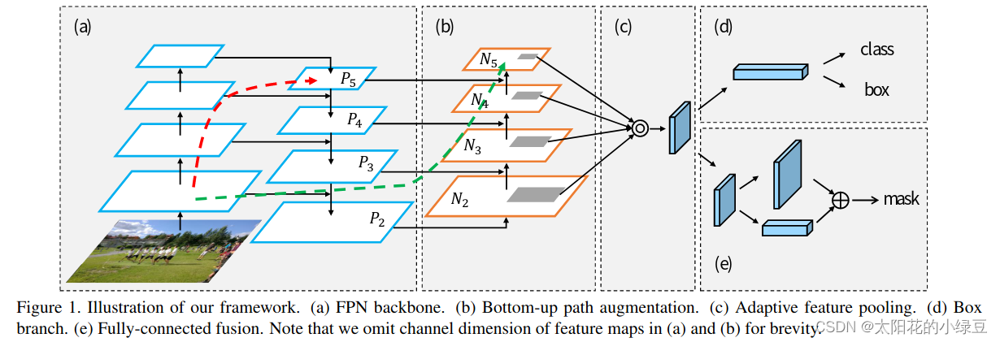

但`YOLOv4`的`PAN`结构和原始论文的融合方式又略有差异，如下图所示。图(a)是原始论文中的融合方式，即特征层之间融合时是直接通过相加的方式进行融合的，但在`YOLOv4`中是通过在通道方向`Concat`拼接的方式进行融合的。

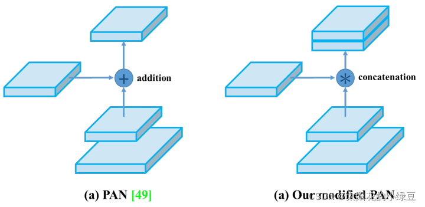

### 1.2 优化策略

有关训练Backbone时采用的优化策略就不讲了有兴趣自己看下论文的`4.2`章节，这里直接讲下训练检测器时作者采用的一些方法。在论文`4.3`章节，作者也罗列了一堆方法，并做了部分消融实验。这里我只介绍确实在代码中有使用到的一些方法。

#### 1.2.1 Eliminate grid sensitivity

在原来`YOLOv3`中，关于计算预测的目标中心坐标计算公式是：
$$
b_x = σ(t_x) + c_x \\
b_y = σ(t_y) + c_y
$$
其中：

- $t_x$ 是网络预测的目标中心 $x$ 坐标偏移量（相对于网格的左上角）
- $t_y$ 是网络预测的目标中心 $y$ 坐标偏移量（相对于网格的左上角）
- $c_x$ 是对应网格左上角的 $x$ 坐标
- $c_y$ 是对应网格左上角的 $y$ 坐标
- σ是`Sigmoid`激活函数，将预测的偏移量限制在0到1之间，即预测的中心点不会超出对应的`Grid Cell`区域

YOLOv4的作者认为这样做不太合理，比如当真实目标中心点非常靠近网格的左上角点 $(t_x)$和 $σ(t_y)$ 应该趋近与0）或者右下角点 $σ(t_x)$ 和 $σ(t_y)$ 应该趋近与1时，网络的预测值需要负无穷或者正无穷时才能取到，而这种很极端的值网络一般无法达到。为了解决这个问题，作者引入了一个大于1的缩放系数 $scale_{xy}$:
$$
b_x = (σ(t_x) ⋅ scale_{xy} - \frac {scale_{xy} − 1} 2) + c_x \\
b_y = (σ(t_y) ⋅ scale_{xy} - \frac {scale_{xy} − 1} 2) + c_y
$$

通过引入这个系数，网络的预测值能够很容易达到0或者1，我现在比较新的实现方法包括YOLOv5都将 $scale_{xy}$ 设置2，即：
$$
b_x = (2 ⋅ σ(t_x) − 0.5) + c_x \\
b_y = (2 ⋅ σ(t_y) − 0.5) + c_y
$$
下图是我绘制的 $y = σ(x)$ 对应`sigma`曲线和 $y = 2 ⋅ σ(x)$对应`scale`曲线，很明显通过引入缩放系数scale以后，$y$对 $x$ 更敏感了，且偏移的范围由原来的 $(0,1)$ 调整到了 $(−0.5,1.5)$。

#### 1.2.2 Mosaic data augmentation

在数据预处理时将四张图片拼接成一张图片，增加学习样本的多样性，之前在[YOLO系列网络详解](https://www.bilibili.com/video/BV1yi4y1g7ro)P4中讲过，这里不在赘述。

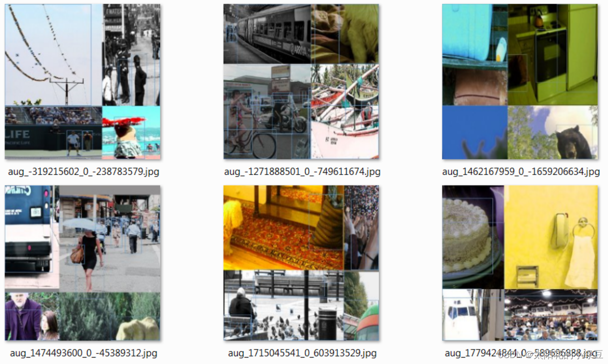

#### 1.2.3 IoU threshold（正样本匹配）

在`YOLOv3`中针对每一个GT都只分配了一个Anchor。但在`YOLOv4`包括之前讲过的`YOLOv3 SPP`以及`YOLOv5`中一个GT可以同时分配给多个Anchor，它们是直接使用Anchor模板与GT Boxes进行粗略匹配，然后在定位到对应cell的对应Anchor。

> 首先回顾下之前在讲`YOLOv3 SPP`源码解析时提到的正样本匹配过程。流程大致如下图所示：比如说针对某个预测特征层采用如下三种Anchor模板`AT 1`、`AT 2`、`AT 3`

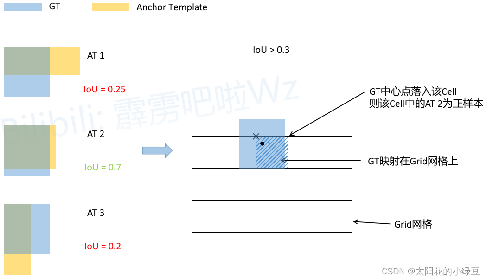

> 找正样本方法

1. **将每个GT Boxes与每个Anchor模板进行匹配（这里直接将GT和Anchor模板左上角对齐，然后计算IoU）**
2. **如果GT与某个Anchor模板的IoU大于给定的阈值，则将GT分配给该Anchor模板，如图中的`AT4 2*`**
3. **将GT(真实位置)投影到对应预测特征层上，根据GT的中心点定位到对应cell（图中黑色的 $×$ 表示`cell`的左上角, 黑点表示GT中心坐标）**
4. **则该`cell`对应的AT2为正样本**
4. **假设同时有多个AT满足IoU要求,如AT1 AT2都满足,就将GT同时分配给这两个框,可以扩充正样本数量**

> 但在`YOLOv4`以及`YOLOv5`中关于匹配正样33本的方法又有些许不同。主要原因在于`1.2.1 Eliminate grid sensitivity`中提到的缩放因子 $scale_{xy}$，通过缩放后网络预测中心点的偏移范围已经从原来的 $(0, 1)$ 调整到了 $(-0.5, 1.5)$。所以对于同一个GT Boxes可以分配给更多的Anchor，即正样本的数量更多了。如下图所示：

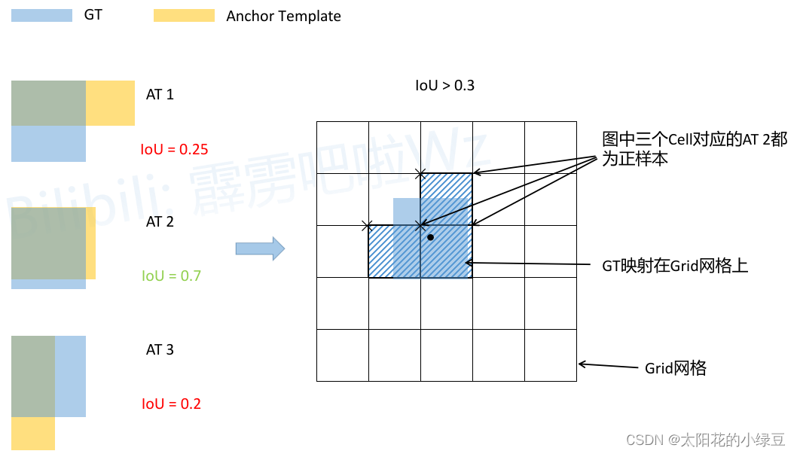

1. **将每个GT Boxes与每个Anchor模板进行匹配（这里直接将GT和Anchor模板左上角对齐，然后计算IoU，在`YOLOv4`中IoU的阈值设置的是`0.213`）**
2. **如果GT与某个Anchor模板的IoU大于给定的阈值，则将GT分配给该Anchor模板，如图中的`AT 2`**
3. **将GT投影到对应预测特征层上，根据GT的中心点定位到对应`cell`（注意图中有三个对应的`cell`，后面会解释，左侧和上侧）**
4. **则这三个`cell`(包括左侧和上侧)对应的AT2都为正样本**

> 为什么图中的GT会定位到3个`cell`，这里简单做下解释（这里是通过分析`ultralytics`的`YOLOv5`源码得到的）。**刚刚说了网络预测中心点的偏移范围已经调整到了 $(-0.5, 1.5)$，所以按理说只要`Grid Cell`左上角点距离GT中心点在 $(-0.5, 1.5)$ 范围内它们对应的Anchor都能回归到GT的位置处。在回过头看看刚刚上面的例子，$GT_x^{center},GT_y^{center}$它们距离落入的`Grid Cell`左上角距离都小于0.5，所以该`Grid Cell`上方的`Cell`以及左侧的`Cell`都满足条件，即`Cell`左上角点距离GT中心在 $(−0.5,1.5)$ 范围内。这样会让正样本的数量得到大量的扩充。**但需要注意的是，`YOLOv5`源码中扩展`Cell`时只会往上、下、左、右四个方向扩展，不会往左上、右上、左下、右下方向扩展。下面又给出了一些根据$GT_x^{center},GT_y^{center}$的位置扩展的一些`Cell`，其中`%1`表示取余并保留小数部分。

> 下图解释

- x%1 < 0.5 y%1 < 0.5  在一个框的左上角区域  向左上扩展2个

- x%1 > 0.5 y%1 > 0.5  在一个框的右下角区域  向右下扩展2个

- x%1 > 0.5 y%1 < 0.5  在一个框的右上角区域  向右上扩展2个

- x%1 < 0.5 y%1 > 0.5  在一个框的左下角区域  向左下扩展2个

- x%1 = 0.5 y%1 = 0.5  中心点                      不扩展

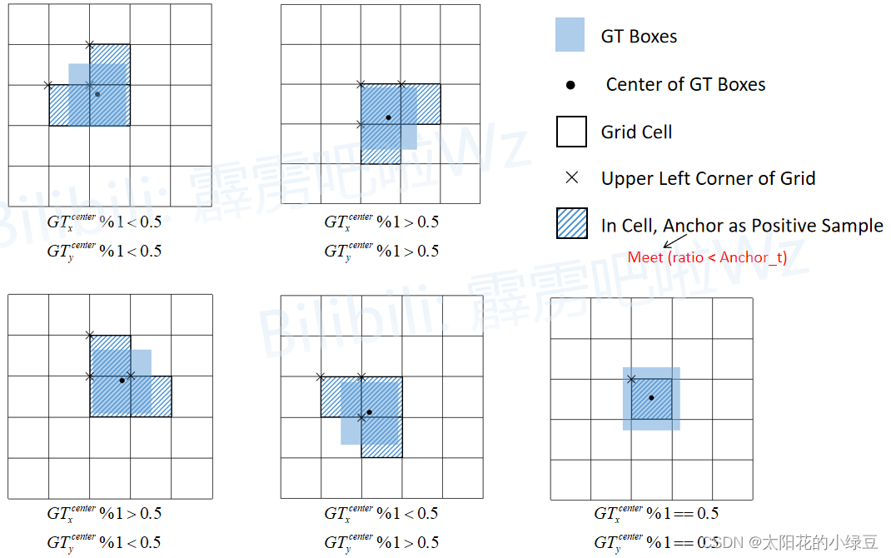

#### 1.2.4 Optimizer Anchors

在`YOLOv3`中使用anchor模板是：

| 目标类型 | Anchors模板                          |
| -------- | ------------------------------------ |
| 小尺度   | (10 × 13), (16 ×30), (33 × 23)       |
| 中尺度   | (30 × 61), (62 ×45), (59 ×119)       |
| 大尺度   | (116 × 90), (156 × 198), (373 × 326) |

在YOLOv4中作者针对 $512 × 512$ 尺度采用的anchor模板是：

| 目标类型 | Anchors模板                           |
| -------- | ------------------------------------- |
| 小尺度   | (12 × 16), (19 × 36), (40 × 28)       |
| 中尺度   | (36 × 75), (76 × 55), (72 ×146)       |
| 大尺度   | (142 × 110), (192 × 243), (459 × 401) |

#### 1.2.5 CIoU（定位损失）

在`YOLOv3`中定位损失采用的是MSE损失，但在`YOLOv4`中作者采用的是`CIoU`损失。之前在[YOLO系列网络详解](https://www.bilibili.com/video/BV1yi4y1g7ro)P4中很详细的讲解过`IoU Loss`，`DIoU Loss`以及`CIoU Loss`，这里不在赘述。

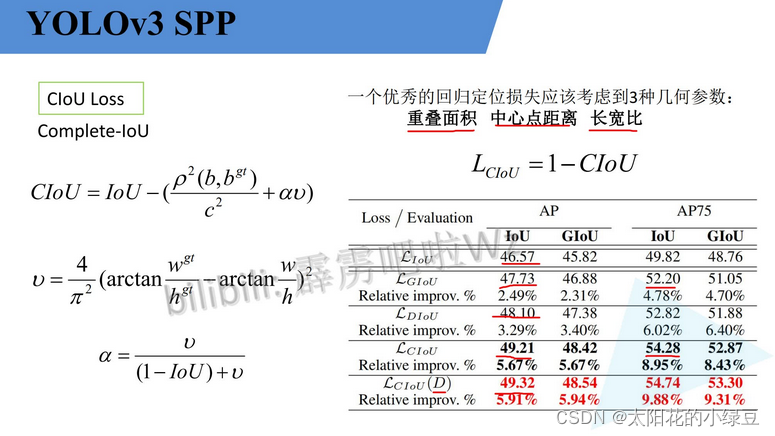

## 2 CSPDarknet53网络结构

`CSPDarknet53`就是将`CSP`结构融入了`Darknet53`中。`CSP`结构是在`CSPNet`（`Cross Stage Partial Network`）论文中提出的，`CSPNet`作者说在目标检测任务中使用`CSP`结构有如下好处：

> 1. 增强CNN学习能力
> 2. 移除计算瓶颈
> 3. 减少显存使用0

即减少网络的计算量以及对显存的占用，同时保证网络的能力不变或者略微提升。`CSP`结构的思想参考原论文中绘制的`CSPDenseNet`，进入每个`stage`（一般在下采样后）先将数据划分成俩部分，如下图所示的`Part1`和`Part2`。但具体怎么划分呢，在`CSPNet`中是直接按照通道均分，但在`YOLOv4`网络中是通过两个`1x1`的卷积层来实现的。在`Part2`后跟一堆`Blocks`然后在通过`1x1`的卷积层（图中的`Transition`），接着将两个分支的信息在通道方向进行Concat拼接，最后再通过`1x1`的卷积层进一步融合（图中的`Transition`）。

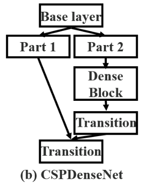

接下来详细分析下CSPDarknet53网络的结构，下图是我根据开源仓库https://github.com/Tianxiaomo/pytorch-YOLOv4中代码绘制的CSPDarknet53详细结构（以输入图片大小为 $416 × 416 × 3$ 为例），图中：

- $k$ 代表卷积核的大小
- $s$ 代表步距
- $c$ 代表通过该模块输出的特征层channels
- 注意，`CSPDarknet53` Backbone中所有的激活函数都是 `Mish` 激活函数

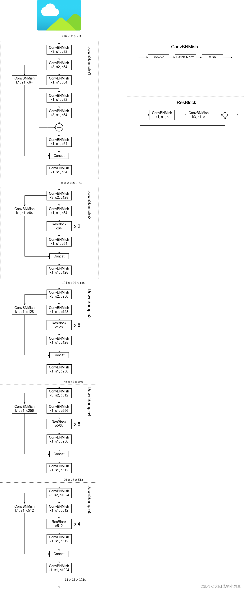

## 3 YOLOv4网络结构

下图是我绘制的`YOLOv4`网络的详细结构，大家在搭建或者学习过程中可以进行参考。

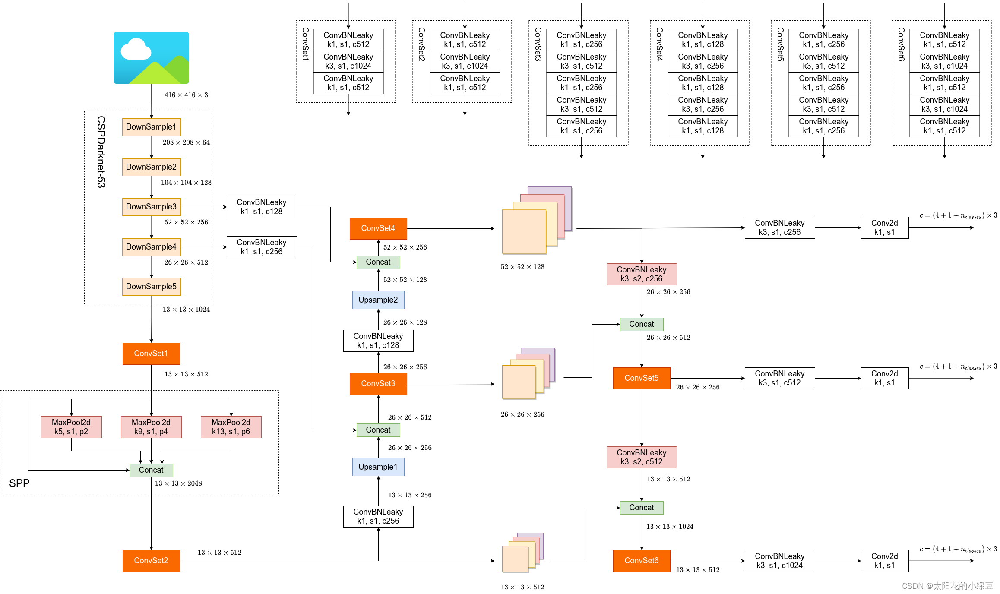