https://blog.csdn.net/qq_37541097/article/details/123594351

## 0 前言

在前面我们已经介绍过了YOLOv1~v4的网络的结构，今天接着上次的[YOLOv4](https://so.csdn.net/so/search?q=YOLOv4&spm=1001.2101.3001.7020)再来聊聊YOLOv5，，如果还不了解YOLOv4的可以参考之前的[博文](https://blog.csdn.net/qq_37541097/article/details/123229946)。[YOLOv5](https://so.csdn.net/so/search?q=YOLOv5&spm=1001.2101.3001.7020)项目的作者是`Glenn Jocher`并不是原`Darknet`项目的作者`Joseph Redmon`。并且这个项目至今都没有发表过正式的论文。之前翻阅该项目的`issue`时，发现有很多人问过这个问题，有兴趣的可以翻翻这个issue [#1333](https://github.com/ultralytics/yolov5/issues/1333#issuecomment-936818045)。作者当时也有说准备在2021年的12月1号之前发表，并承诺如果到时候没有发表就吃掉自己的帽子。

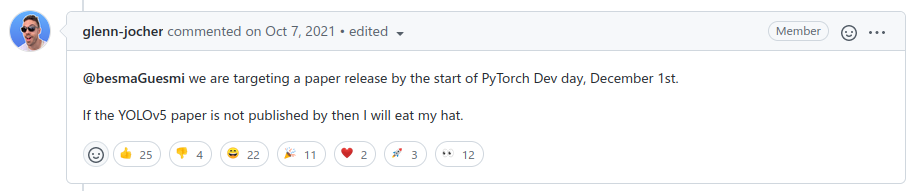

⊙o⊙)…，emmm，但这都2022年了，也不知道他的帽子是啥味儿。过了他承诺的发表期限后，很多人还去该`issue`下表示"关怀"，问啥时候吃帽子，下面这位大哥给我整笑了。

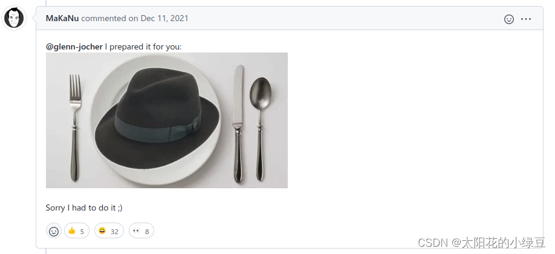

本来`Glenn Jocher`是准备要发表论文的，但至于为啥没发成作者并没有给出原因。我个人的猜测是自从YOLOv4发表后，有很多人想发这方面的文章，然后在YOLOv4上进行改动，改动过程中肯定有人把YOLOv5仓库里的一些技术拿去用了（YOLOv4论文4月出的，YOLOv5仓库5月就有了）。大家改完后发了一堆文章，那么YOLOv5的技术就被零零散散的发表到各个文章中去了。`Glenn Jocher`一看，这也太卷了吧，你们都把我技术写了，那我还写个锤子，直接撂挑子不干了。

当然以上都是我个人yy哈，回归正题，YOLOv5仓库是在`2020-05-18`创建的，到今天已经迭代了很多个大版本了，现在（`2022-3-19`）已经迭代到`v6.1`了。所以本篇博文讲的内容是针对`v6.1`的，大家阅读的时候注意看下版本号，不同的版本内容会略有不同。前几天我在YOLOv5项目中向作者提了一个issue [#6998](https://github.com/ultralytics/yolov5/issues/6998)，主要是根据当前的源码做了一个简单的总结，然后想让作者帮忙看看总结的内容是否有误，根据作者的反馈应该是没啥问题的，所以今天就来谈谈我个人的见解。下表是当前(`v6.1`)官网贴出的关于不同大小模型以及输入尺度对应的`mAP`、推理速度、参数数量以及理论计算量`FLOPs`。

| Model          | size (pixels)       | mAP val 0.5:0.95 | mAP val 0.5 | Speed CPU b1 (ms) | Speed V100 b1 (ms) | Speed V100 b32 (ms) | params (M) | FLOPs @640 (B) |
| -------------- | ------------------- | ---------------- | ----------- | ----------------- | ------------------ | ------------------- | ---------- | -------------- |
| **下采样32倍** | **预测特征层有3层** | **P3 P4 P5**     |             |                   |                    |                     |            |                |
| YOLOv5n        | 640                 | 28.0             | 45.7        | 45                | 6.3                | 0.6                 | 1.9        | 4.5            |
| YOLOv5s        | 640                 | 37.4             | 56.8        | 98                | 6.4                | 0.9                 | 7.2        | 16.5           |
| YOLOv5m        | 640                 | 45.4             | 64.1        | 224               | 8.2                | 1.7                 | 21.2       | 49.0           |
| YOLOv5l        | 640                 | 49.0             | 67.3        | 430               | 10.1               | 2.7                 | 46.5       | 109.1          |
| YOLOv5x        | 640                 | 50.7             | 68.9        | 766               | 12.1               | 4.8                 | 86.7       | 205.7          |
|                |                     |                  |             |                   |                    |                     |            |                |
| **下采样64倍** | **预测特征层有4层** | **P3 P4 P5 P6**  |             |                   |                    |                     |            |                |
| YOLOv5n6       | 1280                | 36.0             | 54.4        | 153               | 8.1                | 2.1                 | 3.2        | 4.6            |
| YOLOv5s6       | 1280                | 44.8             | 63.7        | 385               | 8.2                | 3.6                 | 12.6       | 16.8           |
| YOLOv5m6       | 1280                | 51.3             | 69.3        | 887               | 11.1               | 6.8                 | 35.7       | 50.0           |
| YOLOv5l6       | 1280                | 53.7             | 71.3        | 1784              | 15.8               | 10.5                | 76.8       | 111.4          |
| YOLOv5x6       | 1280                | 55.              | 72.7        | 3136              | 26.2               | 19.4                | 140.7      | 209.8          |
| YOLOv5x6 + TTA | 1536                | 55.8             | 72.7        | -                 | -                  | -                   | -          | -              |

## 1 网络结构

关于YOLOv5的网络结构其实网上相关的讲解已经有很多了。网络结构主要由以下几部分组成：

- **Backbone**: `New CSP-Darknet53`
- **Neck**: `SPPF`, `New CSP-PAN`
- **Head**: `YOLOv3 Head`

下面是我根据`yolov5l.yaml`绘制的网络整体结构，YOLOv5针对不同大小（`n`, `s`, `m`, `l`, `x`）的网络整体架构都是一样的，只不过会在每个子模块中采用不同的深度和宽度，分别应对`yaml`文件中的`depth_multiple`和`width_multiple`参数。还需要注意一点，官方除了`n`, `s`, `m`, `l`, `x`版本外还有`n6`, `s6`, `m6`, `l6`, `x6`，区别在于后者是针对更大分辨率的图片比如`1280x1280`，当然结构上也有些差异，后者会下采样64倍，采用4个预测特征层，而前者只会下采样到32倍且采用3个预测特征层。本博文只讨论前者。下面这幅图（`yolov5l`）有点大，大家可以下载下来仔细看一下。

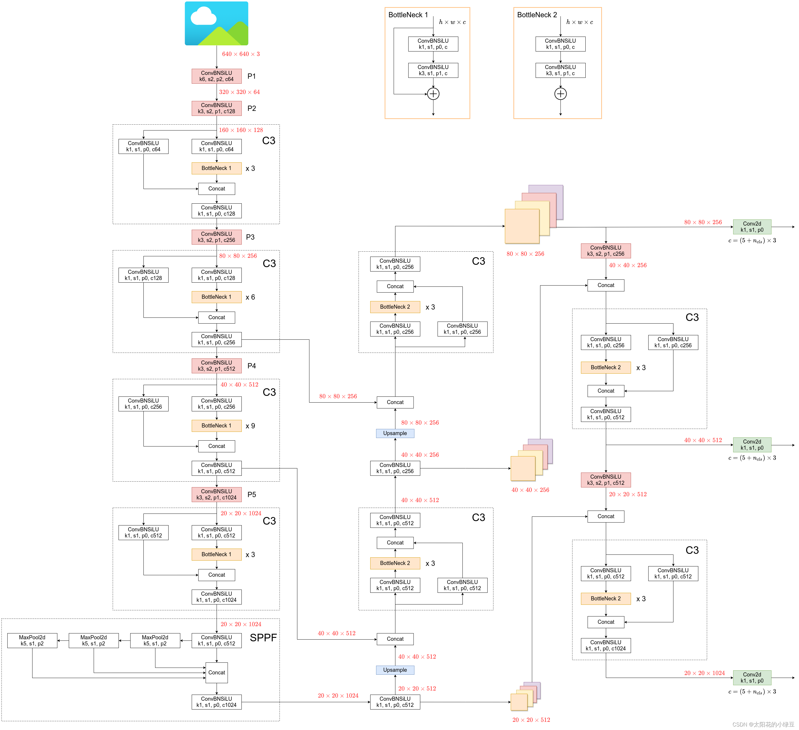

通过和上篇博文讲的YOLOv4对比，其实YOLOv5在**Backbone**部分没太大变化。但是YOLOv5在`v6.0`版本后相比之前版本有一个很小的改动，把网络的第一层（原来是`Focus`模块）换成了一个`6x6`大小的卷积层。**两者在理论上其实等价的**，但是对于现有的一些GPU设备（以及相应的优化算法）使用`6x6`大小的卷积层比使用`Focus`模块更加高效。详情可以参考这个issue [#4825](https://github.com/ultralytics/yolov5/issues/4825)。下图是原来的`Focus`模块(和之前`Swin Transformer`中的`Patch Merging`类似)，将每个`2x2`的相邻像素划分为一个`patch`，然后将每个`patch`中相同位置（同一颜色）像素给拼在一起就得到了4个`feature map`，然后在接上一个`3x3`大小的卷积层。这和直接使用一个`6x6`大小的卷积层等效。

> 把网络的第一层（原来是`Focus`模块）换成了一个`6x6`大小的卷积层。两者在理论上其实等价的
>
> [Is the Focus layer equivalent to a simple Conv layer? · Issue #4825 · ultralytics/yolov5 (github.com)](https://github.com/ultralytics/yolov5/issues/4825)

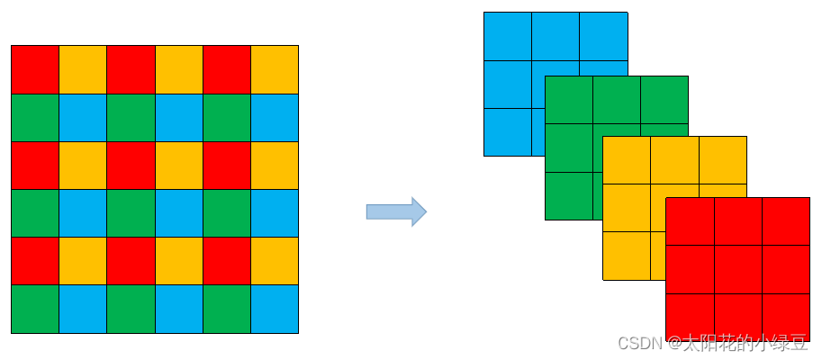

在**Neck**部分的变化还是相对较大的，首先是将`SPP`换成成了`SPPF`（`Glenn Jocher`自己设计的），这个改动我个人觉得还是很有意思的，两者的作用是一样的，但后者效率更高。`SPP`结构如下图所示，是将输入并行通过多个不同大小的`MaxPool`，然后做进一步融合，能在一定程度上解决目标多尺度问题。

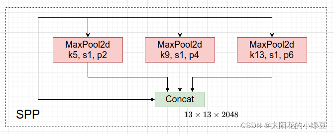

而`SPPF`结构是将输入串行通过多个`5x5`大小的`MaxPool`层，这里需要注意的是串行两个`5x5`大小的`MaxPool`层是和一个`9x9`大小的`MaxPool`层计算结果是一样的，串行三个`5x5`大小的`MaxPool`层是和一个`13x13`大小的`MaxPool`层计算结果是一样的。

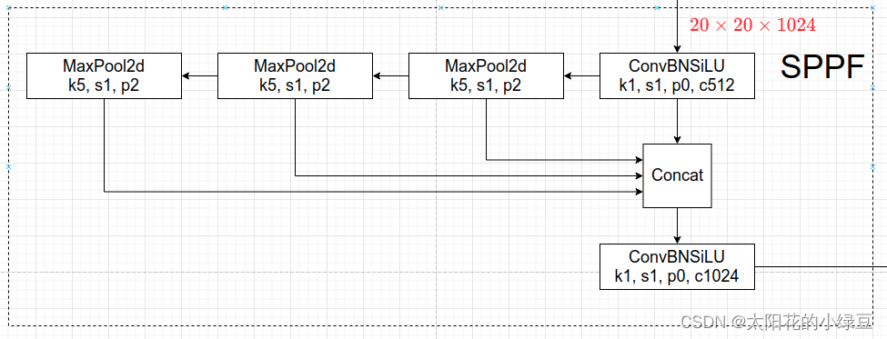

下面做个简单的小实验，对比下`SPP`和`SPPF`的计算结果以及速度，代码如下（注意这里将`SPPF`中最开始和结尾处的`1x1`卷积层给去掉了，只对比含有`MaxPool`的部分）：

```python
import time
import torch
import torch.nn as nn

#------------------------------#
#	3个并行的max_pool
#------------------------------#
class SPP(nn.Module):
    def __init__(self):
        super().__init__()
        self.maxpool1 = nn.MaxPool2d(5, 1, padding=2)
        self.maxpool2 = nn.MaxPool2d(9, 1, padding=4)
        self.maxpool3 = nn.MaxPool2d(13, 1, padding=6)

    def forward(self, x):
        o1 = self.maxpool1(x)
        o2 = self.maxpool2(x)
        o3 = self.maxpool3(x)
        return torch.cat([x, o1, o2, o3], dim=1)

#------------------------------#
#	2个5x5max_pool等价于1个9x9max_pool
#	3个5x5max_pool等价于1个13x13max_pool
#------------------------------#
class SPPF(nn.Module):
    def __init__(self):
        super().__init__()
        self.maxpool = nn.MaxPool2d(5, 1, padding=2)

    def forward(self, x):
        o1 = self.maxpool(x)
        o2 = self.maxpool(o1)
        o3 = self.maxpool(o2)
        return torch.cat([x, o1, o2, o3], dim=1)


def main():
    input_tensor = torch.rand(8, 32, 16, 16)
    spp = SPP()
    sppf = SPPF()
    output1 = spp(input_tensor)
    output2 = sppf(input_tensor)
	
    # 查看两个结果是否完全相同
    print(torch.equal(output1, output2))

    t_start = time.time()
    for _ in range(100):
        spp(input_tensor)
    print(f"spp time: {time.time() - t_start}")

    t_start = time.time()
    for _ in range(100):
        sppf(input_tensor)
    print(f"sppf time: {time.time() - t_start}")


if __name__ == '__main__':
    main()
```

终端输出：

```python
True
spp time: 0.5373051166534424
sppf time: 0.20780706405639648
```

通过对比可以发现，两者的计算结果是一模一样的，但`SPPF`比`SPP`计算速度快了不止两倍，快乐翻倍。

在**Neck**部分另外一个不同点就是`New CSP-PAN`了，在YOLOv4中，**Neck**的`PAN`结构是没有引入`CSP`结构的，但在YOLOv5中作者在`PAN`结构中加入了`CSP`。详情见上面的网络结构图，每个`C3`模块里都含有`CSP`结构。在**Head**部分，YOLOv3, v4, v5都是一样的，这里就不讲了。

## 2 数据增强

在YOLOv5代码里，关于数据增强策略还是挺多的，这里简单罗列部分方法：

- **Mosaic**，将四张图片拼成一张图片，讲过很多次了

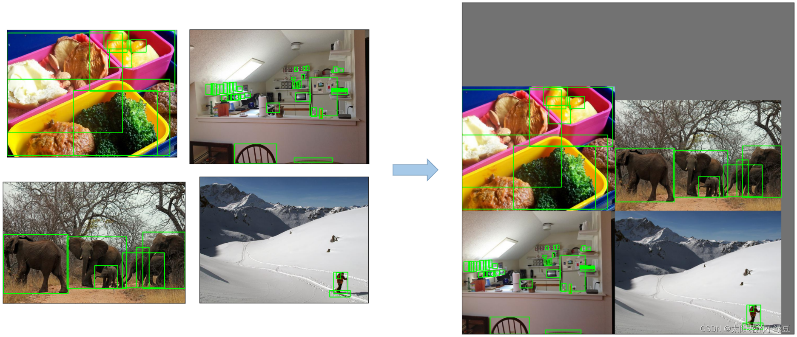

- **Copy paste**，将部分目标随机的粘贴到图片中，**前提是数据要有实例分割`segments`数据才行**，即每个目标的实例分割信息。下面是`Copy paste`原论文中的示意图。

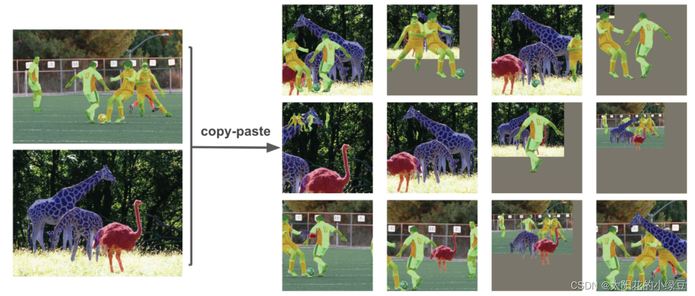

- **Random affine(Rotation, Scale, Translation and Shear)**，随机进行仿射变换，但根据配置文件里的超参数发现只使用了`Scale`和`Translation`即缩放和平移。

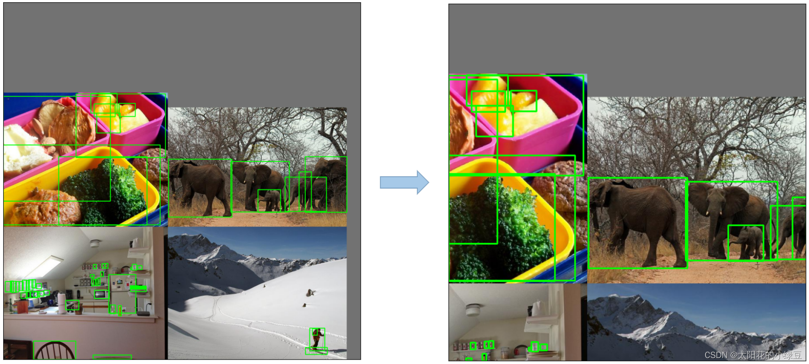

- **MixUp**，就是将两张图片按照一定的透明度融合在一起，具体有没有用不太清楚，毕竟没有论文，也没有消融实验。代码中只有较大的模型才使用到了`MixUp`，而且每次只有10%的概率会使用到。

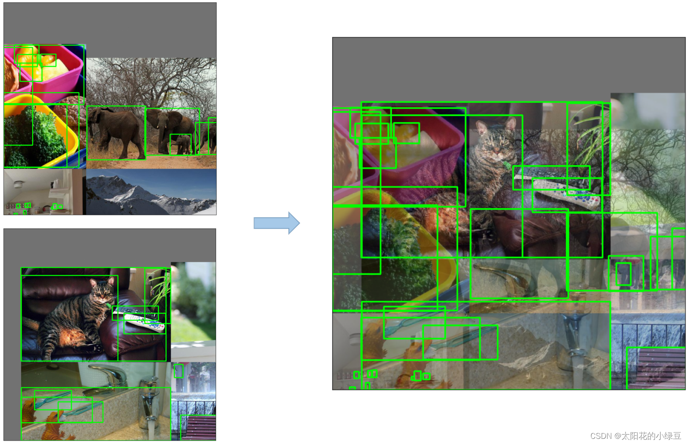

- **Albumentations**，主要是做些滤波、直方图均衡化以及改变图片质量等等，我看代码里写的只有安装了`albumentations`包才会启用，但在项目的`requirements.txt`文件中`albumentations`包是被注释掉了的，所以默认不启用。

- **Augment HSV(Hue, Saturation, Value)**，随机调整色度，饱和度以及明度。

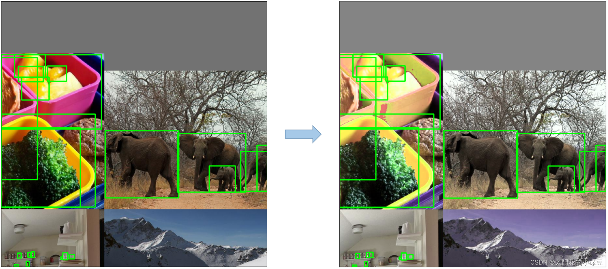

- **Random horizontal flip**，随机水平翻转

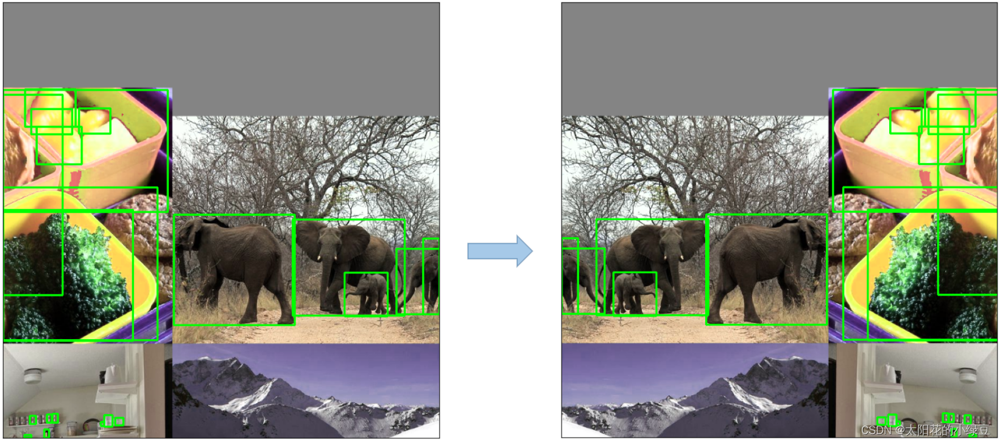

## 3 训练策略

YOLOv5源码中使用到了很多训练的策略，这里简单总结几个我注意到的点，还有些没注意到的请大家自己看下源码：

- **Multi-scale training(0.5~1.5x)**，多尺度训练，假设设置输入图片的大小为$ 640×640$，训练时采用尺寸是在$0.5×640∼1.5×640$间随机取值，注意取值时取得都是32的整数倍（因为网络会最大下采样32倍）。

- **AutoAnchor(For training custom data)**，训练自己数据集时可以根据自己数据集里的目标进行重新聚类生成Anchors模板。
- **Warmup and Cosine LR scheduler**，训练前先进行`Warmup`热身，然后在采用`Cosine`学习率下降策略。
- **EMA(Exponential Moving Average)**，可以理解为给训练的参数加了一个动量，让它更新过程更加平滑。
- **Mixed precision**，混合精度训练，能够减少显存的占用并且加快训练速度，前提是GPU硬件支持。
- **Evolve hyper-parameters**，超参数优化，没有炼丹经验的人勿碰，保持默认就好。

## 4 其他

### 4.1 损失计算

YOLOv5的损失主要由三个部分组成：

- **Classes loss**，分类损失，采用的是`BCE loss`，注意只计算正样本的分类损失。

- **Objectness loss**，`obj`损失，采用的依然是`BCE loss`，注意这里的`obj`指的是网络预测的目标边界框与GT Box的`CIoU`。这里计算的是所有样本的`obj`损失。**(用的CIoU,不是是否有目标,是否有目标只有0和1)**

- **Location loss**，定位损失，采用的是`CIoU loss`，注意只计算正样本的定位损失。
    $$
    Loss =λ_1​L_{cls} + λ_2​L_{obj} + λ_3​L_{loc}
    $$
    其中，$ λ1,λ2,λ3$为平衡系数。

### 4.2 平衡不同尺度的损失

这里是指针对三个预测特征层（`P3, P4, P5`）上的`obj`损失采用不同的权重。在源码中，针对预测小目标的预测特征层（`P3`）采用的权重是`4.0`，针对预测中等目标的预测特征层（`P4`）采用的权重是`1.0`，针对预测大目标的预测特征层（`P5`）采用的权重是`0.4`，作者说这是针对`COCO`数据集设置的超参数。
$$
Lobj = 4.0 ⋅ L_{obj}^{small} + 1.0 ⋅ L_{obj}^{medium} + 0.4 ⋅ L_{obj}^{large}
$$

### 4.3 消除Grid敏感度

在上篇文章YOLOv4中有提到过，主要是调整预测目标中心点相对Grid网格的左上角偏移量。下图是YOLOv2，v3的计算公式。
$$
b_x = σ(t_x) + c_x \\
b_y = σ(t_y) + c_y
$$


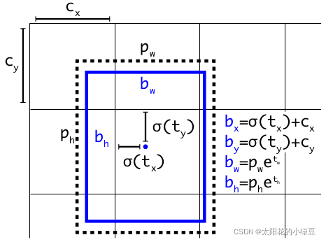

其中：

- $t_x$ 是网络预测的目标中心 $x$ 坐标偏移量（相对于网格的左上角）
- $t_y$ 是网络预测的目标中心 $y$ 坐标偏移量（相对于网格的左上角）
- $c_x$ 是对应网格左上角的 $x$ 坐标
- $c_y$ 是对应网格左上角的 $y$ 坐标
- σ是`Sigmoid`激活函数，将预测的偏移量限制在0到1之间，即预测的中心点不会超出对应的`Grid Cell`区域

关于预测目标中心点相对Grid网格左上角 $(c_x, c_y)$ 偏移量为 $σ(t_x),σ(t_y)$。YOLOv4的作者认为这样做不太合理，比如当真实目标中心点非常靠近网格的左上角点 $(t_x)$和 $σ(t_y)$ 应该趋近与0）或者右下角点 $σ(t_x)$ 和 $σ(t_y)$ 应该趋近与1时，网络的预测值需要负无穷或者正无穷时才能取到，而这种很极端的值网络一般无法达到。为了解决这个问题，作者对偏移量进行了缩放从原来的 $(0,1)$ 缩放到 $(−0.5,1.5)$ 这样网络预测的偏移量就能很方便达到0或1，故最终预测的目标中心点 $b_x, b_y$ 的计算公式为：
$$
b_x = (2 ⋅ σ(t_x) − 0.5) + c_x \\
b_y = (2 ⋅ σ(t_y) − 0.5) + c_y
$$
下图是我绘制的 $y = σ(x)$ 对应`before`曲线和 $y = 2 ⋅ σ(x)$对应`after`曲线，很明显通过引入缩放系数scale以后，$y$对 $x$ 更敏感了，且偏移的范围由原来的 $(0,1)$ 调整到了 $(−0.5,1.5)$。


> https://github.com/ultralytics/yolov5/issues/471
>
> 在YOLOv5中除了调整预测Anchor相对Grid网格左上角 $(c_x, c_y)$ 偏移量以外，还调整了预测目标高宽的计算公式，之前是：

$$
b_w = p_w ⋅ e^{t_w} \\
b_h = p_h ⋅ e^{t_h}
$$
> 在YOLOv5调整为：

$$
b_w = p_w ⋅ (2 ⋅ σ(t_w))^2 \\
b_h = p_h ⋅ (2 ⋅ σ(t_h))^2
$$
作者`Glenn Jocher`的原话如下，也可以参考issue [#471](https://github.com/ultralytics/yolov5/issues/471)：

> The original yolo/darknet box equations have a serious flaw. Width and Height are completely unbounded as they are simply out=exp(in), which is dangerous, as it can lead to runaway gradients, instabilities, NaN losses and ultimately a complete loss of training.

作者的大致意思是，原来的计算公式并没有对预测目标宽高做限制，这样可能出现梯度爆炸，训练不稳定等问题。下图是修改前 $y = e^x$ 和修改后 $y=(2⋅σ(x))^2$相对Anchor宽高的倍率因子）的变化曲线， 很明显调整后倍率因子被限制在 $(0, 4)$ 之间。

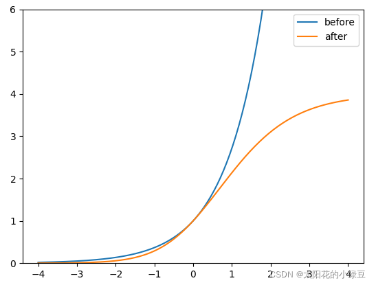

### 4.4 匹配正样本(Build Targets)

> **V4中是将真实框和预测框左上角对齐检测IoU,只要IoU超过阈值就为正样本**
>
> 之前在YOLOv4介绍中有讲过该部分内容，其实YOLOv5也差不多。主要的区别在于`GT Box`与`Anchor Templates`模板的匹配方式。在YOLOv4中是直接将每个`GT Box`与对应的`Anchor Templates`模板计算`IoU`，只要`IoU`大于设定的阈值就算匹配成功。
>
> **但在YOLOv5中，作者先去计算每个`GT Box`与对应的`Anchor Templates`模板的高宽比例，即：**

$$
r_w = w_{gt} / w_{at} \\
r_h = h_{gt} / h_{at}
$$
> **然后统计这些比例和它们倒数之间的最大值，这里可以理解成计算`GT Box`和`Anchor Templates`分别在宽度以及高度方向的最大差异（当相等的时候比例为1，差异最小）**：

$$
r_w^{max} = max(r_w, 1/r_w) \\
r_h^{max} = max(r_h, 1/r_h)
$$
> **接着统计 $r_w^{max}$ 和 $r_h^{max}$ 之间的最大值，即宽度和高度方向差异最大的值**：

$$
r^{max} = max(r_w^{max}, r_h^{max})
$$
> 如果`GT Box`和对应的`Anchor Template`的  $r^{max}$ 小于阈值`anchor_t`（在源码中默认设置为`4.0`）即`GT Box`和对应的`Anchor Template`的高、宽比例相差不算太大，则将`GT Box`分配给该`Anchor Template`模板。为了方便大家理解，可以看下我画的图。假设对某个GT Box而言，其实只要GT Box满足在某个Anchor Template宽和高的 $×0.25$倍和 $×4.0$ 倍之间就算匹配成功。
>
> **anchor_t = 4 是因为上面的消除Grid敏感度将宽高调整设置最大为4**

> 下图蓝色GT 真实框
>
> 黄色 AT 预测框
>
> 黑线代表预测框调整到0.25倍和4倍的大小
>
> **第一个真实框超过了4倍的大小,预测框最大变为4倍,匹配不到,所以就为负样本**
>
> **后面2个真实框都在预测框的0.25~4倍之间,所以为正样本**


剩下的步骤和YOLOv4中一致：

- 将`GT`投影到对应预测特征层上，根据`GT`的中心点定位到对应`Cell`，注意图中有三个对应的`Cell`。因为网络预测中心点的偏移范围已经调整到了 $(-0.5, 1.5)$，所以按理说只要Grid Cell左上角点距离GT中心点在$(−0.5,1.5)$ 范围内它们对应的`Anchor`都能回归到`GT`的位置处。这样会让正样本的数量得到大量的扩充。
- 则这三个`Cell`对应的`AT2`和`AT3`都为正样本。

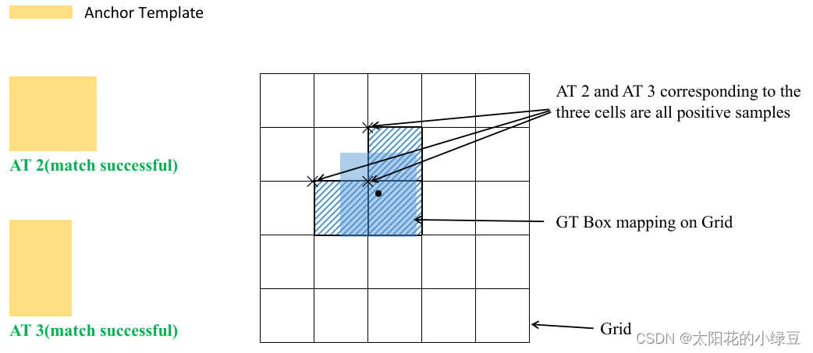

> 还需要注意的是，YOLOv5源码中扩展`Cell`时只会往上、下、左、右四个方向扩展，，不会往左上、右上、左下、右下方向扩展。下面又给出了一些根据 $GT_x^{center},GT_y^{center}$的位置扩展的一些`Cell`案例，其中`%1`表示取余并保留小数部分。

> 下图解释

- x%1 < 0.5 y%1 < 0.5  在一个框的左上角区域  向左上扩展2个

- x%1 > 0.5 y%1 > 0.5  在一个框的右下角区域  向右下扩展2个

- x%1 > 0.5 y%1 < 0.5  在一个框的右上角区域  向右上扩展2个

- x%1 < 0.5 y%1 > 0.5  在一个框的左下角区域  向左下扩展2个

- x%1 = 0.5 y%1 = 0.5  中心点                      不扩展

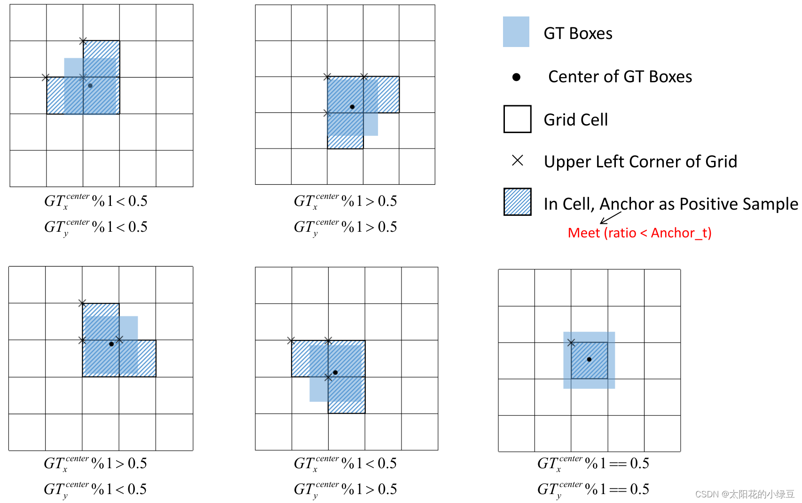

到此，YOLOv5相关的内容基本上都分析完了。当然由于个人原因，肯定还有一些细节被我忽略掉了，也建议大家自己看看源码，收获肯定会更多。

