https://mp.weixin.qq.com/s/I7y52U-t4ZNveeEESNFuMg

https://blog.csdn.net/qq_37541097/article/details/125132817?spm=1001.2014.3001.5502

论文名称：YOLOX: Exceeding YOLO Series in 2021

论文下载地址：https://arxiv.org/abs/2107.08430

论文对应源码地址：https://github.com/Megvii-BaseDetection/YOLOX


# 0 前言

在之前文章中我们已经聊过YOLO v5了，今天我们再来聊聊YOLOX。YOLOX是旷视科技在2021年发表的一篇文章，当时主要对标的网络就是很火的YOLO v5，如果对YOLO v5不了解的可以看下我之前的[文章](https://blog.csdn.net/qq_37541097/article/details/123594351)。那么在YOLOX中引入了当年的哪些黑科技呢，简单总结主要有三点，`decoupled head`、`anchor-free`以及`advanced label assigning strategy(SimOTA)`。YOLOX的性能如何呢，可以参考原论文图一，如下图所示，YOLOX比当年的YOLO v5略好一点，并且论文中说他们利用YOLOX获得了当年的`Streaming Perception Challenge`的第一名。那这里可能有人会问了，在自己的项目中YOLO v5和YOLOX到底应该选择哪个。我个人的建议是，如果你的数据集图像分辨率不是很高，比如`640x640`，那么两者都可以试试。如果你的图像分辨率很高，比如`1280x1280`，那么我建议使用YOLO v5。因为YOLO v5官方仓库有提供更大尺度的预训练权重，而YOLOX当前只有`640x640`的预训练权重（YOLOX官方仓库说后续会提供更大尺度的预训练权重，可过了快一年了还没有音讯）。

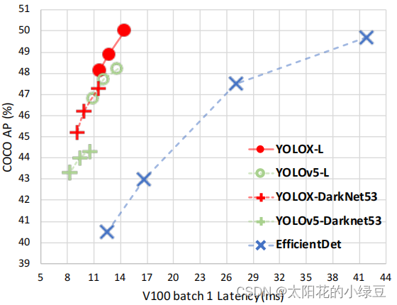

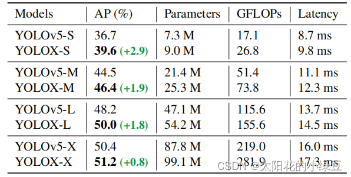

# 1 网络结构

下图是我根据源码绘制的`YOLOX-L`网络结构。因为它是基于YOLO v5构建的，所以Backbone以及PAN部分和YOLO v5是一模一样的，注意这里说的YOLO v5是对应`tag:v5.0`版本的，而我们之前讲的YOLO v5文章中是`tag:v6.1`版本，所以在Backbone部分有些细微区别，大家自行对比一下就知道了，这里不去赘述。如果看不懂的可以翻下之前写的YOLO v5文章。

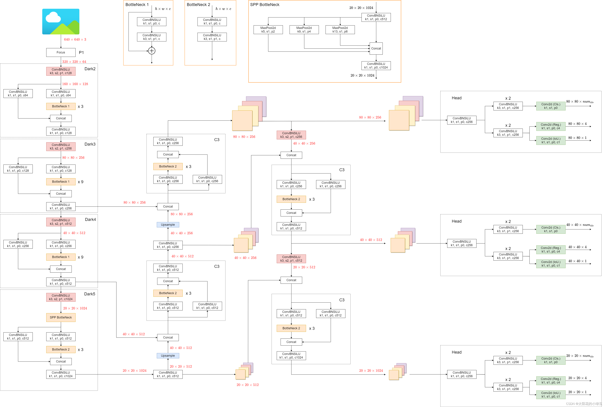

那YOLOX和YOLO v5在网络结构上有什么差别呢，主要的差别就在检测头head部分。之前的检测头就是通过一个卷积核大小为`1x1`的卷积层实现的，即这个卷积层要同时预测类别分数、边界框回归参数以及`object ness`，这种方式在文章中称之为`coupled detection head`（耦合的检测头）。作者说采用`coupled detection head`是对网络有害的，如果将`coupled detection head`换成`decoupled detection head`（解耦的检测头）能够大幅提升网络的收敛速度。在论文的图3中展示了YOLO v3分别使用`coupled detection head`和`decoupled detection head`的训练收敛情况，明显采用`decoupled detection head`后收敛速度会更快（在论文的表2中显示采用`decoupled detection head`能够提升AP约1.1个点）。说句题外话相比与YOLO v3我更关心对于YOLO v5能提升多少AP，但文章中并没有相关数据。

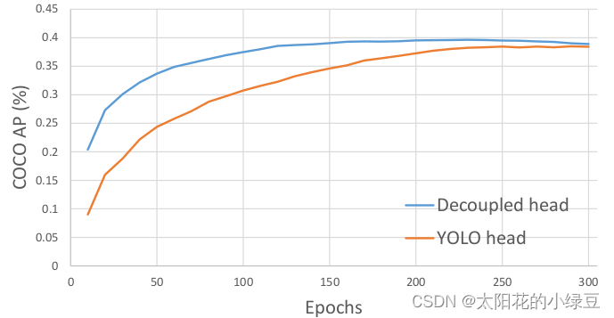

那`decoupled detection head`到底长啥样，根据原论文的图2以及源码绘制的`decoupled detection head`结构如下。在`decoupled detection head`中对于预测`Cls.`、`Reg.`以及`IoU`参数分别使用三个不同的分支，这样就将三者进行了解耦。这里需要注意一点，在YOLOX中对于不同的预测特征图采用不同的head，即**参数不共享**。

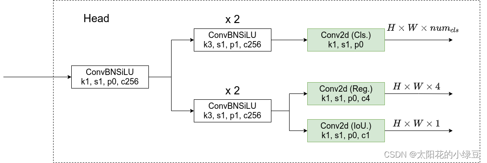

# 2 Anchor-Free

近几年有关Anchor-Free的网络也层出不穷，之前我们也聊过一个Anchor-Free的网络FCOS，如果不了解的建议看下之前的[文章](https://blog.csdn.net/qq_37541097/article/details/124844726)。今天讲的YOLOX也是一个Anchor-Free的网络，并且借鉴了FCOS中的思想。刚刚在上面我们已经简单聊到了YOLOX的`decoupled detection head`，它对预测特征图（`feature map`/`Grid 网格`）上的每一个位置都预测了 $num_{cls}+4+1$ 个参数，其中 $num_{cls}$ 代表检测的目标类别数，`4`代表网络预测的目标边界框参数，`1`代表`object ness`（图中标的是`IoU.`）。


由于YOLOX是Anchor-Free的网络，所以head在每个位置处直接预测4个目标边界框参数 $[t_x, t_y, t_w, t_h]$ 如下如所示，这4个参数分别对应预测目标中心点相对`Grid Cell`左上角 $ (c_x, c_y)$ 的偏移量，以及目标的宽度、高度因子，**注意这些值都是相对预测特征图尺度上的，如果要映射回原图需要乘上当前特征图相对原图的步距`stride`**。

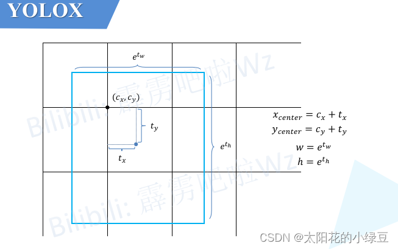

关于如何将预测目标边界框信息转换回原图尺度可参考源码中`decode_outputs`函数（在源码项目中的`yolox -> models -> yolo_head.py`文件中）：

```python
def decode_outputs(self, outputs, dtype):
    grids = []
    strides = []
    for (hsize, wsize), stride in zip(self.hw, self.strides):
        # 生成网格xy
        yv, xv = meshgrid([torch.arange(hsize), torch.arange(wsize)])
        grid = torch.stack((xv, yv), 2).view(1, -1, 2)
        grids.append(grid)
        shape = grid.shape[:2]
        strides.append(torch.full((*shape, 1), stride))
	
    # 网格
    grids = torch.cat(grids, dim=1).type(dtype)
    # 步长
    strides = torch.cat(strides, dim=1).type(dtype)

    outputs[..., :2] = (outputs[..., :2] + grids) * strides  	# 预测目标边界框中心坐标
    outputs[..., 2:4] = torch.exp(outputs[..., 2:4]) * strides  # 预测目标边界框宽度和高度
    return outputs
```

# 3 损失计算

由于在网络的检测头中有`Cls.`分支、`Reg.`分支以及`IoU.`分支（其实是`Obj.`分支），所以损失由 $L_{cls}$、$L_{reg}$ 以 $L_{obj}$ 及这三部分组成，个人感觉如果把 $L_{obj}$ 换成 $L_{iou}$ 会更合理。其中 $L_{cls}$ 和 $L_{obj}$ 采用的都是二值交叉熵损失（`BCELoss`）而 $L_{reg}$ 采用的是`IoULoss`。还要注意的是，**$L_{cls}$ 以及 $L_{reg}$ 只计算正样本的损失，而 $L_{obj}$ 既计算正样本也计算负样本的损失**。
$$
Loss
=
\frac
{
L_{cls} + \lambda L_{reg} + L_{obj}
}
{
N_{pos}
}
$$
 其中：

- $L_{cls}$ 代表分类损失
- $L{reg}$ 代表定位损失
- $L_{obj}$ 代表 $obj$ 损失，正样本为1，负样本为0
- λ 代表定位损失的平衡系数，源码中设置是`5.0`

- $N_{pos}$ 代表被分为正样的`Anchor Point`数

------

# 4 正负样本匹配策略SimOTA

`SimOTA`是我个人认为比较难理解的部分，主要是源码看的头大。训练网络时就是通过`SimOTA`来进行正负样本的匹配。而`SimOTA`是由`OTA`（Optimal Transport Assignment）简化得到的，`OTA`也是旷视科技同年出的一篇文章，论文名称叫做《Optimal transport assignment for object detection》，有兴趣的可以自己了解一下。根据原论文中的表二，可以看到，在YOLO v3的基准上使用`SimOTA`后能够给AP带来`2.3`个点的提升。其实我这里有个疑问，这个`SimOTA`对于YOLO v5能够带来多少提升，如果对YOLO v5也能带来两个多点的提升那不是YOLO v5又把YOLOX给反超了？

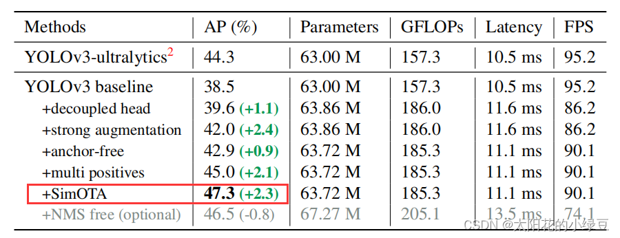

那`OTA`究竟是什么呢？下面是论文中的原话：

> Specifically, OTA [4] analyzes the label assignment from a global  perspective and formulate the assigning procedure as an Optimal  Transport (OT) problem, producing the SOTA performance among the current assigning strategies [12, 41, 36, 22, 37].

简单来说，就是将匹配正负样本的过程看成一个**最优传输问题**。关于最优传输理论，说实话我不太了解所以就不展开细讲，这里为了方便理解就举个简单的例子。如下图所示，假设有1到6共6个城市（图中的五角星），有2个牛奶生产基地A和B。现在要求这两个牛奶生产基地为这6个城市送牛奶，究竟怎样安排才能最小化运输成本。假设运输成本（cost）仅由距离决定，那么很明显城市1、2、3由牛奶生产基地A负责，城市4、5、6由牛奶生产基地B负责，运输成本最低。

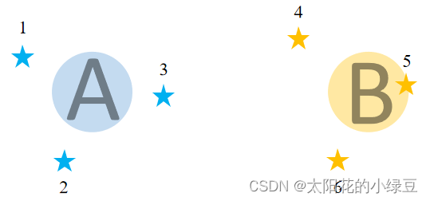

那么在`SimOTA`正负样本匹配过程中，城市对应的是每个样本（对应论文中的`anchor point`，其实就是`grid`网格中的每个`cell`），牛奶生产基地对应的是标注好的GT Bbox，那现在的目标是怎样以最低的成本（cost）将GT分配给对应的样本。根据论文中的公式1，cost的计算公式如下，其中 $\lambda$ 为平衡系数，代码中设置的是`3.0`：
$$
c_{ij} = L_{ij}^{cls} + \lambda L_{ij}^{reg}
$$
通过公式可以得知，成本cost由分类损失和回归损失两部分组成，并且网络预测的类别越准确cost越小，网络预测的目标边界框越准确cost越小。**那么最小化cost可以理解为让网络以最小的学习成本学习到有用的知识**。看到这里如果不理解也没关系，后面会有更详细的例子。

刚刚在上面有提到，城市对应的是每个样本（对应论文中的`anchor point`，其实就是`grid`网格中的每个`cell`），那是不是所有的样本都要参与cost的计算呢，当然不是。这里先回忆一下之前讲过的FCOS网络，它是如何匹配正负样本的？**它是将那些落入GT中心sub-box范围内的样本视为正样本，其他的都视为负样本**。

那在`SimOTA`中，也有个类似的预筛选过程，通过阅读源码分析得到它首先会将落入目标GT Bbox内或落入`fixed center area`内的样本给筛选出来，在源码中作者将`center_ratius`设置为`2.5`，即`fixed center area`是一个`5x5`大小的box。如下图所示，feature map（或者称grid网格）中所有打勾的位置都是通过预筛选得到的样本（`anchor point`）。注意，这里将落入GT Bbox与`fixed center area`相交区域内的样本用橙色的勾表示。

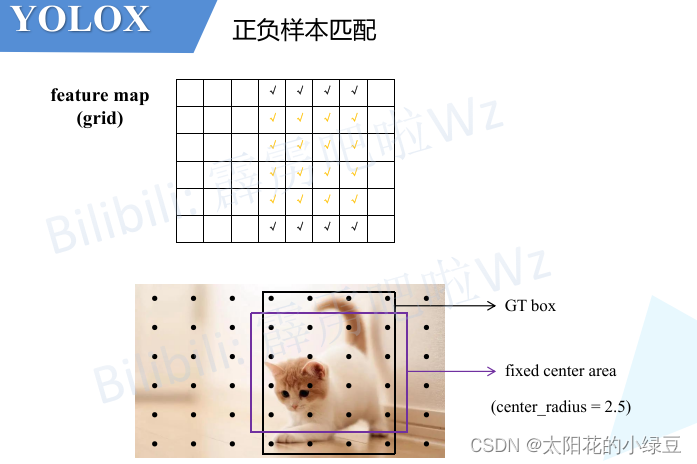

接着计算网络在这些样本（`anchor point`）位置处的预测值（目标类别以及目标边界框）和每个GT的 $L_{ij}^{cls}$ 以及 $L_{ij}^{reg}$ （由于回归损失是IoULoss，所以这里也知道每个样本和每个GT的IoU），然后再计算每个样本和每个GT之间的cost。这里需要注意下，在代码中计算cost的过程如下，和论文中给的公式有一点点区别：

```python
cost = (
            pair_wise_cls_loss							# 分类损失
            + 3.0 * pair_wise_ious_loss					# 回归损失
            + 100000.0 * (~is_in_boxes_and_center)		# 黑色对勾对应的anchor point 
        )
```

其中：

- `pair_wise_cls_loss`就是每个样本与每个GT之间的分类损失 $L_{ij}^{cls}$
- `pair_wise_ious_loss`是每个样本与每个GT之间的回归损失 $L_{ij}^{reg}$
- `is_in_boxes_and_center`代表那些落入GT Bbox与`fixed center area`交集内的样本，即上图中橙色勾对应的样本，然后这里进行了取反`~`表示不在GT Bbox与`fixed center area`交集内的样本（非橙色样本），即上图中**黑色勾**对应的样本。接着又乘以`100000.0`，也就是说对于GT Bbox与`fixed center area`交集外的样本cost加上了一个非常大的数，这样在最小化cost过程中会优先选择GT Bbox与`fixed center area`交集内的样本。

> 接下来介绍如何利用cost去进行正负样本的匹配，以下内容全部是按照源码中的计算流程进行讲解，可能没那么容易理解，如果想看懂源码的话建议多看几遍。

- 首先构建两个矩阵，一个是之前筛选出的Anchor Point与每个GT之间的cost矩阵，另一个是Anchor Point与每个GT之间的IoU矩阵。**接着计算`n_candidate_k`并结合IoU对Anchor Point做进一步筛选（保留IoU大的Anchor Point），`n_candidate_k`是取`10`和Anchor Point数量之间的最小值，在下面给的这个示例中由于Anchor Point数量为6，所以`n_candidate_k=6`故保留所有的Anchor Point（下面示例中的值都是我随手写的，不必深究）**。


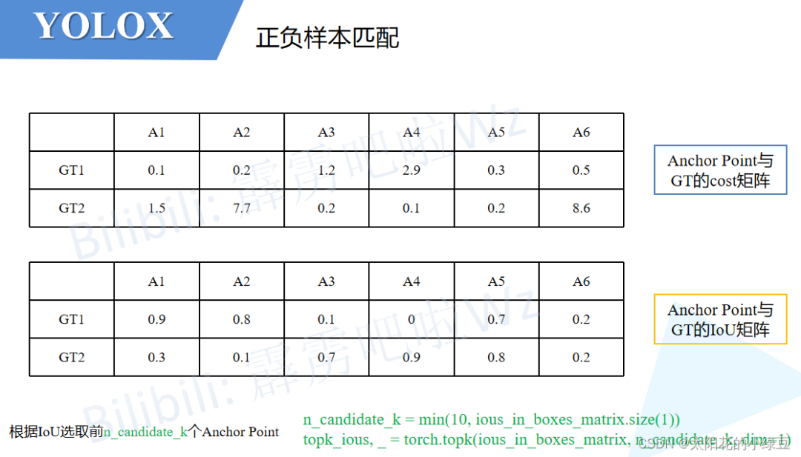

- 接着对每个GT计算剩下所有的Anchor Point的IoU之和然后向下取整得到针对每个GT所采用的正样本数量，即代码中计算得到的`dynamic_ks`（这个计算过程对应论文中的`Dynamic k Estimation Strategy`）。对于下面的示例，GT1的所有Anchor Point的IoU之和为`3.0`向下取整就是`3`所以对于GT1有3个正样本，同理GT2也有3个正样本。

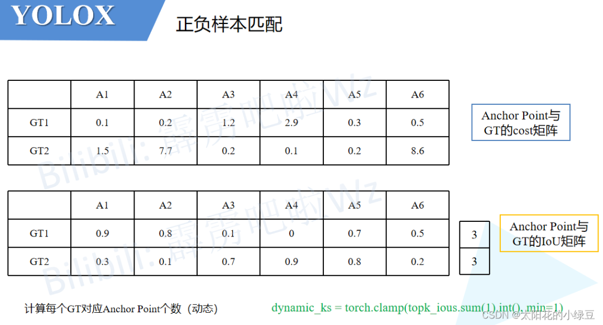

- 然后根据刚刚计算得到的`dynamic_ks`（每个GT对应几个正样本）和cost矩阵找出所有的正样本（根据cost的数值大小）。比如对于示例中的GT1，刚刚计算采用3个正样本，然后看下GT1和所有Anchor Point的cost，按照从小到大的顺序将前3小的Anchor Point找出来，即示例中的`A1`、`A2`和`A5`。同理对于GT2，cost排前3的是`A3`、`A4`和`A5`。根据以上结果，我们可以再构建一个Anchor Point分配矩阵，记录每个GT对应哪些正样本，对应正样本的位置标`1`，其他位置标`0`。

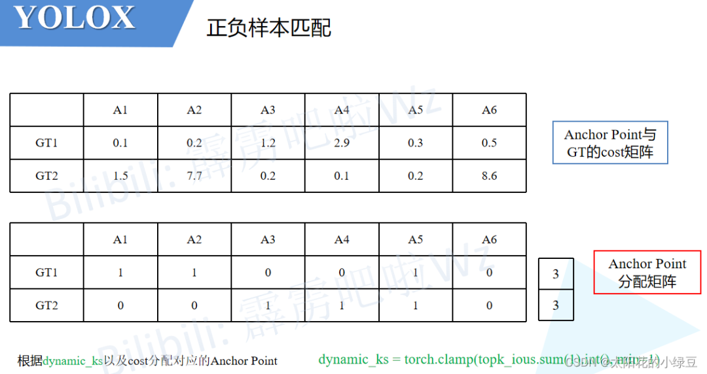

- 按照示例我们会发现一个问题，即GT1和GT2同时分配给了`A5`。作者为了解决这个带有歧义的问题，又加了一个判断。如果多个GT同时分配给一个Anchor Point，那么只选cost最小的GT。在示例中，由于`A5`与GT2的cost小于与GT1的cost，故只将GT2分配给`A5`。

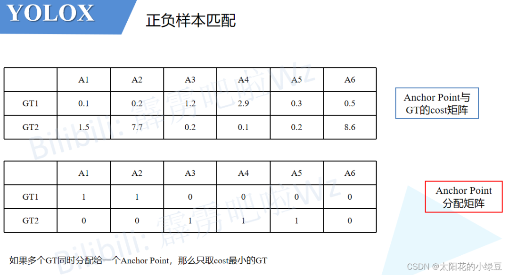

根据以上流程就能找到所有的正样本以及正样本对应的GT了，那么剩下的Anchor Point全部归为负样本。

----

到此，有关YOLOX的内容就基本讲完了。如果觉得这篇文章对你有用，记得点赞、收藏并分享给你的小伙伴们哦😄。